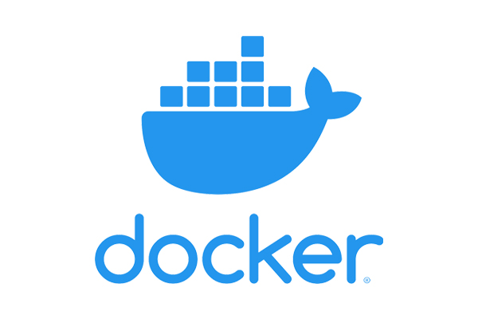

.. _getting_started:

===============
Getting Started
===============

------------
Installation
------------

`smash` can be used on Linux and is compatible with most distributions. It has been tested for use on Ubuntu 20.04 and 22.04 LTS, and supports Python versions 3.8 to 3.11.
The installation instructions are detailed for Ubuntu. Depending on your distribution, you will need to use the correct package manager and insert the appropriate packages.

First, clone the Git repository:

.. code-block:: none

    git clone https://github.com/DassHydro-dev/smash.git

and navigate to the working directory:

.. code-block:: none

    cd smash

Now you can proceed with building the code and installing dependencies. You have multiple options, such as using `Anaconda <https://www.anaconda.com/>`__, your own Python environment, or `Docker <https://docs.docker.com/engine/install/>`__.

**********************
Anaconda (recommended)
**********************

.. image:: ../_static/logo_anaconda.png
    :width: 175
    :align: center

1. **Create environment**
    In the ``smash`` directory, create a `conda <https://www.anaconda.com/>`__ environment named **smash**:

    .. code-block:: none

        conda env create -f environment.yml

2. **Activate environment**
    Activate the environment:

    .. code-block:: none

        conda activate smash

3. **Build**
    Use the `make <https://www.gnu.org/software/make/manual/make.html>`__ command inside the ``smash`` directory:

    .. code-block:: none

        (smash) make

4. **Check your installation**
    Once the compilation is complete, make sure that everything went well by tring to import the `smash` package inside a Python interface:

    .. code-block:: none

        (smash) python3

    .. code-block:: python

        import smash

.. hint::

    If you'd prefer that conda's base environment not be activated on startup, 
    set the auto_activate_base parameter to false:

    .. code-block::

        conda config --set auto_activate_base false

********************
Your own environment
********************

.. image:: ../_static/logo_terminal.svg
    :width: 75
    :align: center

1. **Install f90wrap**
    Install the `f90wrap <https://github.com/jameskermode/f90wrap>`__ package using ``pip3``:

    .. code-block:: none
        
        sudo pip3 install f90wrap
        
    .. note ::
        
        ``pip3`` can be installed as follows:
        
        .. code-block:: none
        
            sudo apt install python3-pip
            
2. **Install gdal**
    Install the `gdal <https://gdal.org/api/python/osgeo.gdal.html>`__ package:

    .. code-block:: none
        
        sudo add-apt-repository ppa:ubuntugis/ppa
        sudo apt-get update
        sudo apt-get install gdal-bin libgdal-dev
        
3. **Build**
    Use the `make <https://www.gnu.org/software/make/manual/make.html>`__ command inside the ``smash`` directory:
    
    .. code-block:: none
    
        make
        
4. **Check your installation**
    Once the compilation is finished, make sure that everything went well by tring to import the `smash` package inside a Python interface:
    
    .. code-block:: none
    
        python3
        
    .. code-block:: python
        
        import smash
    
******
Docker
******
    

    
.. warning::

    Section in development
    
    .. note::

        ``docker`` can be downloaded .
        
    1. **Build image**
        Build `docker <https://docs.docker.com/engine/install/>`__ image:
        
        .. code-block:: none
            
            docker build --network=host -t smash .
            
    2. **Run**
        Run image:
        
        .. code-block ::
            
            docker run smash

---------
Tutorials
---------

For a brief user guide to get started with **smash**, you can refer to the ``Quickstart`` section in the :ref:`User Guide <user_guide>`. Other in-depth functionalities and advanced optimization techniques are also included in this :ref:`User Guide <user_guide>`.

For detailed descriptions of the **smash** API, you can visit the :ref:`API Reference <api_reference>` section.

Additionally, if you're interested in the mathematical and numerical documentation of the hydrological model operators and the optimization problems, you can refer to the :ref:`Math/Num Documentation <math_num_documentation>` section. 