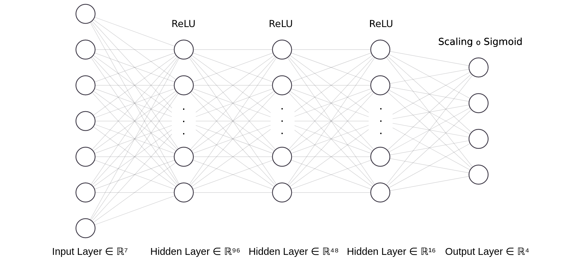

.. _math_num_documentation.forward.regionalization_operators:

=========================
Regionalization operators
=========================

Here we introduce a pre-regionalization operator :math:`\mathcal{F}_{R}` enabling us to hypothesize a relationship between physiographic descriptors :math:`\boldsymbol{D}` and the hydrological model parameters :math:`\boldsymbol{\theta}` such that:

.. math::
    :name: eq:regio-mapping-intro
    
        \boldsymbol{\theta}(x)=\mathcal{F}_{R}(\boldsymbol{D}(x),\boldsymbol{\rho}(x)), \forall x \in \Omega

with :math:`\boldsymbol{D}` the :math:`N_D`-dimensional vector of physiographic descriptor maps covering :math:`\Omega`, and :math:`\boldsymbol{\rho}` the vector of tunable regionalization parameters that is defined depending upon the following two types of pre-regionalization operators.

Multivariate polynomial regression
**********************************
A multivariate polynomial regression operator :math:`\mathcal{P}` that for the :math:`k^{th}`-parameter of the forward hydrological model writes:

.. math::
    :name: eq:polynom-regio

       \mathcal{F}_{R}: \boldsymbol{\rho} \mapsto \theta_{k}(x;\boldsymbol{D};\boldsymbol{\rho}) := s_{k}\left(\alpha_{k,0}+\sum_{d=1}^{N_{D}}\alpha_{k,d}D_{d}^{\beta_{k,d}}(x)\right),\,\forall\left(k,x\right)\in[1..N_{\theta}]\times\Omega

with :math:`s_{k}(z)=l_{k}+(u_{k}-l_{k})/\left(1+e^{- z}\right),\,\forall z\in\mathbb{R}`, a transformation based on a sigmoid function with values in :math:`\left]l_k;u_k\right[`, thus imposing bound constrains in the direct hydrological model such that  :math:`l_{k}<\theta_{k}(x)<u_{k},\,\forall x\in\Omega`. 
The regional control vector in this case is:
   
.. math::
    :name: eq:polynom-control-vec

    \boldsymbol{\rho} := \left[\alpha_{k,0},\left(\alpha_{k,d},\beta_{k,d}\right)\right]^{T},\forall(k,d)\in[1..N_{\theta}]\times[1..N_{D}]

Artificial neural network
*************************
An artificial neural network (ANN) denoted :math:`\mathcal{N}`, consisting of a multilayer perceptron, aims to learn the descriptors to parameters mapping such that:

.. math::
    :name: eq-ann-regio

        \mathcal{F}_{R}: \boldsymbol{\rho} \mapsto \boldsymbol{\theta}(x;\boldsymbol{D};\boldsymbol{\rho}) := \mathcal{N}\left(\boldsymbol{D}(x), \boldsymbol{W}, \boldsymbol{b}\right),\forall x \in \Omega

where :math:`\boldsymbol{W}` and :math:`\boldsymbol{b}` are respectively weights and biases of the neural network composed of :math:`N_L` dense layers.   
Note that an output layer consisting in a transformation based on the sigmoid function enables to impose :math:`l_{k}<\theta_{k}(x)<u_{k},\,\forall x\in\Omega`, i.e. bounds constrains on the :math:`k^{th}`-hydrological parameters. 
The regional control vector in this case is:  

.. math::
    :name: eq-ann-control-vec
    
        \boldsymbol{\rho} := \left[\boldsymbol{W}, \boldsymbol{b}\right]^T
        
The following figure illustrates the architecture of the ANN with three hidden layers, followed by the ReLU activation function, and an output layer that uses the Sigmoid activation function in combination with a scaling function. 
In this particular case, we have :math:`N_D=7` and :math:`N_{\theta}=4`.

