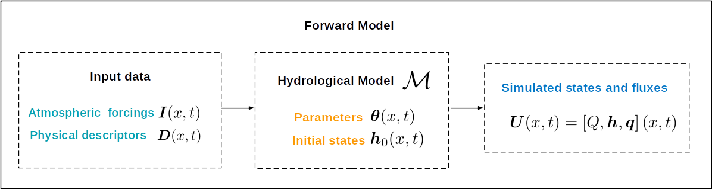
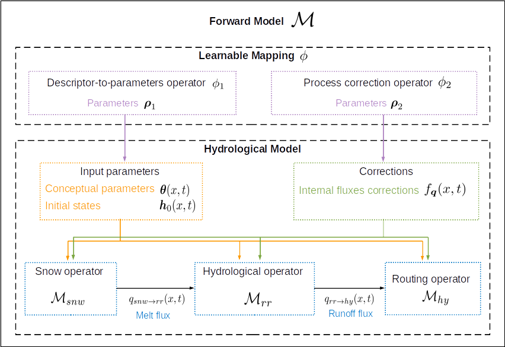

.. _math_num_documentation.forward_inverse_problem:

==========================
Forward & Inverse Problems
==========================

This section explains:
 
- The **hydrological modeling problem (forward/direct problem)**, that consists in modeling the spatio-temporal evolution of water states-fluxes within a spatio-temporal domain given atmospheric forcings and basin physical descriptors. 
 
- The **parameter estimation problem (inverse problem)**, that aims to estimating uncertain or unknows model parameters from the available spatio-temporal observations of hydrological state-fluxes and from basin physical descriptors.

Forward problem statement
-------------------------

The forward/direct hydrological modeling problem statement is formulated here.

The 2D spatial domain is denoted :math:`\Omega` with :math:`x` the vector of spatial coordinates, and :math:`t` is the time in the simulation window :math:`\left]0,T\right]`. 

Hydrological model definition
*****************************

The spatially distributed hydrological model is a dynamic operator :math:`\mathcal{M}` projecting fields of atmospheric forcings :math:`I`,
catchment physical descriptors :math:`\boldsymbol{D}` onto surface discharge :math:`Q`, model states :math:`\boldsymbol{h}`, and internal fluxes  :math:`\boldsymbol{q}` such that:

.. math::
    :name: math_num_documentation.forward_inverse_problem.forward_problem_M_1
    
    \boxed{
    \boldsymbol{U}(x,t)=(Q,\boldsymbol{h},\boldsymbol{q})(x,t)=\mathcal{M}\left(\left[\boldsymbol{I},\boldsymbol{D}\right](x,t);\left[\boldsymbol{\theta},\boldsymbol{h}_{0}\right](x)\right)
    }

with :math:`\boldsymbol{U}(x,t)` the modeled state-flux variables, :math:`\boldsymbol{\theta}` the parameters and :math:`\boldsymbol{h}_{0}=\boldsymbol{h}\left(x,t=0\right)` the initial states.

    
    Flowchart of the forward modeling problem: input data, forward hydrological model :math:`\mathcal{M}`, simulated quantites.

.. dropdown:: Detail on model variables
    :animate: fade-in-slide-down

    The sizes of the variables in the forward/direct problem are detailed here. We denote by :math:`N=N_{x} \times N_{t}` with :math:`N_{x}` the number of  cells in :math:`\Omega` and :math:`N_t` the number of simulation time steps in :math:`\left]0,T\right]`.

    - Surface discharge :math:`Q(x,t)\in\mathbb{R}^{N}`

    - States :math:`\boldsymbol{h}=\left(h_{1}(x,t),...,h_{N_{h}}(x,t)\right)\in\mathbb{R}^{N \times {N_{h}}}` with :math:`N_h` the number of distinct state variables

    - Internal fluxes :math:`\boldsymbol{q}=\left(q_{1}(x,t),...,q_{N_{q}}(x,t)\right)\in\mathbb{R}^{N \times N_{q}}` with :math:`N_q` the number of distinct internal fluxes

    - Atmospheric forcings :math:`\mathcal{\boldsymbol{I}}=\left(I_{1}(x,t),...,I_{N_{I}}(x,t)\right)\in\mathbb{R}^{N \times N_{I}}` with :math:`N_I` the number of atmospheric forcings types

    - Physiographic descriptors :math:`\mathcal{\boldsymbol{D}}=\left(D_{1}(x,t),...,D_{N_{D}}(x,t)\right)\in\mathbb{R}^{N \times N_{D}}` with :math:`N_{D}` the number of physical descriptors

    - Parameters :math:`\boldsymbol{\theta}=\left(\theta_{1}(x),...,\theta_{N_{\theta}}(x)\right)\in\mathbb{R}^{N \times N_{\theta}}` with :math:`N_{\theta}` the number of distinct parameters

    - Initial states :math:`\boldsymbol{h}_{0}=\boldsymbol{h}(x,t=0)`

    
.. _math_num_documentation.forward_inverse_problem.chaining:
    
    
Operators Chaining Principle
****************************

The **forward hydrological model** :math:`\mathcal{M}` is obtained by chaining through fluxes at least two operators: the hydrological operator :math:`\mathcal{M}_{rr}` to simulate runoff from atmospheric forcings and use this runoff to feed a routing operator :math:`\mathcal{M}_{hy}` for cell to cell flow routing. 

A snow module :math:`\mathcal{M}_{snw}` can also be added.

A **learnable mapping** :math:`\phi`, composed of neural networks, can also be included into the forward model to predict parameters and/or fluxes corrections from various input data. 

Several differentiable model structures are proposed in `smash` and detailed in :ref:`model strucures section <math_num_documentation.forward_structure>`.

    
    Schematic view of operators composition into the forward model :math:`\mathcal{M}`.

Hydrological Model Operators
============================

The forward hydrological model is obtained by partial composition (each operator taking various other inputs data and paramters) of the flow operators writes:

.. math:: 
      :name: math_num_documentation.forward_inverse_problem.forward_problem_Mhy_circ_Mrr
      
      \mathcal{M}=\mathcal{M}_{hy}\left(\,.\,,\mathcal{M}_{rr}\left(\,.\,,\mathcal{M}_{snw}\left(.\right)\right)\right)
      
with the snow module :math:`\mathcal{M}_{snw}` producing a melt flux :math:`q_{snw\rightarrow rr}(x,t)` feeding the production module :math:`\mathcal{M}_{rr}` that produces runoff flux  :math:`q_{rr \rightarrow hy}(x,t)` feeding the routing module :math:`\mathcal{M}_{hy}`. 

Models structures are detailed in :ref:`model strucures section <math_num_documentation.forward_structure>`.

.. _math_num_documentation.forward_inverse_problem.mapping:

Learnable Mapping
=================

The spatio-temporal fields of model parameters and initial states can be constrained with spatialization rules (e.g. spatial patches for control reduction), or even explained by physiographic descriptors :math:`\boldsymbol{D}`. This can be achieved via an operator :math:`\phi` projecting physical descriptors :math:`\boldsymbol{D}` onto model conceptual parameters such that

.. math::
    :name: math_num_documentation.forward_inverse_problem.mapping_general
    
    \left(\boldsymbol{\theta}(x),\boldsymbol{h}_{0}(x)\right)=\phi\left(\boldsymbol{D}(x,t),\boldsymbol{\rho}\right)
    
with :math:`\boldsymbol{\rho}` the control vector that can be optimized.

Consequently, replacing in :ref:`Eq. 1 <math_num_documentation.forward_inverse_problem.forward_problem_M_1>` the parameters and initial states predicted by :math:`\phi` operator, the forward model writes as: 

.. math::
    :name: math_num_documentation.forward_inverse_problem.forward_problem_M_2

    \boldsymbol{U}(x,t)=(Q,\boldsymbol{h},\boldsymbol{q})(x,t)=\mathcal{M}\left(\left[\boldsymbol{I},\boldsymbol{D}\right](x,t);\phi\left(\boldsymbol{D}(x,t),\boldsymbol{\rho}\right)\right)
    
The descriptors-to-parameters mappings are described in  :ref:`mapping section <math_num_documentation.mapping>`.

Parameter Estimation problem statement
--------------------------------------

A general formulation of the model parameter estimation problem is given here. The aim is to fit modeled quantities :math:`\boldsymbol{U}(x,t)=(Q,\boldsymbol{h},\boldsymbol{q})(x,t)` onto the available observations :math:`\boldsymbol{Y}^{*}` of hydrological responses. This is for example the classical calibration problem on discharge time series at measurement gages over a river network, or more advanced data assimilation processes using multi source observations (ex. discharge, moisture, etc) and complex data-to-parameters mappings and other constrains and regularization.

A general description of the cost function, of the optimization problem and process is given here.

    
    Schematic view of the optimization process of the parameters of the forward model :math:`\mathcal{M}` (adapted from data assimilation course of :cite:`monnier2021coursevariational`). The parameters control vector :math:`\boldsymbol{\rho}` that is optimized can simply be the hydrological model control :math:`\boldsymbol{\rho}:=\boldsymbol{\theta}` in case where the learnable mapping :math:`\phi` is not used. This parameters control vector :math:`\boldsymbol{\rho}` can also contain initial states :math:`\boldsymbol{h}_0` (for example in short range data assimilation for states correction).

.. _math_num_documentation.forward_inverse_problem.cost_function:

Cost function
*************

Consider the following generic differentiable cost function composed of an observation term :math:`J_{obs}` and a regularization term :math:`J_{reg}` weighted by :math:`\alpha\geq0`:

.. math::
    :name: math_num_documentation.forward_inverse_problem.inverse_problem_J

    J=J_{obs}+\alpha J_{reg}

Observation term
****************

The modeled states variables :math:`\boldsymbol{U}(x,t)=(Q,\boldsymbol{h},\boldsymbol{q})(x,t)` are observed in a vector 
:math:`\boldsymbol{Y}=H\left[\mathcal{M}(\boldsymbol{\rho})\right]\in\mathcal{Y}` with :math:`H:\mathcal{X}\mapsto\mathcal{Y}` 
the observation operator from state space :math:`\mathcal{X}` to observation space :math:`\mathcal{Y}`.

Given observations :math:`\boldsymbol{Y}^{*}(x^{*},t^{*})\in\mathcal{Y}` of hydrological responses over the domain :math:`\Omega\times]0 .. T]`, 
the model misfit to observations is measured through the observation cost function:

.. math::

    J_{obs}=\frac{1}{2}\left\Vert \boldsymbol{Y}-\boldsymbol{Y}^{*}\right\Vert _{O}^{2}

.. math::
    :name: math_num_documentation.forward_inverse_problem.inverse_problem_Jobs

    J_{obs}\left(\boldsymbol{\rho}\right)=\frac{1}{2}\left\Vert H\left[\mathcal{M}(\boldsymbol{\rho})\right]-\boldsymbol{Y^{*}}\right\Vert _{O}^{2}

with :math:`O` the observation error covariance matrix and the euclidian norm :math:`\left\Vert X\right\Vert {O}^{2}=X^{T}OX` 

Regularization term
*******************

The regularization term is for example a Thikhonov regularization that only involves the control :math:`\boldsymbol{\rho}` and its background value :math:`\boldsymbol{\rho}^*` from which optimization is started.

Optimization
************

The optimization problem minimizing the misfit :math:`J` to observations writes as:

.. math::
    :name: math_num_documentation.forward_inverse_problem.inverse_problem_optimization

    \boldsymbol{\hat{\rho}}=\underset{\mathrm{\boldsymbol{\rho}}}{\text{argmin}}J

This problem can be tackled with optimization algorithms adapted to high dimensional problems (L-BFGS-B :cite:p:`zhu1994bfgs` or machine learning optimizers (e.g., Adam :cite:p:`kingma2014adam`)) that require the gradient :math:`\nabla_{\boldsymbol{\rho}}J` 
of the cost function to the sought parameters :math:`\boldsymbol{\rho}`. The computation of the cost gradient :math:`\nabla_{\boldsymbol{\rho}}J` relies on the composed adjoint model :math:`D_{\boldsymbol{\rho}}\mathcal{M}` 
that is derived by automatic differenciation of the forward model, using the Tapenade software :cite:p:`hascoet2013tapenade`. The optimization is started from a first guess :math:`\boldsymbol{\rho}^*` on the sought parameters :math:`\boldsymbol{\rho}`.

.. note::

    Following this general definition of the inverse problem, multiple definitions of observation cost function, regularization as well as mappings included into the forward model are possible with `smash` and detailled after along with several optimization algorithms taylored adapted to solve the different parameter optimization problems.

