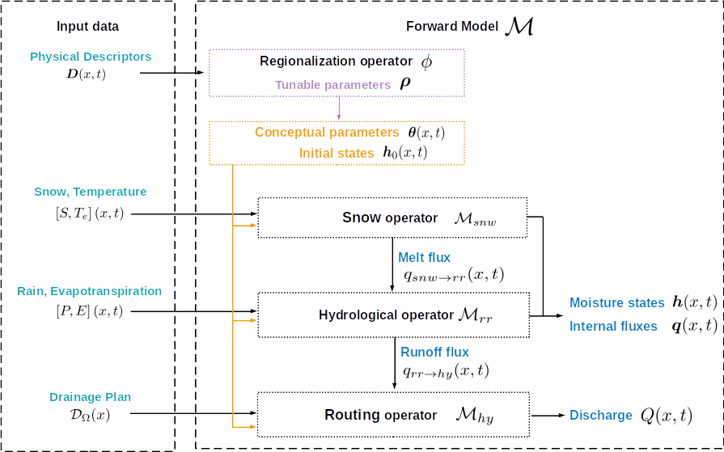
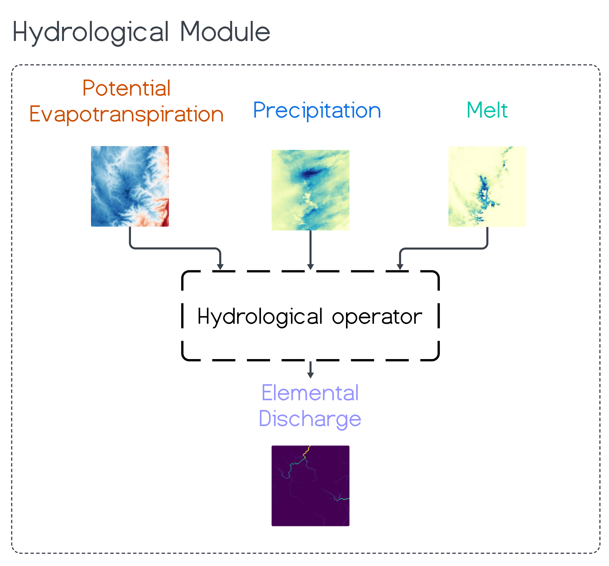

.. _math_num_documentation.forward_structure:

=================
Forward Structure
=================

In `smash` a forward/direct spatially distributed model is obtained by chaining **differentiable hydrological-hydraulic operators** via simulated fluxes:

- (optional) a descriptors-to-parameters mapping :math:`\phi` either for parameters imposing spatial constrain and/or regional mapping between physical descriptor and model conceptual parameters, see :ref:`mapping section <math_num_documentation.mapping>`.
- (optional) a ``snow`` operator :math:`\mathcal{M}_{snw}` generating a melt flux :math:`m_{lt}` which is then summed with the precipitation flux to feed the ``hydrological`` operator :math:`\mathcal{M}_{rr}`.
- A ``hydrological`` production operator :math:`\mathcal{M}_{rr}` generating an elementary discharge :math:`q_t` which feeds the routing operator. 
- A ``routing`` operator :math:`\mathcal{M}_{hy}` simulating propagation of discharge :math:`Q)`.

The operators chaining principle  is presented in section :ref:`forward and inverse problems statement <math_num_documentation.forward_inverse_problem.chaining>` (cf. :ref:`Eq. 2 <math_num_documentation.forward_inverse_problem.forward_problem_Mhy_circ_Mrr>` ) and the chaining fluxes are explicitated in the diagram below. The forward model obtained reads :math:`\mathcal{M}=\mathcal{M}_{hy}\left(\,.\,,\mathcal{M}_{rr}\left(\,.\,,\mathcal{M}_{snw}\left(.\right)\right)\right)` .

This section describes the various operators available in `smash` with mathematical/numerical expression, **input data** :math:`\left[\boldsymbol{I},\boldsymbol{D}\right](x,t)`, **tunable conceptual parameters** :math:`\boldsymbol{\theta}(x,t)` and simulated **state and fluxes** :math:`\boldsymbol{U}(x,t)=\left[Q,\boldsymbol{h},\boldsymbol{q}\right](x,t)`.

These operators are written below for a given pixel :math:`x` of the 2D spatial domain :math:`\Omega` and for a time :math:`t` in the simulation window :math:`\left]0,T\right]`.

    
    Diagram of input data, hydrological-hydraulic operators, simulated quantities of a forward model
    :math:`\mathcal{M}=\mathcal{M}_{hy}\left(\,.\,,\mathcal{M}_{rr}\left(\,.\,,\mathcal{M}_{snw}\left(.\right)\right)\right)` (cf. :ref:`Eq. 2 <math_num_documentation.forward_inverse_problem.forward_problem_Mhy_circ_Mrr>`);
    recall the  composition principle is explained in section :ref:`forward and inverse problems statement <math_num_documentation.forward_inverse_problem>`.
    

.. _math_num_documentation.forward_structure.snow_module:

Snow operator :math:`\mathcal{M}_{snw}`
---------------------------------------

.. dropdown:: zero (Zero Snow)
    :animate: fade-in-slide-down

    This snow operator simply means that there is no snow operator.

    .. math::
        
        m_{lt}(x, t) = 0

    with :math:`m_{lt}` the melt flux.

.. dropdown:: ssn (Simple Snow)
    :animate: fade-in-slide-down

    This snow operator is a simple degree-day snow operator. It can be expressed as follows:

    .. math::

        m_{lt}(x, t) = f\left(\left[S, T_e\right](x, t), k_{mlt}(x), h_s(x, t)\right)

    with :math:`m_{lt}` the melt flux, :math:`S` the snow, :math:`T_e` the temperature, :math:`k_{mlt}` the melt coefficient and :math:`h_s` the state of the snow reservoir.

    .. note::

        Linking with the forward problem equation :ref:`Eq. 1 <math_num_documentation.forward_inverse_problem.forward_problem_M_1>`
        
        - Internal fluxes, :math:`\{m_{lt}\}\in\boldsymbol{q}`
        - Atmospheric forcings, :math:`\{S, T_e\}\in\boldsymbol{\mathcal{I}}`
        - Parameters, :math:`\{k_{mlt}\}\in\boldsymbol{\theta}`
        - States, :math:`\{h_s\}\in\boldsymbol{h}`

    The function :math:`f` is resolved numerically as follows:

    - Update the snow reservoir state :math:`h_s` for :math:`t^* \in \left] t-1 , t\right[`

    .. math::

        h_s(x, t^*) = h_s(x, t-1) + S(x, t)

    - Compute the melt flux :math:`m_{lt}`

    .. math::
        :nowrap:

        \begin{eqnarray}

            m_{lt}(x, t) =
            \begin{cases}

                0 &\text{if} \; T_e(x, t) \leq 0 \\
                \min\left(h_s(x, t^*), k_{mlt}(x)\times T_e(x, t)\right) &\text{otherwise}

            \end{cases}

        \end{eqnarray}

    - Update the snow reservoir state :math:`h_s`

    .. math::

        h_s(x, t) = h_s(x, t^*) - m_{lt}(x, t)

.. _math_num_documentation.forward_structure.hydrological_module:

Hydrological operator :math:`\mathcal{M}_{rr}`
----------------------------------------------

Hydrological processes can be described at pixel scale in `smash` with one of the availabe hydrological operators adapted from state-of-the-art lumped models.

.. _math_num_documentation.forward_structure.hydrological_module.gr4:

.. dropdown:: gr4 (Génie Rural 4)
    :animate: fade-in-slide-down

    This hydrological operator is derived from the GR4 model :cite:p:`perrin2003improvement`.

    .. hint::

        Helpful links about GR:

        - `Brief history of GR models <https://webgr.inrae.fr/models/a-brief-history/>`__
        - `Scientific papers <https://webgr.inrae.fr/publications/articles/>`__
        - `GR models in a R package <https://hydrogr.github.io/airGR/>`__

    .. figure:: ../_static/gr4_structure.svg
        :align: center
        :width: 400
        
        Diagram of the ``gr4`` like hydrological operator

    It can be expressed as follows:

    .. math::

        q_{t}(x, t) = f\left(\left[P, E\right](x, t), m_{lt}(x, t), \left[c_i, c_p, c_t, k_{exc}\right](x), \left[h_i, h_p, h_t\right](x, t)\right)

    with :math:`q_{t}` the elemental discharge, :math:`P` the precipitation, :math:`E` the potential evapotranspiration,
    :math:`m_{lt}` the melt flux from the snow operator, :math:`c_i` the maximum capacity of the interception reservoir,
    :math:`c_p` the maximum capacity of the production reservoir, :math:`c_t` the maximum capacity of the transfer reservoir,
    :math:`k_{exc}` the exchange coefficient, :math:`h_i` the state of the interception reservoir, :math:`h_p` the state of the production reservoir
    and :math:`h_t` the state of the transfer reservoir.

    .. note::

        Linking with the forward problem equation :ref:`Eq. 1 <math_num_documentation.forward_inverse_problem.forward_problem_M_1>`
        
        - Internal fluxes, :math:`\{q_{t}, m_{lt}\}\in\boldsymbol{q}`
        - Atmospheric forcings, :math:`\{P, E\}\in\boldsymbol{\mathcal{I}}`
        - Parameters, :math:`\{c_i, c_p, c_t, k_{exc}\}\in\boldsymbol{\theta}`
        - States, :math:`\{h_i, h_p, h_t\}\in\boldsymbol{h}`

    The function :math:`f` is resolved numerically as follows:

    **Interception**

    - Compute interception evaporation :math:`e_i`

    .. math::

        e_i(x, t) = \min(E(x, t), P(x, t) + m_{lt}(x, t) + h_i(x, t - 1)\times c_i(x))

    - Compute the neutralized precipitation :math:`p_n` and evaporation :math:`e_n`

    .. math::
        :nowrap:

        \begin{eqnarray}

            &p_n(x, t)& &=& &\max \left(0, \; P(x, t) + m_{lt}(x, t) - c_i(x) \times (1 - h_i(x, t - 1)) - e_i(x, t) \right)\\

            &e_n(x, t)& &=& &E(x, t) - e_i(x, t)

        \end{eqnarray}

    - Update the interception reservoir state :math:`h_i`

    .. math::

        h_i(x, t) = h_i(x, t - 1) + \frac{P(x, t) + m_{lt}(x, t) + e_i(x, t) - p_n(x, t)}{c_i(x)}

    **Production**

    - Compute the production infiltrating precipitation :math:`p_s` and evaporation :math:`e_s`

    .. math::
        :nowrap:

        \begin{eqnarray}

        &p_s(x, t)& &=& &c_p(x) (1 - h_p(x, t - 1)^2) \frac{\tanh\left(\frac{p_n(x, t)}{c_p(x)}\right)}{1 + h_p(x, t - 1) \tanh\left(\frac{p_n(x, t)}{c_p(x)}\right)}\\

        &e_s(x, t)& &=& &h_p(x, t - 1) c_p(x) (2 - h_p(x, t - 1)) \frac{\tanh\left(\frac{e_n(x, t)}{c_p(x)}\right)}{1 + (1 - h_p(x, t - 1)) \tanh\left(\frac{e_n(x, t)}{c_p(x)}\right)}
        \end{eqnarray}

    - Update the production reservoir state :math:`h_p`

    .. math::

        h_p(x, t^*) = h_p(x, t - 1) + \frac{p_s(x, t) - e_s(x, t)}{c_p(x)}

    - Compute the production runoff :math:`p_r`

    .. math::
        :nowrap:

        \begin{eqnarray}

            p_r(x, t) =
            \begin{cases}

                0 &\text{if} \; p_n(x, t) \leq 0 \\
                p_n(x, t) - (h_p(x, t^*) - h_p(x, t - 1))c_p(x) &\text{otherwise}

            \end{cases}

        \end{eqnarray}

    - Compute the production percolation :math:`p_{erc}`

    .. math::

        p_{erc}(x, t) = h_p(x, t^*) c_p(x) \left(1 - \left(1 + \left(\frac{4}{9}h_p(x, t^*)\right)^4\right)^{-1/4}\right)

    - Update the production reservoir state :math:`h_p`

    .. math::

        h_p(x, t) = h_p(x, t^*) - \frac{p_{erc}(x, t)}{c_p(x)}

    **Exchange**

    - Compute the exchange flux :math:`l_{exc}`

    .. math::

        l_{exc}(x, t) = k_{exc}(x) h_t(x, t - 1)^{7/2}

    **Transfer**

    - Split the production runoff :math:`p_r` into two branches (transfer and direct), :math:`p_{rr}` and :math:`p_{rd}`

    .. math::
        :nowrap:

        \begin{eqnarray}

            &p_{rr}(x, t)& &=& &0.9(p_r(x, t) + p_{erc}(x, t)) + l_{exc}(x, t)\\
            &p_{rd}(x, t)& &=& &0.1(p_r(x, t) + p_{erc}(x, t))

        \end{eqnarray}

    - Update the transfer reservoir state :math:`h_t`

    .. math::
        
        h_t(x, t^*) = \max\left(0, h_t(x, t - 1) + \frac{p_{rr}(x, t)}{c_t(x)}\right)

    - Compute the transfer branch elemental discharge :math:`q_r`

    .. math::
        :nowrap:

        \begin{eqnarray}

            q_r(x, t) = h_t(x, t^*)c_t(x) - \left(\left(h_t(x, t^*)c_t(x)\right)^{-4} + c_t(x)^{-4}\right)^{-1/4}

        \end{eqnarray}

    - Update the transfer reservoir state :math:`h_t`

    .. math::

        h_t(x, t) = h_t(x, t^*) - \frac{q_r(x, t)}{c_t(x)}

    - Compute the direct branch elemental discharge :math:`q_d`

    .. math::

        q_d(x, t) = \max(0, p_{rd}(x, t) + l_{exc}(x, t))

    - Compute the elemental discharge :math:`q_t`

    .. math::

        q_t(x, t) = q_r(x, t) + q_d(x, t)

.. _math_num_documentation.forward_structure.hydrological_module.gr5:

.. dropdown:: gr5 (Génie Rural 5)
    :animate: fade-in-slide-down

    This hydrological operator is derived from the GR5 model :cite:p:`LeMoine_2008`. It consists in a gr4 like model stucture (see diagram above)  with a modified exchange flux with two parameters to account for seasonal variaitons.

    .. hint::

        Helpful links about GR:

        - `Brief history of GR models <https://webgr.inrae.fr/models/a-brief-history/>`__
        - `Scientific papers <https://webgr.inrae.fr/publications/articles/>`__
        - `GR models in a R package <https://hydrogr.github.io/airGR/>`__

    .. figure:: ../_static/gr5_structure.svg
        :align: center
        :width: 400
        
        Diagram of the ``gr5`` like hydrological operator

    It can be expressed as follows:

    .. math::

        q_{t}(x, t) = f\left(\left[P, E\right](x, t), m_{lt}(x, t), \left[c_i, c_p, c_t, k_{exc}, a_{exc}\right](x), \left[h_i, h_p, h_t\right](x, t)\right)

    with :math:`q_{t}` the elemental discharge, :math:`P` the precipitation, :math:`E` the potential evapotranspiration,
    :math:`m_{lt}` the melt flux from the snow operator, :math:`c_i` the maximum capacity of the interception reservoir,
    :math:`c_p` the maximum capacity of the production reservoir, :math:`c_t` the maximum capacity of the transfer reservoir,
    :math:`k_{exc}` the exchange coefficient, :math:`a_{exc}` the exchange threshold, :math:`h_i` the state of the interception reservoir, 
    :math:`h_p` the state of the production reservoir and :math:`h_t` the state of the transfer reservoir.

    .. note::

        Linking with the forward problem equation :ref:`Eq. 1 <math_num_documentation.forward_inverse_problem.forward_problem_M_1>`
        
        - Internal fluxes, :math:`\{q_{t}, m_{lt}\}\in\boldsymbol{q}`
        - Atmospheric forcings, :math:`\{P, E\}\in\boldsymbol{\mathcal{I}}`
        - Parameters, :math:`\{c_i, c_p, c_t, k_{exc}, a_{exc}\}\in\boldsymbol{\theta}`
        - States, :math:`\{h_i, h_p, h_t\}\in\boldsymbol{h}`

    The function :math:`f` is resolved numerically as follows:

    **Interception**

    Same as ``gr4`` interception, see :ref:`GR4 Interception <math_num_documentation.forward_structure.hydrological_module.gr4>`

    **Production**

    Same as ``gr4`` production, see :ref:`GR4 Production <math_num_documentation.forward_structure.hydrological_module.gr4>`

    **Exchange**

    - Compute the exchange flux :math:`l_{exc}`

    .. math::

        l_{exc}(x, t) = k_{exc}(x) \left(h_t(x, t - 1) - a_{exc}(x)\right)

    **Transfer**

    Same as ``gr4`` transfer, see :ref:`GR4 Transfer <math_num_documentation.forward_structure.hydrological_module.gr4>`

.. _math_num_documentation.forward_structure.hydrological_module.grd:

.. dropdown:: grd (Génie Rural Distribué)
    :animate: fade-in-slide-down

    This hydrological operator is derived from the GR models and is a simplified strucutre used in :cite:p:`jay2019potential`.

    .. figure:: ../_static/grd_structure.svg
        :align: center
        :width: 300
        
        Diagram of the ``grd`` hydrological operator, a simplified ``GR`` like

    It can be expressed as follows:

    .. math::

        q_{t}(x, t) = f\left(\left[P, E\right](x, t), m_{lt}(x, t), \left[c_p, c_t\right](x), \left[h_p, h_t\right](x, t)\right)

    with :math:`q_{t}` the elemental discharge, :math:`P` the precipitation, :math:`E` the potential evapotranspiration,
    :math:`m_{lt}` the melt flux from the snow operator, :math:`c_p` the maximum capacity of the production reservoir, 
    :math:`c_t` the maximum capacity of the transfer reservoir, :math:`h_p` the state of the production reservoir and
    :math:`h_t` the state of the transfer reservoir.

    .. note::

        Linking with the forward problem equation :ref:`Eq. 1 <math_num_documentation.forward_inverse_problem.forward_problem_M_1>`
        
        - Internal fluxes, :math:`\{q_{t}, m_{lt}\}\in\boldsymbol{q}`
        - Atmospheric forcings, :math:`\{P, E\}\in\boldsymbol{\mathcal{I}}`
        - Parameters, :math:`\{c_p, c_t\}\in\boldsymbol{\theta}`
        - States, :math:`\{h_p, h_t\}\in\boldsymbol{h}`

    The function :math:`f` is resolved numerically as follows:

    **Interception**

    - Compute the interception evaporation :math:`e_i`

    .. math::

        e_i(x, t) = \min(E(x, t), P(x, t) + m_{lt}(x, t))

    - Compute the neutralized precipitation :math:`p_n` and evaporation :math:`e_n`

    .. math::
        :nowrap:

        \begin{eqnarray}

            &p_n(x, t)& &=& &\max \left(0, \; P(x, t) + m_{lt}(x, t) - e_i(x, t) \right)\\

            &e_n(x, t)& &=& &E(x, t) - e_i(x, t)

        \end{eqnarray}

    **Production**

    Same as ``gr4`` production, see :ref:`GR4 Production <math_num_documentation.forward_structure.hydrological_module.gr4>`

    **Transfer**

    - Update the transfer reservoir state :math:`h_t`

    .. math::
        
        h_t(x, t^*) = \max\left(0, h_t(x, t - 1) + \frac{p_{r}(x, t)}{c_t(x)}\right)

    - Compute the transfer branch elemental discharge :math:`q_r`

    .. math::
        :nowrap:

        \begin{eqnarray}

            q_r(x, t) = h_t(x, t^*)c_t(x) - \left(\left(h_t(x, t^*)c_t(x)\right)^{-4} + c_t(x)^{-4}\right)^{-1/4}

        \end{eqnarray}

    - Update the transfer reservoir state :math:`h_t`

    .. math::

        h_t(x, t) = h_t(x, t^*) - \frac{q_r(x, t)}{c_t(x)}

    - Compute the elemental discharge :math:`q_t`

    .. math::

        q_t(x, t) = q_r(x, t)

.. _math_num_documentation.forward_structure.hydrological_module.loieau:

.. dropdown:: loieau (LoiEau)
    :animate: fade-in-slide-down

    This hydrological operator is derived from the GR model :cite:p:`Folton_2020`.

    .. hint::

        Helpful links about LoiEau:

        - `Database <https://loieau.recover.inrae.fr/>`__

    .. figure:: ../_static/loieau_structure.svg
        :align: center
        :width: 300
        
        Diagram of the ``loieau`` like hydrological operator

    It can be expressed as follows:

    .. math::

        q_{t}(x, t) = f\left(\left[P, E\right](x, t), m_{lt}(x, t), \left[c_a, c_c, k_b\right](x), \left[h_a, h_c\right](x, t)\right)

    with :math:`q_{t}` the elemental discharge, :math:`P` the precipitation, :math:`E` the potential evapotranspiration,
    :math:`m_{lt}` the melt flux from the snow operator, :math:`c_a` the maximum capacity of the production reservoir, 
    :math:`c_c` the maximum capacity of the transfer reservoir, :math:`k_b` the transfer coefficient, 
    :math:`h_a` the state of the production reservoir and :math:`h_c` the state of the transfer reservoir.

    .. note::

        Linking with the forward problem equation :ref:`Eq. 1 <math_num_documentation.forward_inverse_problem.forward_problem_M_1>`
        
        - Internal fluxes, :math:`\{q_{t}, m_{lt}\}\in\boldsymbol{q}`
        - Atmospheric forcings, :math:`\{P, E\}\in\boldsymbol{\mathcal{I}}`
        - Parameters, :math:`\{c_a, c_c, k_b\}\in\boldsymbol{\theta}`
        - States, :math:`\{h_a, h_c\}\in\boldsymbol{h}`

    The function :math:`f` is resolved numerically as follows:

    **Interception**

    Same as ``grd`` interception, see :ref:`GRD Interception <math_num_documentation.forward_structure.hydrological_module.grd>`

    **Production**

    Same as ``gr4`` production, see :ref:`GR4 Production <math_num_documentation.forward_structure.hydrological_module.gr4>`

    .. note::

        The parameter :math:`c_p` is replaced by :math:`c_a` and the state :math:`h_p` by :math:`h_a`

    **Transfer**

    - Split the production runoff :math:`p_r` into two branches (transfer and direct), :math:`p_{rr}` and :math:`p_{rd}`

    .. math::
        :nowrap:

        \begin{eqnarray}

            &p_{rr}(x, t)& &=& &0.9(p_r(x, t) + p_{erc}(x, t))\\
            &p_{rd}(x, t)& &=& &0.1(p_r(x, t) + p_{erc}(x, t))

        \end{eqnarray}

    - Update the transfer reservoir state :math:`h_c`

    .. math::
        
        h_c(x, t^*) = \max\left(0, h_c(x, t - 1) + \frac{p_{rr}(x, t)}{c_c(x)}\right)

    - Compute the transfer branch elemental discharge :math:`q_r`

    .. math::
        :nowrap:

        \begin{eqnarray}

            q_r(x, t) = h_c(x, t^*)c_c(x) - \left(\left(h_c(x, t^*)c_c(x)\right)^{-3} + c_c(x)^{-3}\right)^{-1/3}

        \end{eqnarray}

    - Update the transfer reservoir state :math:`h_c`

    .. math::

        h_c(x, t) = h_c(x, t^*) - \frac{q_r(x, t)}{c_c(x)}

    - Compute the direct branch elemental discharge :math:`q_d`

    .. math::

        q_d(x, t) = \max(0, p_{rd}(x, t))

    - Compute the elemental discharge :math:`q_t`

    .. math::

        q_t(x, t) = k_b(x)\left(q_r(x, t) + q_d(x, t)\right)

.. _math_num_documentation.forward_structure.hydrological_module.vic3l:

.. dropdown:: vic3l (Variable Infiltration Curve 3 Layers)
    :animate: fade-in-slide-down

    This hydrological operator is derived from the VIC model :cite:p:`liang1994simple`.

    .. hint::

        Helpful links about VIC:

        - `Model overview <https://vic.readthedocs.io/en/master/Overview/ModelOverview/>`__
        - `References <https://vic.readthedocs.io/en/master/Documentation/References/>`__
        - `GitHub <https://github.com/UW-Hydro/VIC/>`__

    .. figure:: ../_static/vic3l_structure.svg
        :align: center
        :width: 300
        
        Diagram of the ``vic3l`` like hydrological operator

    It can be expressed as follows:

    .. math::

        q_{t}(x, t) = f\left(\left[P, E\right](x, t), m_{lt}(x, t), \left[b, c_{usl}, c_{msl}, c_{bsl}, k_s, p_{bc}, d_{sm}, d_s, w_s\right](x), \left[h_{cl}, h_{usl}, h_{msl}, h_{bsl}\right](x, t)\right)

    with :math:`q_{t}` the elemental discharge, :math:`P` the precipitation, :math:`E` the potential evapotranspiration,
    :math:`m_{lt}` the melt flux from the snow operator, :math:`b` the variable infiltration curve parameter,
    :math:`c_{usl}` the maximum capacity of the upper soil layer, :math:`c_{msl}` the maximum capacity of the medium soil layer,
    :math:`c_{bsl}` the maximum capacity of the bottom soil layer, :math:`k_s` the saturated hydraulic conductivity,
    :math:`p_{bc}` the Brooks and Corey exponent, :math:`d_{sm}` the maximum velocity of baseflow, 
    :math:`d_s` the non-linear baseflow threshold maximum velocity, :math:`w_s` the non-linear baseflow threshold soil moisture,
    :math:`h_{cl}` the state of the canopy layer, :math:`h_{usl}` the state of the upper soil layer,
    :math:`h_{msl}` the state of the medium soil layer and :math:`h_{bsl}` the state of the bottom soil layer. 

    .. note::

        Linking with the forward problem equation :ref:`Eq. 1 <math_num_documentation.forward_inverse_problem.forward_problem_M_1>`
        
        - Internal fluxes, :math:`\{q_{t}, m_{lt}\}\in\boldsymbol{q}`
        - Atmospheric forcings, :math:`\{P, E\}\in\boldsymbol{\mathcal{I}}`
        - Parameters, :math:`\{b, c_{usl}, c_{msl}, c_{bsl}, k_s, p_{bc}, d_{sm}, d_s, w_s\}\in\boldsymbol{\theta}`
        - States, :math:`\{h_{cl}, h_{usl}, h_{msl}, h_{bsl}\}\in\boldsymbol{h}`

    The function :math:`f` is resolved numerically as follows:

    **Canopy layer interception**

    - Compute the canopy layer interception evaporation :math:`e_c`

    .. math::

        e_c(x, t) = \min(E(x, t)h_{cl}(x, t - 1)^{2/3}, P(x, t) + m_{lt}(x, t) + h_{cl}(x, t - 1))

    - Compute the neutralized precipitation :math:`p_n` and evaporation :math:`e_n`

    .. math::
        :nowrap:

        \begin{eqnarray}

            &p_n(x, t)& &=& &\max\left(0, P(x, t) + m_{lt}(x, t) - (1 - h_{cl}(x, t - 1)) - e_c(x, t)\right)\\
            &e_n(x, t)& &=& &E(x, t) - e_c(x, t)

        \end{eqnarray}

    - Update the canopy layer interception state :math:`h_{cl}`

    .. math::

        h_{cl}(x, t) = h_{cl}(x, t - 1) + P(x, t) - e_c(x, t) - p_n(x, t)

    **Upper soil layer evaporation**

    - Compute the maximum :math:`i_{m}` and the corresponding soil saturation :math:`i_{0}` infiltration

    .. math::
        :nowrap:

        \begin{eqnarray}

            &i_{m}(x, t)& &=& &(1 + b(x))c_{usl}(x)\\
            &i_{0}(x, t)& &=& &i_{m}(x, t)\left(1 - (1 - h_{usl}(x, t - 1))^{1/(1 - b(x))}\right)

        \end{eqnarray}

    - Compute the upper soil layer evaporation :math:`e_s`

    .. math::
        :nowrap:

        \begin{eqnarray}

            e_s(x, t) =
            \begin{cases}

                e_n(x, t) &\text{if} \; i_{0}(x, t) \geq i_{m}(x, t) \\
                \beta(x, t)e_n(x, t) &\text{otherwise}

            \end{cases}

        \end{eqnarray}

    with :math:`\beta`, the beta function in the ARNO evaporation :cite:p:`todini1996arno` (Appendix A)

    .. FIXME Maybe explain what is the beta function, power expansion ...

    - Update the upper soil layer reservoir state :math:`h_{usl}`

    .. math::

        h_{usl}(x, t) = h_{usl}(x, t - 1) - \frac{e_s(x, t)}{c_{usl}(x)}

    **Infiltration**

    - Compute the maximum capacity :math:`c_{umsl}`, the soil moisture :math:`w_{umsl}` and the relative state :math:`h_{umsl}` of the first two layers

    .. math::
        :nowrap:

        \begin{eqnarray}

            &c_{umsl}(x)& &=& &c_{usl}(x) + c_{msl}(x)\\
            &w_{umsl}(x, t - 1)& &=& &h_{usl}(x, t - 1)c_{usl}(x) + h_{msl}(x, t - 1)c_{msl}(x)\\
            &h_{umsl}(x, t - 1)& &=& &\frac{w_{umsl}(x, t - 1)}{c_{umsl}(x)}

        \end{eqnarray}

    - Compute the maximum :math:`i_{m}` and the corresponding soil saturation :math:`i_{0}` infiltration

    .. math::
        :nowrap:

        \begin{eqnarray}

            &i_{m}(x, t)& &=& &(1 + b(x))c_{umsl}(x)\\
            &i_{0}(x, t)& &=& &i_{m}(x, t)\left(1 - (1 - h_{umsl}(x, t - 1))^{1/(1 - b(x))}\right)

        \end{eqnarray}

    - Compute the infiltration :math:`i`

    .. math::
        :nowrap:

        \begin{eqnarray}

            i(x, t) = 
            \begin{cases}

                c_{umsl}(x) - w_{umsl}(x, t - 1) &\text{if} \; i_{0}(x, t) + p_n(x, t) > i_{m}(x, t) \\
                c_{umsl}(x) - w_{umsl}(x, t - 1) - c_{umsl}(x)\left(1 - \frac{i_{0}(x, t) + p_n(x, t)}{i_m(x, t)}\right)^{b(x) + 1} &\text{otherwise}

            \end{cases}

        \end{eqnarray}

    - Distribute the infiltration :math:`i` between the first two layers, :math:`i_{usl}` and :math:`i_{msl}`

    .. math::
        :nowrap:

        \begin{eqnarray}

            &i_{usl}(x, t)& &=& &\min((1 - h_{usl}(x, t - 1)c_{usl}(x), i(x, t))\\
            &i_{msl}(x, t)& &=& &\min((1 - h_{msl}(x, t - 1)c_{msl}(x), i(x, t) - i_{usl}(x, t))

        \end{eqnarray}

    - Update the first two layers reservoir states, :math:`h_{usl}` and :math:`h_{msl}`

    .. math::
        :nowrap:

        \begin{eqnarray}

            &h_{usl}(x, t)& &=& &h_{usl}(x, t - 1) + i_{usl}(x, t)\\
            &h_{msl}(x, t)& &=& &h_{msl}(x, t - 1) + i_{msl}(x, t)

        \end{eqnarray}

    - Compute the runoff :math:`q_r`

    .. math::

        q_r(x, t) = p_n(x, t) - (i_{usl}(x, t) + i_{msl}(x, t))

    **Drainage**

    - Compute the soil moisture in the first two layers, :math:`w_{usl}` and :math:`w_{msl}`

    .. math::
        :nowrap:

        \begin{eqnarray}

            &w_{usl}(x, t - 1)& &=& &h_{usl}(x, t - 1)c_{usl}(x)\\
            &w_{msl}(x, t - 1)& &=& &h_{msl}(x, t - 1)c_{msl}(x)

        \end{eqnarray}

    - Compute the drainage flux :math:`d_{umsl}` from the upper soil layer to medium soil layer

    .. math::

        d_{umsl}(x, t^*) = k_s(x) * h_{usl}(x, t - 1)^{p_{bc}}

    - Update the drainage flux :math:`d_{umsl}` according to under and over soil layer saturation

    .. math::

        d_{umsl}(x, t) = \min(d_{umsl}(x, t^*), \min(w_{usl}(x, t - 1), c_{msl}(x) - w_{msl}(x, t - 1)))

    - Update the first two layers reservoir states, :math:`h_{usl}` and :math:`h_{msl}`

    .. math::
        :nowrap:

        \begin{eqnarray}

            &h_{usl}(x, t)& &=& &h_{usl}(x, t - 1) - \frac{d_{umsl}(x, t)}{c_{usl}(x)}\\
            &h_{msl}(x, t)& &=& &h_{msl}(x, t - 1) + \frac{d_{umsl}(x, t)}{c_{msl}(x)}

        \end{eqnarray}

    .. note::
        
        The same approach is performed for drainage in the medium and bottom layers. Hence the three first steps are skiped for readability and the update of the reservoir states is directly written.

    - Update of the reservoirs states, :math:`h_{msl}` and :math:`h_{bsl}`

    .. math::
        :nowrap:

        \begin{eqnarray}

            &h_{msl}(x, t)& &=& &h_{msl}(x, t - 1) - \frac{d_{mbsl}(x, t)}{c_{msl}(x)}\\
            &h_{bsl}(x, t)& &=& &h_{bsl}(x, t - 1) + \frac{d_{mbsl}(x, t)}{c_{bsl}(x)}

        \end{eqnarray}

    **Baseflow**

    - Compute the baseflow :math:`q_b`

    .. math::
        :nowrap:

        \begin{eqnarray}

            q_b(x, t) =
            \begin{cases}

                \frac{d_{sm}(x)d_s(x)}{w_s(x)}h_{bsl}(x, t - 1) &\text{if} \; h_{bsl}(x, t - 1) > w_s(x) \\
                \frac{d_{sm}(x)d_s(x)}{w_s(x)}h_{bsl}(x, t - 1) + d_{sm}(x)\left(1 - \frac{d_s(x)}{w_s(x)}\right)\left(\frac{h_{bsl}(x, t - 1) - w_s(x)}{1 - w_s(x)}\right)^2 &\text{otherwise}
            
            \end{cases}

        \end{eqnarray}

    - Update the bottom soil layer reservoir state :math:`h_{bsl}`

    .. math::

        h_{bsl}(x, t) = h_{bsl}(x, t - 1) - \frac{q_b(x, t)}{c_{bsl}(x)}

.. _math_num_documentation.forward_structure.routing_module:

Routing operator :math:`\mathcal{M}_{hy}`
-----------------------------------------

The following routing operators are grid based and adapted to perform on the same grid than the snow and production operators. 
They take as input a 8 direction (D8) drainage plan :math:`\mathcal{D}_{\Omega}\left(x\right)` obtained by terrain elevation processing. 

For all the following models, the 2D flow routing problem over the spatial domain :math:`\Omega` reduces to a 1D problem by using the 
drainage plan :math:`\mathcal{D}_{\Omega}\left(x\right)`. The lattest, for a given cell :math:`x\in\Omega` defines 1 to 7 upstream cells which 
surface discharge can inflow the current cell :math:`x` - each cell has a unique downstream cell.

.. image:: ../_static/routing_module.svg
    :align: center
    :width: 300

.. _math_num_documentation.forward_structure.routing_module.lag0:

.. dropdown:: lag0 (Instantaneous Routing)
    :animate: fade-in-slide-down

    This routing operator is a simple aggregation of upstream discharge to downstream following the drainage plan. It can be expressed as follows:

    .. math::

        Q(x, t) = f\left(Q(x', t), q_{t}(x, t)\right),\;\forall x'\in \Omega_x

    with :math:`Q` the surface discharge, :math:`q_t` the elemental discharge and :math:`\Omega_x` a 2D spatial domain that corresponds to all upstream cells
    flowing into cell :math:`x`, i.e. the whole upstream catchment. Note that :math:`\Omega_x` is a subset of :math:`\Omega`, :math:`\Omega_x\subset\Omega` and for the most upstream cells, 
    :math:`\Omega_x=\emptyset`.

    .. note::

        Linking with the forward problem equation :ref:`Eq. 1 <math_num_documentation.forward_inverse_problem.forward_problem_M_1>`
        
        - Surface discharge, :math:`Q`
        - Internal fluxes, :math:`\{q_{t}\}\in\boldsymbol{q}`

    The function :math:`f` is resolved numerically as follows:

    **Upstream discharge**

    - Compute the upstream discharge :math:`q_{up}`

    .. math::
        :nowrap:

        \begin{eqnarray}

            q_{up}(x, t) = 
            \begin{cases}

                0 &\text{if} \; \Omega_x = \emptyset \\
                \sum_{k\in\Omega_x} Q(k, t) &\text{otherwise}

            \end{cases}

        \end{eqnarray}

    **Surface discharge**

    - Compute the surface discharge :math:`Q`

    .. math::

        Q(x, t) = q_{up}(x, t) + \alpha(x) q_t(x, t)

    with :math:`\alpha` a conversion factor from :math:`mm.\Delta t^{-1}` to :math:`m^3.s^{-1}` for a single cell.

.. _math_num_documentation.forward_structure.routing_module.lr:

.. dropdown:: lr (Linear Reservoir)
    :animate: fade-in-slide-down

    This routing operator is using a linear reservoir to rout upstream discharge to downstream following the drainage plan. It can be expressed as follows:

    .. math::

        Q(x, t) = f\left(Q(x', t), q_{t}(x, t), l_{lr}(x), h_{lr}(x, t)\right),\;\forall x'\in \Omega_x

    with :math:`Q` the surface discharge, :math:`q_t` the elemental discharge, :math:`l_{lr}` the routing lag time, 
    :math:`h_{lr}` the state of the routing reservoir and :math:`\Omega_x` a 2D spatial domain that corresponds to all upstream cells
    flowing into cell :math:`x`. Note that :math:`\Omega_x` is a subset of :math:`\Omega`, :math:`\Omega_x\subset\Omega` and for the most upstream cells, 
    :math:`\Omega_x=\emptyset`.

    .. note::

        Linking with the forward problem equation :ref:`Eq. 1 <math_num_documentation.forward_inverse_problem.forward_problem_M_1>`
        
        - Surface discharge, :math:`Q`
        - Internal fluxes, :math:`\{q_{t}\}\in\boldsymbol{q}`
        - Parameters, :math:`\{l_{lr}\}\in\boldsymbol{\theta}`
        - States, :math:`\{h_{lr}\}\in\boldsymbol{h}`

    The function :math:`f` is resolved numerically as follows:

    **Upstream discharge**

    Same as ``lag0`` upstream discharge, see :ref:`LAG0 Upstream Discharge <math_num_documentation.forward_structure.routing_module.lag0>`

    **Surface discharge**

    - Update the routing reservoir state :math:`h_{lr}`

    .. math::

        h_{lr}(x, t^*) = h_{lr}(x, t) + \frac{1}{\beta(x)} q_{up}(x, t)

    with :math:`\beta` a conversion factor from :math:`mm.\Delta t^{-1}` to :math:`m^3.s^{-1}` for the whole upstream domain :math:`\Omega_x`.

    - Compute the routed discharge :math:`q_{rt}`

    .. math::

        q_{rt}(x, t) = h_{lr}(x, t^*) \left(1 - \exp\left(\frac{-\Delta t}{60\times l_{lr}}\right)\right)

    - Update the routing reservoir state :math:`h_{lr}`

    .. math::

        h_{lr}(x, t) = h_{lr}(x, t^*) - q_{rt}(x, t)

    - Compute the surface discharge :math:`Q`

    .. math::

        Q(x, t) = \beta(x)q_{rt}(x, t) + \alpha(x)q_t(x, t)

    with :math:`\alpha` a conversion factor from from :math:`mm.\Delta t^{-1}` to :math:`m^3.s^{-1}` for a single cell.

.. _math_num_documentation.forward_structure.routing_module.kw:

.. dropdown:: kw (Kinematic Wave) 
    :animate: fade-in-slide-down

    This routing operator is based on a conceptual 1D kinematic wave model that is numerically solved with a linearized implicit numerical scheme :cite:p:`ChowAppliedhydrology`. This is applicable given the drainage plan :math:`\mathcal{D}_{\Omega}\left(x\right)` that enables reducing the routing problem to 1D. 

    The kinematic wave model is a simplification of 1D Saint-Venant hydraulic model. First the mass equation writes:

    .. math:: 
        :name: math_num_documentation.forward_structure.forward_problem_mass_KW

        \partial_{t}A+\partial_{x}Q =q
        
    with :math:`\partial_{\square}` denoting the partial derivation either in time or space, :math:`A` the cross sectional flow area, :math:`Q` the flow discharge and :math:`q` the lateral inflows. 

    Assuming that the momentum equation reduces to

    .. math:: 
        :name: math_num_documentation.forward_structure.forward_problem_momentum_KW
        
        S_0=S_f
        
    with :math:`S_0` the bottom slope and :math:`S_f` the friction slope - i.e. a locally uniform flow with energy grade line parallel to the channel bottom. This momentum equation can be written as :cite:p:`ChowAppliedhydrology`:

    .. math::
        :name: math_num_documentation.forward_structure.conceptual_A_of_Q
        
        A=a_{kw} Q ^{b_{kw}}

    with :math:`a_{kw}` and :math:`b_{kw}` two constants to be estimated - that can also be written using Manning friction law.

    Injecting the momentum parameterization of :ref:`Eq. 3 <math_num_documentation.forward_structure.conceptual_A_of_Q>` into mass equation :ref:`Eq. 1 <math_num_documentation.forward_structure.forward_problem_mass_KW>` 
    leads to the following one equation kinematic wave model :cite:p:`ChowAppliedhydrology`:

    .. math:: 
        :name: math_num_documentation.forward_structure.oneEq_KW_conceptual

        \partial_{x}Q+a_{kw}b_{kw} Q^{b_{kw}-1}\partial_{t}Q=q

    .. hint::

        Helpful link about kinematic wave:

        - `Numerical Solution <https://wecivilengineers.files.wordpress.com/2017/10/applied-hydrology-ven-te-chow.pdf>`__ (page 294, section 9.6)

    The solution of this equation can written as:

    .. math::

        Q(x, t) = f\left(Q(x', t'), q_{t}(x, t'), \left[a_{kw}, b_{kw}\right](x)\right),\;\forall (x', t') \in \Omega_x\times[t-1, t]

    with :math:`Q` the surface discharge, :math:`q_t` the elemental discharge, :math:`a_{kw}` the alpha kinematic wave parameter, 
    :math:`b_{kw}` the beta kinematic wave parameter and :math:`\Omega_x` a 2D spatial domain that corresponds to all upstream cells
    flowing into cell :math:`x`. Note that :math:`\Omega_x` is a subset of :math:`\Omega`, :math:`\Omega_x\subset\Omega` and for the most upstream cells, 
    :math:`\Omega_x=\emptyset`.

    .. note::

        Linking with the forward problem equation :ref:`Eq. 1 <math_num_documentation.forward_inverse_problem.forward_problem_M_1>`
        
        - Surface discharge, :math:`Q`
        - Internal fluxes, :math:`\{q_{t}\}\in\boldsymbol{q}`
        - Parameters, :math:`\{a_{kw}, b_{kw}\}\in\boldsymbol{\theta}`

    For the sake of clarity, the following variables are renamed for this section and the finite difference numerical scheme writting:

    .. list-table:: Renamed variables
        :widths: 25 25
        :header-rows: 1

        * - Before
          - After
        * - :math:`Q(x, t)`
          - :math:`Q_i^j`
        * - :math:`Q(x, t - 1)`
          - :math:`Q_{i}^{j-1}`
        * - :math:`q_t(x, t)`
          - :math:`q_{i}^{j}`
        * - :math:`q_t(x, t - 1)`
          - :math:`q_{i}^{j-1}`

    The function :math:`f` is resolved numerically as follows:

    **Upstream discharge**

    Same as ``lag0`` upstream discharge, see :ref:`LAG0 Upstream Discharge <math_num_documentation.forward_structure.routing_module.lag0>`

    .. note::

        :math:`q_{up}` is denoted here :math:`Q_{i-1}^{j}`

    **Surface discharge**

    - Compute the intermediate variables :math:`d_1` and :math:`d_2`

    .. math::
        :nowrap:

        \begin{eqnarray}

            &d_1& &=& &\frac{\Delta t}{\Delta x}\\
            &d_2& &=& &a_{kw} b_{kw} \left(\frac{\left(Q_i^{j-1} + Q_{i-1}^j\right)}{2}\right)^{b_{kw} - 1}

        \end{eqnarray}

    - Compute the intermediate variables :math:`n_1`, :math:`n_2` and :math:`n_3`

    .. math::
        :nowrap:

        \begin{eqnarray}

            &n_1& &=& &d_1 Q_{i-1}^j\\
            &n_2& &=& &d_2 Q_{i}^{j-1}\\
            &n_3& &=& &d_1 \frac{\left(q_i^{j-1} + q_{i}^{j}\right)}{2}

        \end{eqnarray}

    - Compute the surface discharge :math:`Q_i^j`

    .. math::

        Q_i^j = Q(x, t) = \frac{n_1 + n_2 + n_3}{d_1 + d_2}
