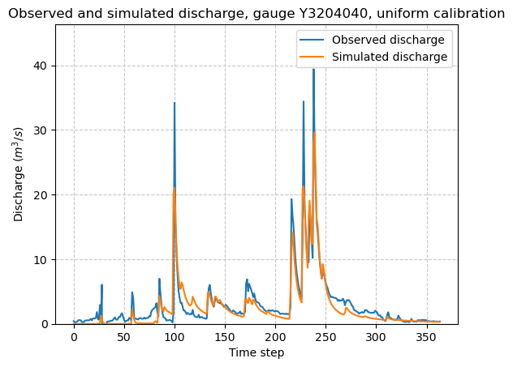
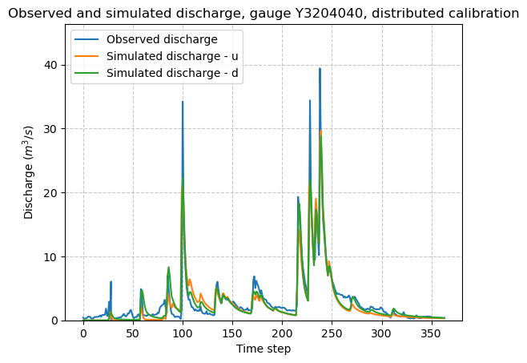
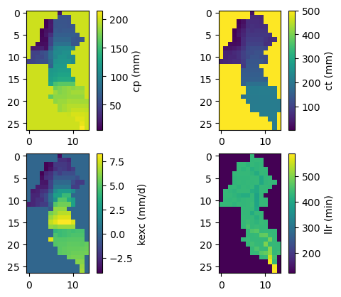

.. _user_guide.classical_uses.fully_distributed_calibration:

=============================
Fully Distributed Calibration
=============================

This tutorial presents the gradient-based optimization of spatially distributed parameters and initial states as enabled in SMASH. The spatial calibration process is initialized from previously calibrated spatially uniform parameters.

.. _user_guide.in_depth.optimize.fully_distributed:

To get started, open a Python interface:

.. code-block:: none

    python3
    
-------
Imports
-------

.. code-block:: python

    >>> import smash
    >>> import numpy as np
    >>> import matplotlib.pyplot as plt
    
--------------
Model creation
--------------

In this tutorial, we will use the :ref:`user_guide.data_and_format_description.lez` dataset as an example.

.. code-block:: python

    >>> setup, mesh = smash.factory.load_dataset("lez")
    >>> model = smash.Model(setup, mesh)

------------------------------
Spatially uniform optimization
------------------------------

First spatially uniform parameters are optimized with the simple global search algithm :math:`\mathrm{SBS}` algorithm:

.. code-block:: python

    >>> model_u = smash.optimize(model, optimize_options={"termination_crit": {"maxiter": 2}}) 

.. code-block:: output

    </> Optimize
    At iterate     0    nfg =     1    J = 6.85771e-01    ddx = 0.64
    At iterate     1    nfg =    30    J = 3.51670e-01    ddx = 0.64
    At iterate     2    nfg =    58    J = 1.80573e-01    ddx = 0.32
    STOP: TOTAL NO. of ITERATIONS REACHED LIMIT

Once the optimization is complete. We can visualize the simulated discharge:

.. code-block:: python

    >>> code = model_d.mesh.code[0]
    >>> plt.plot(model_u.response_data.q[0, :], label="Observed discharge");
    >>> plt.plot(model_u.response.q[0, :], label="Simulated discharge");
    >>> plt.xlabel("Time step");
    >>> plt.ylabel("Discharge ($m^3/s$)");
    >>> plt.grid(ls="--", alpha=.7);
    >>> plt.legend();
    >>> plt.ylim(bottom=0);
    >>> plt.title(f"Observed and simulated discharge, gauge {code}, uniform calibration");

The spatially uniform calibrated parameters, which will serve as the initial guess for the subsequent spatially distributed calibration, are as follows:

.. code-block:: python
    
    >>> ind = tuple(model_u.mesh.gauge_pos[0,:])

    >>> params = {
    >>>     "cp": model_u.get_rr_parameters("cp")[ind],
    >>>     "ct": model_u.get_rr_parameters("ct")[ind],
    >>>     "llr": model_u.get_rr_parameters("llr")[ind],
    >>>     "kexc": model_u.get_rr_parameters("kexc")[ind],
    >>> }
    
    >>> print(" | ".join(f"{k}: {v:.3f}" for k, v in params.items()))

.. code-block:: output

    cp: 55.607 | ct: 139.019 | llr: 431.597 | kexc: 0.685

.. hint::

    You can refer to the :ref:`Bayesian estimation <user_guide.in_depth.bayesian_estimation>` section 
    for information on how to determine a first guess using a Bayesian estimation approach.

----------------------------------
Spatially distributed optimization
----------------------------------

Next, using the first guess provided by a global spatially uniform calibration in the previous step, we perform a spatially distributed calibration using the :math:`\mathrm{L}\text{-}\mathrm{BFGS}\text{-}\mathrm{B}` algorithm:

.. code-block:: python
    
    >>> model_d = smash.optimize(*
            model_u,
            mapping="distributed", 
            optimizer="l-bfgs-b", 
            optimize_options={"termination_crit": {"maxiter": 20}}
        )

.. code-block:: output

    </> Optimize
    At iterate     0    nfg =     1    J = 1.80573e-01    |proj g| = 1.90387e-02
    At iterate     1    nfg =     2    J = 1.74888e-01    |proj g| = 9.94795e-03
    At iterate     2    nfg =     3    J = 1.70161e-01    |proj g| = 4.27593e-03
    At iterate     3    nfg =     4    J = 1.63467e-01    |proj g| = 1.00257e-02
    At iterate     4    nfg =     6    J = 1.56355e-01    |proj g| = 1.55517e-02
    At iterate     5    nfg =     7    J = 1.47279e-01    |proj g| = 1.49576e-02
    At iterate     6    nfg =     8    J = 1.39557e-01    |proj g| = 1.23212e-02
    At iterate     7    nfg =     9    J = 1.36247e-01    |proj g| = 1.26723e-02
    ABNORMAL:                 

We can once again visualize, the simulated discharges (``u``: spatially uniform, ``d``: spatially distributed):

.. code-block:: python

    >>> code = model_d.mesh.code[0]
    >>> plt.plot(model_d.response_data.q[0, :], label="Observed discharge");
    >>> plt.plot(model_u.response.q[0,:], label="Simulated discharge - u");
    >>> plt.plot(model_d.response.q[0, :], label="Simulated discharge - d");
    >>> plt.xlabel("Time step");
    >>> plt.ylabel("Discharge ($m^3/s$)");
    >>> plt.grid(ls="--", alpha=.7);
    >>> plt.legend();
    >>> plt.ylim(bottom=0);
    >>> plt.title(f"Observed and simulated discharge, gauge {code}, distributed calibration");

Finally, we visualize the spatial distribution of the optimized parameters

.. code-block:: python

    >>> f, ax = plt.subplots(2, 2)
    >>> map_cp = ax[0, 0].imshow(model_d.get_rr_parameters("cp"))
    >>> f.colorbar(map_cp, ax=ax[0, 0], label="cp (mm)")
    >>> map_ct = ax[0, 1].imshow(model_d.get_rr_parameters("ct"))
    >>> f.colorbar(map_ct, ax=ax[0, 1], label="ct (mm)")
    >>> map_kexc = ax[1, 0].imshow(model_d.get_rr_parameters("kexc"))
    >>> f.colorbar(map_kexc, ax=ax[1, 0], label="kexc (mm/d)")
    >>> map_llr = ax[1, 1].imshow(model_d.get_rr_parameters("llr"))
    >>> f.colorbar(map_llr, ax=ax[1, 1], label="llr (min)")
    >>> plt.show()
    

