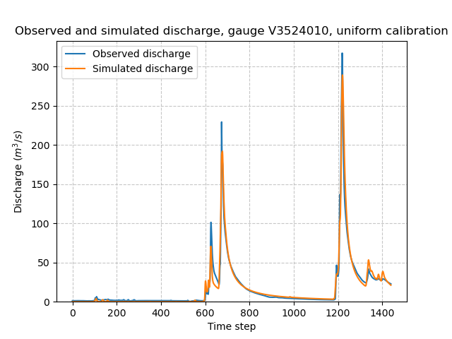
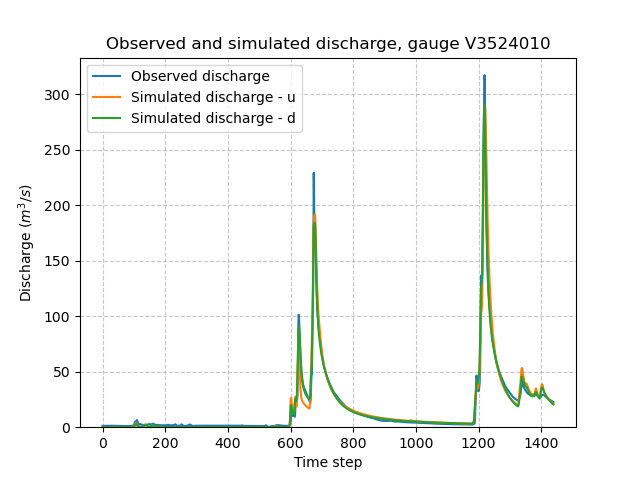
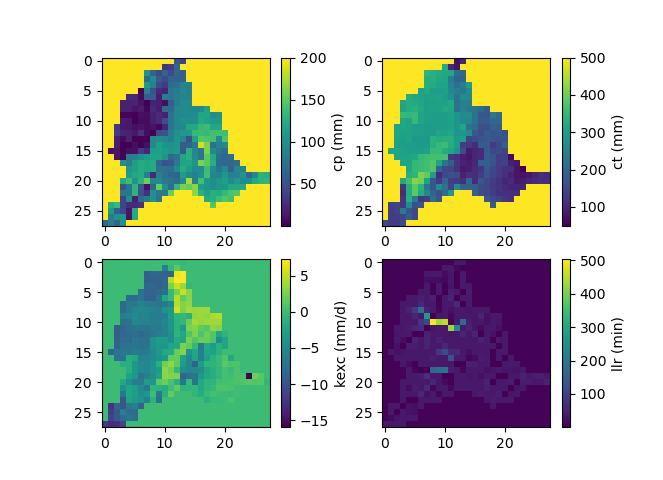

.. _user_guide.classical_uses.fully_distributed_calibration:

=============================
Fully Distributed Calibration
=============================

This tutorial presents the gradient-based optimization of spatially distributed parameters and initial states as enabled in `smash`. 
The spatial calibration process is initialized from pre-calibrated spatially uniform parameters.

To get started, open a Python interface:

.. code-block:: none

    python3
    
-------
Imports
-------

.. code-block:: python

    >>> import smash
    >>> import matplotlib.pyplot as plt
    
--------------
Model creation
--------------

In this tutorial, we will use the :ref:`user_guide.data_and_format_description.cance` dataset as an example.

.. code-block:: python

    >>> setup, mesh = smash.factory.load_dataset("Cance")
    >>> model = smash.Model(setup, mesh)

------------------------------
Spatially uniform optimization
------------------------------

First, spatially uniform parameters are optimized using the simple global search :math:`\mathrm{SBS}` algorithm with a small number of iterations to provide a first guess for the hydrological parameters (see explanation on :ref:`first guess selection <math_num_documentation.mapping.spatially_uniform.first_guess>` for details):

.. code-block:: python

    >>> model_u = smash.optimize(model, optimize_options={"termination_crit": {"maxiter": 2}}) 

.. code-block:: output

    </> Optimize
        At iterate     0    nfg =     1    J = 6.95010e-01    ddx = 0.64
        At iterate     1    nfg =    30    J = 9.84102e-02    ddx = 0.64
        At iterate     2    nfg =    59    J = 4.54091e-02    ddx = 0.32
        STOP: TOTAL NO. of ITERATIONS REACHED LIMIT

.. hint::
    You can refer to the :meth:`smash.multiset_estimate` method and the :ref:`Multi-set Parameters Estimate <user_guide.in_depth.multiset_parameters_estimate>` tutorial to learn how to obtain the first guess using a Bayesian-like estimate on multiple sets of solutions.

Once the optimization is complete. We can visualize the simulated discharge:

.. code-block:: python

    >>> code = model_u.mesh.code[0]
    >>> plt.plot(model_u.response_data.q[0, :], label="Observed discharge")
    >>> plt.plot(model_u.response.q[0, :], label="Simulated discharge")
    >>> plt.xlabel("Time step")
    >>> plt.ylabel("Discharge ($m^3/s$)")
    >>> plt.grid(ls="--", alpha=.7)
    >>> plt.legend()
    >>> plt.ylim(bottom=0)
    >>> plt.title(f"Observed and simulated discharge, gauge {code}, uniform calibration")
    >>> plt.show()

The spatially uniform calibrated parameters, which will serve as a first guess for the subsequent spatially distributed calibration, are as follows:

.. code-block:: python
    
    >>> ind = tuple(model_u.mesh.gauge_pos[0, :])  # get the outlet gauge position
    >>> 
    >>> params = {
    >>>     "cp": model_u.get_rr_parameters("cp")[ind],
    >>>     "ct": model_u.get_rr_parameters("ct")[ind],
    >>>     "llr": model_u.get_rr_parameters("llr")[ind],
    >>>     "kexc": model_u.get_rr_parameters("kexc")[ind],
    >>> }
    >>> 
    >>> print(" | ".join(f"{k}: {v:.3f}" for k, v in params.items()))

.. code-block:: output

    cp: 76.579 | ct: 263.646 | llr: 34.105 | kexc: -0.325

----------------------------------
Spatially distributed optimization
----------------------------------

Next, using the first guess provided by a global spatially uniform calibration in the previous step, we perform a spatially distributed calibration using the :math:`\mathrm{L}\text{-}\mathrm{BFGS}\text{-}\mathrm{B}` algorithm:

.. code-block:: python
    
    >>> model_d = smash.optimize(
    >>>     model_u,
    >>>     mapping="distributed", 
    >>>     optimizer="lbfgsb",
    >>> )

.. code-block:: output

    </> Optimize
        At iterate     0    nfg =     1    J = 4.54093e-02    |proj g| = 1.62286e-01
        At iterate     1    nfg =     3    J = 4.03796e-02    |proj g| = 2.75469e-02
        At iterate     2    nfg =     4    J = 4.00789e-02    |proj g| = 1.11513e-02
        ...
        At iterate    99    nfg =   108    J = 9.93878e-03    |proj g| = 1.36990e-03
        At iterate   100    nfg =   109    J = 9.80383e-03    |proj g| = 1.39941e-03
        STOP: TOTAL NO. of ITERATIONS REACHED LIMIT

.. note::
    Compared to spatially uniform optimization, the size of the control vector (i.e., the vector of parameters to be optimized) is significantly larger, as it includes spatially distributed parameters, thus the total number of parameters to be calibrated equal to the number of hydrological parameters multiplied by the number of active cells. 
    This provides the model with greater flexibility to fit the observed discharge but also increases the risk of over-parameterization, particularly when observational data are sparse.

.. hint::
    To mitigate potential over-parameterization with fully distributed calibration, regularization techniques can be applied (refer to the :ref:`Calibration with Regularization Term <user_guide.in_depth.calibration_with_regularization_term>` tutorial for more details).
    Alternatively, physical descriptors can be used to estimate spatially distributed parameters through regionalization mappings (see the tutorial on :ref:`Regionalization and Spatial Validation <user_guide.classical_uses.regionalization_spatial_validation>`).

We can once again visualize, the simulated discharges (``u``: spatially uniform, ``d``: spatially distributed):

.. code-block:: python

    >>> code = model_d.mesh.code[0]
    >>> plt.plot(model_d.response_data.q[0, :], label="Observed discharge")
    >>> plt.plot(model_u.response.q[0, :], label="Simulated discharge - u")
    >>> plt.plot(model_d.response.q[0, :], label="Simulated discharge - d")
    >>> plt.xlabel("Time step")
    >>> plt.ylabel("Discharge ($m^3/s$)")
    >>> plt.grid(ls="--", alpha=.7)
    >>> plt.legend()
    >>> plt.ylim(bottom=0)
    >>> plt.title(f"Observed and simulated discharge, gauge {code}")
    >>> plt.show()

Finally, we visualize the spatial distribution of the optimized parameters:

.. code-block:: python

    >>> f, ax = plt.subplots(2, 2)
    >>> map_cp = ax[0, 0].imshow(model_d.get_rr_parameters("cp"))
    >>> f.colorbar(map_cp, ax=ax[0, 0], label="cp (mm)")
    >>> map_ct = ax[0, 1].imshow(model_d.get_rr_parameters("ct"))
    >>> f.colorbar(map_ct, ax=ax[0, 1], label="ct (mm)")
    >>> map_kexc = ax[1, 0].imshow(model_d.get_rr_parameters("kexc"))
    >>> f.colorbar(map_kexc, ax=ax[1, 0], label="kexc (mm/d)")
    >>> map_llr = ax[1, 1].imshow(model_d.get_rr_parameters("llr"))
    >>> f.colorbar(map_llr, ax=ax[1, 1], label="llr (min)")
    >>> plt.show()
    

