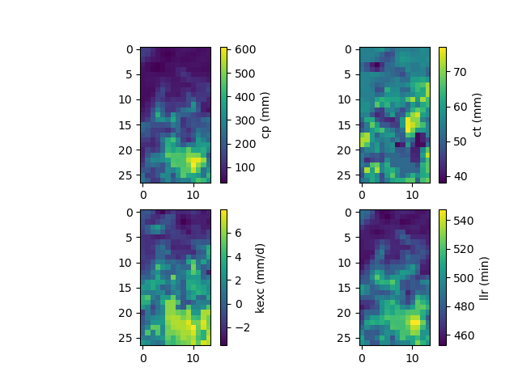
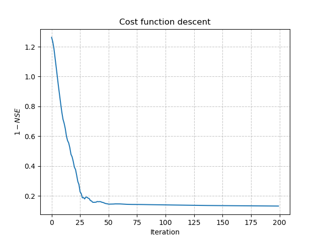
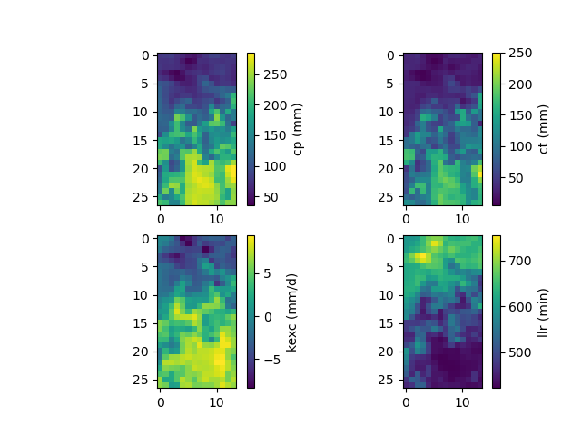

.. _user_guide.classical_uses.regionalization_spatial_validation:

======================================
Regionalization and Spatial Validation
======================================

This tutorial explains how to perform regionalization and spatial validation methods with `smash` using physical descriptors.
The parameters :math:`\boldsymbol{\theta}` can be written as a mapping :math:`\phi` of descriptors :math:`\boldsymbol{\mathcal{D}}`
(slope, drainage density, soil water storage, etc.) and :math:`\boldsymbol{\rho}`, a control vector:
:math:`\boldsymbol{\theta}(x)=\phi\left(\boldsymbol{\mathcal{D}}(x),\boldsymbol{\rho}\right)`.
See the :ref:`math_num_documentation.mapping` section for more details.
Then the control vector of the mapping needs to be optimized: :math:`\boldsymbol{\hat{\rho}}=\underset{\mathrm{\boldsymbol{\rho}}}{\text{argmin}}\;J`,
with :math:`J` being the cost function.

We begin by opening a Python interface:

.. code-block:: none

    python3

Imports
-------

We will first import the necessary libraries for this tutorial.

.. code-block:: python

    >>> import smash
    >>> import numpy as np
    >>> import pandas as pd
    >>> import matplotlib.pyplot as plt

Model creation and descriptors visualization
--------------------------------------------

Now, we need to create a :class:`smash.Model` object.
For this case, we will use the :ref:`user_guide.data_and_format_description.lez` dataset as an example.

Load the ``setup`` and ``mesh`` dictionaries using the `smash.factory.load_dataset` function and create the :class:`smash.Model` object.

.. code-block:: python

    >>> setup, mesh = smash.factory.load_dataset("Lez")
    >>> model = smash.Model(setup, mesh)

Six physical descriptors are considered in this example, which are:

.. image:: ../../_static/physio_descriptors.png
    :align: center

.. TODO: Add descriptor explanation

The values of these descriptors can be obtained in the ``physio_data`` derived type of the :class:`smash.Model` object.

.. code-block:: python

    >>> model.physio_data.descriptor.shape  # (x, y, n_descriptors)

.. code-block:: output

    (27, 14, 6)

.. note::
    In this tutorial, we load the setup dictionary using the `smash.factory.load_dataset` function.
    If you need to define your own setup, ensure that the keys ``read_descriptor``, ``descriptor_name``, and ``descriptor_directory`` are properly set.

Model simulation
----------------

Multiple linear/power mapping
*****************************

Two classical approaches are commonly used for regionalization to map descriptors to parameters:

- ``multi-linear``: a multiple linear mapping where the optimizable parameters are the coefficients.

- ``multi-power``: a multiple power mapping where the optimizable parameters include both the coefficients and the exponents.

In this example, we use the multi-linear mapping. Before optimizing the model, it is recommended to provide a first guess for the control vector  
(see explanation on :ref:`first guess selection <math_num_documentation.mapping.spatially_uniform.first_guess>` for details).

.. code-block:: python

    >>> # First guess should be optimized for a small number of iterations
    >>> optimize_options = {"termination_crit": {"maxiter": 2}}
    >>> # Find first guess by optimizing the model using a uniform mapping
    >>> model_ml = smash.optimize(model, optimize_options=optimize_options)

.. code-block:: output

    </> Optimize
        At iterate     0    nfg =     1    J = 6.85771e-01    ddx = 0.64
        At iterate     1    nfg =    30    J = 3.51670e-01    ddx = 0.64
        At iterate     2    nfg =    58    J = 1.80573e-01    ddx = 0.32
        STOP: TOTAL NO. of ITERATIONS REACHED LIMIT

.. hint::
    You can refer to the :meth:`smash.multiset_estimate` method and the :ref:`Multi-set Parameters Estimate <user_guide.in_depth.multiset_parameters_estimate>` tutorial to learn how to obtain the first guess using a Bayesian-like estimate on multiple sets of solutions.

Now, we can optimize the model using the multi-linear mapping.

.. code-block:: python

    >>> # Optimize model using multi-linear mapping
    >>> model_ml.optimize(mapping="multi-linear")

.. code-block:: output

    </> Optimize
        At iterate     0    nfg =     1    J = 1.80573e-01    |proj g| = 1.74191e-01
        At iterate     1    nfg =     3    J = 1.78344e-01    |proj g| = 6.51597e-02
        At iterate     2    nfg =     4    J = 1.77767e-01    |proj g| = 5.04328e-02
        At iterate     3    nfg =     5    J = 1.76513e-01    |proj g| = 3.56779e-02
        ...
        At iterate    62    nfg =    72    J = 1.31757e-01    |proj g| = 4.70840e-03
        At iterate    63    nfg =    73    J = 1.31750e-01    |proj g| = 2.37749e-03
        At iterate    64    nfg =    88    J = 1.31750e-01    |proj g| = 2.37749e-03
        CONVERGENCE: REL_REDUCTION_OF_F_<=_FACTR*EPSMCH

We have therefore optimized the set of rainfall-runoff parameters using a multiple linear regression constrained by
physiographic descriptors. Here, most of the options used are the default ones, i.e., a minimization of one minus the Nash-Sutcliffe
efficiency on the most downstream gauge of the domain. The resulting rainfall-runoff parameter maps can be viewed.

.. code-block:: python

    >>> f, ax = plt.subplots(2, 2)
    >>> 
    >>> map_cp = ax[0, 0].imshow(model_ml.get_rr_parameters("cp"))
    >>> f.colorbar(map_cp, ax=ax[0, 0], label="cp (mm)")
    >>> map_ct = ax[0, 1].imshow(model_ml.get_rr_parameters("ct"))
    >>> f.colorbar(map_ct, ax=ax[0, 1], label="ct (mm)")
    >>> map_kexc = ax[1, 0].imshow(model_ml.get_rr_parameters("kexc"))
    >>> f.colorbar(map_kexc, ax=ax[1, 0], label="kexc (mm/d)")
    >>> map_llr = ax[1, 1].imshow(model_ml.get_rr_parameters("llr"))
    >>> f.colorbar(map_llr, ax=ax[1, 1], label="llr (min)")
    >>> plt.show()

The spatial validation can be performed by evaluating the model performances at non-calibrated gauges:

.. code-block:: python
    
    >>> metrics = ["NSE", "KGE"]
    >>>
    >>> scores = np.round(smash.evaluation(model_ml, metrics)[1:, :], 2)
    >>>
    >>> upstream_perf = pd.DataFrame(data=scores, index=model.mesh.code[1:], columns=metrics)
    >>> upstream_perf

.. code-block:: output

               NSE   KGE
    Y3204030  0.80  0.63
    Y3204010  0.68  0.73

.. note::
    We used ``[1:]`` in the lists to select all the gauges except the first one, which is the downstream gauge on which the model has been calibrated.

Artificial neural network (ANN)
*******************************

We can optimize the rainfall-runoff model using an ANN-based mapping of descriptors to conceptual model parameters.
This is achieved by setting the ``mapping`` argument to ``'ann'``, which is by default optimized using the Adam algorithm (see :ref:`math_num_documentation.optimization_algorithms`).
We can also specify several parameters for the calibration process with ANN:

- ``optimize_options``
    - ``net``: the neural network configuration used to learn the regionalization mapping,
    - ``random_state``: a random seed used to initialize neural network parameters (weights and biases),
    - ``learning_rate``: the learning rate used for weight and bias updates during training,
    - ``termination_crit``: the maximum number of training ``maxiter`` for the neural network and a positive number to stop training when the loss function does not decrease below the current optimal value for ``early_stopping`` consecutive iterations.

- ``return_options``
    - ``net``: return the optimized neural network.

.. code-block:: python

    >>> # Get the default optimization options for ANN mapping
    >>> optimize_options = smash.default_optimize_options(model, mapping="ann")
    >>> optimize_options

.. code-block:: output

    {
        'parameters': ['cp', 'ct', 'kexc', 'llr'], 
        'bounds': {'cp': (1e-06, 1000.0), 'ct': (1e-06, 1000.0), 'kexc': (-50, 50), 'llr': (1e-06, 1000.0)}, 
        'net': 
            +---------------------------------------------------------+
            | Layer Type           Input/Output Shape  Num Parameters |
            +---------------------------------------------------------+
            | Dense                (6,)/(18,)          126            |
            | Activation (ReLU)    (18,)/(18,)         0              |
            | Dense                (18,)/(29,)         551            |
            | Activation (ReLU)    (29,)/(29,)         0              |
            | Dense                (29,)/(12,)         360            |
            | Activation (ReLU)    (12,)/(12,)         0              |
            | Dense                (12,)/(4,)          52             |
            | Activation (TanH)    (4,)/(4,)           0              |
            | Scale (MinMaxScale)  (4,)/(4,)           0              |
            +---------------------------------------------------------+
            Total parameters: 1089
            Trainable parameters: 1089, 
        'learning_rate': 0.001, 'random_state': None, 
        'termination_crit': {'maxiter': 200, 'early_stopping': 0}
    }

In this example, we use the default neural network configuration as shown above.
It indicates that the default neural network is composed of 3 hidden dense layers, each followed by a ``ReLU`` activation function.
The output layer is followed by a ``TanH`` (hyperbolic tangent) function and it outputs in :math:`\left]-1,1\right[` are scaled to given conceptual parameter bounds using a ``MinMaxScale`` function.

Now, we can customize several parameters such as the random state, learning rate, and early stopping criterion before optimizing the model.

.. code-block:: python

    >>> optimize_options["random_state"] = 0
    >>> optimize_options["learning_rate"] = 0.003
    >>> optimize_options["termination_crit"]["early_stopping"] = 40

.. code-block:: python

    >>> # Optimize model using ANN mapping
    >>> model_ann, opt_ann = smash.optimize(
    ...     model,
    ...     mapping="ann",
    ...     optimize_options=optimize_options,
    ...     return_options={"net": True},
    ... )

.. code-block:: output

    </> Optimize
        At iterate     0    nfg =     1    J = 1.27958e+00    |proj g| = 1.59778e-03
        At iterate     1    nfg =     2    J = 1.26261e+00    |proj g| = 1.85001e-03
        At iterate     2    nfg =     3    J = 1.23397e+00    |proj g| = 1.41041e-03
        At iterate     3    nfg =     4    J = 1.19054e+00    |proj g| = 1.43112e-03
        ...
        At iterate   198    nfg =   199    J = 1.32467e-01    |proj g| = 7.48844e-04
        At iterate   199    nfg =   200    J = 1.32411e-01    |proj g| = 7.44386e-04
        At iterate   200    nfg =   201    J = 1.32357e-01    |proj g| = 7.40128e-04
        STOP: TOTAL NO. of ITERATIONS REACHED LIMIT

.. hint::
    For advanced techniques, such as using customized ANNs, transfer learning, and more,
    refer to the in-depth tutorial on :ref:`Learnable Regionalization Mapping <user_guide.in_depth.advanced_learnable_regionalization>`.

The returned `Optimize <smash.Optimize>` object ``opt_ann`` contains a `Net <smash.factory.Net>` object with the trained parameters.
For example, we can access the bias of the last dense layer:

.. code-block:: python

    >>> opt_ann.net.get_bias()[-1]

.. code-block:: output

    array([[-0.18723589, -0.16801801,  0.04658873, -0.15251763]])

Or plot the cost function descent during the training:

.. code-block:: python

    >>> plt.plot(opt_ann.net.history["loss_train"])
    >>> plt.xlabel("Iteration")
    >>> plt.ylabel("$1-NSE$")
    >>> plt.grid(alpha=.7, ls="--")
    >>> plt.title("Cost function descent")
    >>> plt.show()

The maps of conceptual parameters optimized by the ANN mapping:

.. code-block:: python

    >>> f, ax = plt.subplots(2, 2)
    >>> 
    >>> map_cp = ax[0, 0].imshow(model_ann.get_rr_parameters("cp"))
    >>> f.colorbar(map_cp, ax=ax[0, 0], label="cp (mm)")
    >>> map_ct = ax[0, 1].imshow(model_ann.get_rr_parameters("ct"))
    >>> f.colorbar(map_ct, ax=ax[0, 1], label="ct (mm)")
    >>> map_kexc = ax[1, 0].imshow(model_ann.get_rr_parameters("kexc"))
    >>> f.colorbar(map_kexc, ax=ax[1, 0], label="kexc (mm/d)")
    >>> map_llr = ax[1, 1].imshow(model_ann.get_rr_parameters("llr"))
    >>> f.colorbar(map_llr, ax=ax[1, 1], label="llr (min)")
    >>> plt.show()

Finally, we perform spatial validation on non-calibrated catchments.

.. code-block:: python
    
    >>> metrics = ["NSE", "KGE"]
    >>>
    >>> scores = np.round(smash.evaluation(model_ann, metrics)[1:, :], 2)
    >>>
    >>> upstream_perf = pd.DataFrame(data=scores, index=model.mesh.code[1:], columns=metrics)
    >>> upstream_perf

.. code-block:: output

               NSE   KGE
    Y3204030  0.82  0.69
    Y3204010  0.75  0.73
