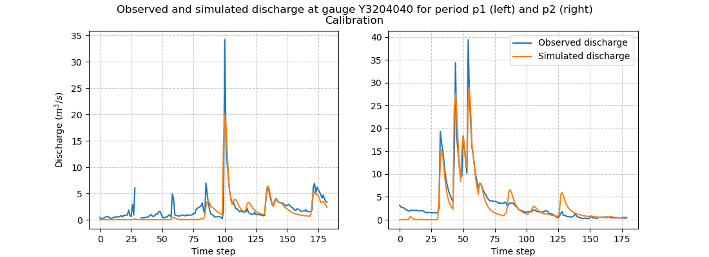
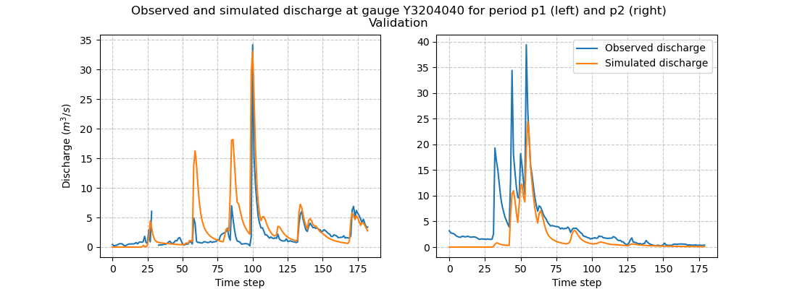

.. _user_guide.classical_uses.split_sample_temporal_validation:

====================================
Split Sample and Temporal Validation
====================================

The objective of this tutorial is to learn how to set up an optimization with a split sample test :cite:p:`klemevs1986operational` in `smash`,
i.e., cross-calibration and temporal validation over two distinct periods ``p1`` and ``p2``.

Open a Python interface:

.. code-block:: none

    python3

Imports
-------

We will first import the necessary libraries for this tutorial.

.. code-block:: python

    >>> import smash
    >>> import numpy as np
    >>> import pandas as pd
    >>> import matplotlib.pyplot as plt

Model creation
--------------

In this tutorial, we will use the :ref:`user_guide.data_and_format_description.lez` dataset as an example.

.. code-block:: python

    >>> setup, mesh = smash.factory.load_dataset("lez")

Check the start and end time defined in the ``setup``:

.. code-block:: python

    >>> setup["start_time"], setup["end_time"]

.. code-block:: output

    (datetime.date(2012, 8, 1), datetime.date(2013, 7, 31))

Since we are going to work on two different periods, each of 6 months, we need to create two ``setup`` dictionaries where the only difference 
will be in the simulation period arguments ``start_time`` and ``end_time``. The first period ``p1`` will run from ``2012-08-01`` to
``2013-01-31`` and the second, from ``2013-02-01`` to ``2013-07-31``.

.. code-block:: python

    >>> setup_p1 = setup.copy()
    >>> setup_p1.update(
    ...     {
    ...         "start_time": "2012-08-01",
    ...         "end_time": "2013-01-31",
    ...     }
    ... )
    >>> 
    >>> setup_p2 = setup.copy()
    >>> setup_p2.update(
    ...     {
    ...         "start_time": "2013-02-01",
    ...         "end_time": "2013-07-31",
    ...     }
    ... )

For the ``mesh``, there is no need to generate two different ``mesh`` dictionaries, the same one can be used for both time periods.
Now we can initialize the two `smash.Model` objects:

.. code-block:: python

    >>> model_p1 = smash.Model(setup_p1, mesh)
    >>> model_p2 = smash.Model(setup_p2, mesh)

Model calibration and validation
--------------------------------

Optimization
************

First, we will optimize both models for each period to generate two sets of optimized rainfall-runoff parameters.
So far, to optimize, we have called the method associated with the `smash.Model` object `Model.optimize <smash.Model.optimize>`. This method
will modify the associated object in place (i.e., the values of the rainfall-runoff parameters after calling this function are modified). Here, we
want to optimize the model but still keep this model object to run the validation afterwards. To do this, instead of calling the
`Model.optimize <smash.Model.optimize>` method, we can call the `smash.optimize` function, which is identical but takes a
`smash.Model` object as input and returns a copy of it. This method allows you to optimize a `smash.Model` object and store the results in 
another object without modifying the initial one.

Here, we perform a simple derivative-free optimization algorithm, for instance SBS (see :ref:`math_num_documentation.optimization_algorithms`), to optimize the spatially uniform hydrological parameters. 
We use a default cost function equal to one minus the Nash-Sutcliffe efficiency at the most downstream gauge.

.. code-block:: python

    >>> model_p1_opt = smash.optimize(model_p1)

.. code-block:: output

    </> Optimize
        At iterate     0    nfg =     1    J = 1.35661e+00    ddx = 0.64
        At iterate     1    nfg =    30    J = 8.30659e-01    ddx = 0.64
        At iterate     2    nfg =    58    J = 4.63114e-01    ddx = 0.32
        At iterate     3    nfg =    88    J = 4.00084e-01    ddx = 0.16
        At iterate     4    nfg =   117    J = 3.93997e-01    ddx = 0.08
        At iterate     5    nfg =   151    J = 3.87771e-01    ddx = 0.04
        At iterate     6    nfg =   183    J = 3.82824e-01    ddx = 0.04
        At iterate     7    nfg =   215    J = 3.78023e-01    ddx = 0.08
        At iterate     8    nfg =   248    J = 3.68680e-01    ddx = 0.08
        At iterate     9    nfg =   281    J = 3.63157e-01    ddx = 0.16
        At iterate    10    nfg =   316    J = 3.58884e-01    ddx = 0.08
        At iterate    11    nfg =   349    J = 3.58221e-01    ddx = 0.04
        At iterate    12    nfg =   383    J = 3.56019e-01    ddx = 0.04
        At iterate    13    nfg =   416    J = 3.55442e-01    ddx = 0.02
        At iterate    14    nfg =   451    J = 3.54573e-01    ddx = 0.02
        At iterate    15    nfg =   477    J = 3.54552e-01    ddx = 0.01
        CONVERGENCE: DDX < 0.01

.. code-block:: python

    >>> model_p2_opt = smash.optimize(model_p2)

.. code-block:: output
    
    </> Optimize
        At iterate     0    nfg =     1    J = 1.27190e+00    ddx = 0.64
        At iterate     1    nfg =    30    J = 4.14639e-01    ddx = 0.64
        At iterate     2    nfg =    58    J = 3.22555e-01    ddx = 0.64
        At iterate     3    nfg =    87    J = 1.80229e-01    ddx = 0.64
        At iterate     4    nfg =   115    J = 1.71559e-01    ddx = 0.64
        At iterate     5    nfg =   149    J = 1.53549e-01    ddx = 1.28
        At iterate     6    nfg =   181    J = 1.52750e-01    ddx = 1.28
        At iterate     7    nfg =   214    J = 1.52746e-01    ddx = 0.32
        At iterate     8    nfg =   250    J = 1.44511e-01    ddx = 0.08
        At iterate     9    nfg =   285    J = 1.44496e-01    ddx = 0.02
        At iterate    10    nfg =   318    J = 1.44471e-01    ddx = 0.01
        CONVERGENCE: DDX < 0.01

We can take a look at the hydrographs and the optimized rainfall-runoff parameters.

.. code-block:: python

    >>> code = model_p1.mesh.code[0]
    >>> 
    >>> f, (ax1, ax2) = plt.subplots(1, 2, figsize=(11, 4))
    >>> 
    >>> qobs = model_p1_opt.response_data.q[0,:].copy()
    >>> qobs = np.where(qobs < 0, np.nan, qobs) # To deal with missing values
    >>> qsim = model_p1_opt.response.q[0,:]
    >>> ax1.plot(qobs)
    >>> ax1.plot(qsim)
    >>> ax1.grid(ls="--", alpha=.7)
    >>> ax1.set_xlabel("Time step")
    >>> ax1.set_ylabel("Discharge ($m^3/s$)")
    >>> 
    >>> qobs = model_p2_opt.response_data.q[0,:].copy()
    >>> qobs = np.where(qobs < 0, np.nan, qobs) # To deal with missing values
    >>> qsim = model_p2_opt.response.q[0,:]
    >>> ax2.plot(qobs, label="Observed discharge")
    >>> ax2.plot(qsim, label="Simulated discharge")
    >>> ax2.grid(ls="--", alpha=.7)
    >>> ax2.set_xlabel("Time step")
    >>> ax2.legend()
    >>> 
    >>> f.suptitle(
    ...     f"Observed and simulated discharge at gauge {code}"
    ...     " for period p1 (left) and p2 (right)\nCalibration"
    ... )
    >>> plt.show()

.. code-block:: python

    >>> ind = tuple(model_p1.mesh.gauge_pos[0, :])
    >>> 
    >>> opt_parameters_p1 = {
    ...     k: model_p1_opt.get_rr_parameters(k)[ind] for k in ["cp", "ct", "kexc", "llr"]
    ... }
    >>> opt_parameters_p1

.. code-block:: output

    {'cp': np.float32(160.68974), 'ct': np.float32(35.321835), 'kexc': np.float32(0.017074872), 'llr': np.float32(557.58215)}

.. code-block:: python

    >>> opt_parameters_p2 = {
    ...     k: model_p2_opt.get_rr_parameters(k)[ind] for k in ["cp", "ct", "kexc", "llr"]
    ... }
    >>> opt_parameters_p2

.. code-block:: output

    {'cp': np.float32(9.942335e-05), 'ct': np.float32(107.30205), 'kexc': np.float32(-2.3589046), 'llr': np.float32(498.9533)}

Temporal validation
*******************

Rainfall-runoff parameters transfer
'''''''''''''''''''''''''''''''''''

We can now transfer the optimized rainfall-runoff parameters for each calibration period to the respective validation period. 
We will transfer the rainfall-runoff parameters from ``model_p1_opt`` to ``model_p2`` and from ``model_p2_opt`` to ``model_p1``. 
There are several ways to do this:

- Transfer all rainfall-runoff parameters at once
    All rainfall-runoff parameters are stored in the variable ``values`` of the object `Model.rr_parameters <smash.Model.rr_parameters>`. 
    We can therefore pass the whole array of rainfall-runoff parameters from one object to the other.

    .. code-block:: python

        >>> model_p1.rr_parameters.values = model_p2_opt.rr_parameters.values.copy()
        >>> model_p2.rr_parameters.values = model_p1_opt.rr_parameters.values.copy()

    .. note::
        A deep copy is recommended to avoid that the rainfall-runoff parameters between each object become shallow copies and
        so that the modification of one of the arrays leads to the modification of another.

- Transfer each rainfall-runoff parameter one by one
    It is also possible to loop on each rainfall-runoff parameter and assign new rainfall-runoff parameter by passing
    by getters and setters

    .. code-block:: python

        >>> for key in model_p1.rr_parameters.keys:
        ...     model_p1.set_rr_parameters(key, model_p2_opt.get_rr_parameters(key))
        ...     model_p2.set_rr_parameters(key, model_p1_opt.get_rr_parameters(key))

    .. note::
        This method allows, instead of looping on all rainfall-runoff parameters, to loop only on some. We can replace
        ``model_p1.rr_parameters.keys`` by ``["cp", "ct"]`` for example

Forward run
'''''''''''

Once the rainfall-runoff parameters have been transferred, we can proceed with the validation forward runs by calling the 
`Model.forward_run <smash.Model.forward_run>` method.

.. code-block:: python

    >>> model_p1.forward_run()
    >>> model_p2.forward_run()

and visualize the hydrographs:

.. code-block:: python

    >>> code = model_p1.mesh.code[0]
    >>> 
    >>> f, (ax1, ax2) = plt.subplots(1, 2, figsize=(11, 4));
    >>> 
    >>> qobs = model_p1.response_data.q[0,:].copy()
    >>> qobs = np.where(qobs < 0, np.nan, qobs) # To deal with missing values
    >>> qsim = model_p1.response.q[0,:]
    >>> ax1.plot(qobs)
    >>> ax1.plot(qsim)
    >>> ax1.grid(ls="--", alpha=.7)
    >>> ax1.set_xlabel("Time step")
    >>> ax1.set_ylabel("Discharge ($m^3/s$)")
    >>> 
    >>> qobs = model_p2.response_data.q[0,:].copy()
    >>> qobs = np.where(qobs < 0, np.nan, qobs) # To deal with missing values
    >>> qsim = model_p2.response.q[0,:]
    >>> ax2.plot(qobs, label="Observed discharge")
    >>> ax2.plot(qsim, label="Simulated discharge")
    >>> ax2.grid(ls="--", alpha=.7)
    >>> ax2.set_xlabel("Time step")
    >>> ax2.legend()
    >>> 
    >>> f.suptitle(
    ...     f"Observed and simulated discharge at gauge {code}"
    ...     " for period p1 (left) and p2 (right)\nValidation"
    ... )
    >>> plt.show()

Scoring metrics
'''''''''''''''

We evaluate calibration and validation performances using certain metrics. Using the function `smash.evaluation`,
you can compute one metric of your choice (among those available) for all the gauges that make up the ``mesh``. Here, we are interested 
in the ``nse`` (the calibration metric) and the ``kge`` for the downstream gauge only. We will create two `pandas.DataFrame`, one for the 
calibration performances and the other for the validation performances.

.. code-block:: python

    >>> metrics = ["NSE", "KGE"]
    >>> perf_cal = pd.DataFrame(index=["p1", "p2"], columns=metrics)
    >>> perf_val = perf_cal.copy()
    >>> 
    >>> perf_cal.loc["p1"] = np.round(smash.evaluation(model_p1_opt, metrics)[0, :], 2)
    >>> perf_cal.loc["p2"] = np.round(smash.evaluation(model_p2_opt, metrics)[0, :], 2)
    >>> 
    >>> perf_val.loc["p1"] = np.round(smash.evaluation(model_p1, metrics)[0, :], 2)
    >>> perf_val.loc["p2"] = np.round(smash.evaluation(model_p2, metrics)[0, :], 2)

Calibration performances:

.. code-block:: python

    >>> perf_cal

.. code-block:: output

         NSE   KGE
    p1  0.65   0.7
    p2  0.86  0.88

Validation performances:

.. code-block:: python

    >>> perf_val

.. code-block:: output

         NSE   KGE
    p1 -0.38  0.17
    p2  0.53  0.35

.. TODO: Add a conclusion (or change case ...) on this split sample test parameters are wildly different... I suspect it's due to
.. the state initialisation (Qobs is quite high at the beginning of p2). Not a big deal in the context of this doc,
.. but it could be mentioned either here or maybe better as a conclusion of this split-sample exercise, to demonstrate.
.. its utility and explain why the validation metrics are quite bad.
