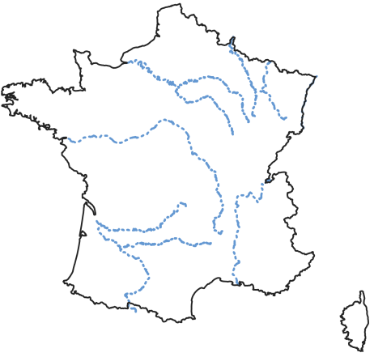

.. _user_guide.data_and_format_description.france:

======
France
======

**The metropolitan France** data are based on a large spatial domain without gauge attributes or observed discharge.
We will focus solely on performing a forward run on a domain without optimization beforehand.

Before starting any tutorial on this dataset, we need to download all the required data listed below:

.. button-link:: https://smash.recover.inrae.fr/dataset/France-dataset.tar
    :color: primary
    :shadow:
    :align: center

    **Download**

If the download was successful, a file named ``France-dataset.tar`` should be available. We can switch to the directory where this file has been 
downloaded and extract it using the following command:

.. code-block:: shell

    tar xf France-dataset.tar

Now a folder called ``France-dataset`` should be accessible and contain the following files and folders:

- ``France_flwdir.tif``
    A GeoTiff file containing the flow direction data,
- ``prcp``
    A directory containing precipitation data in GeoTiff format with the following directory structure: ``%Y/%m/%d`` 
    (``2012/01/01``),
- ``pet``
    A directory containing daily interannual potential evapotranspiration data in GeoTiff format,

Flow direction
--------------

The flow direction file is a mandatory input in order to create a mesh, its associated drainage plan :math:`\mathcal{D}_{\Omega}(x)`, and the localization on the mesh of the gauging stations that we want to model. Here, 
the ``France_flwdir.tif`` contains the flow direction data on the whole France, at a spatial resolution of 1km² using a Lambert-93 projection
(**EPSG: 2154**). `smash` is using the following D8 convention for the flow direction.
    
.. image:: ../../_static/flwdir_convention.png
    :align: center
    :width: 175

.. note::

    The flow directions should not contain sink(s), i.e., consecutive cells flowing toward each other.
    It is therefore important to ensure that flow directions are consistent from upstream to downstream.

Precipitation
-------------

Precipitation data are mandatory. `smash` expects a precipitation file per time step whose name contains a date in the following format
``%Y%m%d%H%M``. The file must be in GeoTiff format at a resolution and projection identical to the flow direction file. Any unit can be chosen 
as long as it can be converted into a millimetre using a simple conversion factor (the unit used in this dataset is tenth of a millimetre). 
Regarding the structure of the precipitation folder, there is no strict rule, by default `smash`  will fetch all the ``tif`` files in a folder 
provided by the user (i.e., ``prcp``). However, when simulating a large number of time steps, we recommend sorting the files as much as possible to
speed up access when reading those (e.g., ``%Y/%m/%d``, ``2014/09/15``).

.. note::

    As you may have seen when opening any precipitation file, the data has already been cropped over the catchment area. This has been done 
    simply to reduce the size of the files. It is possible to work with files whose spatial extent is different from the catchment area.
    `smash` will automatically crop to the correct area when the file is read.

Potential evapotranspiration
----------------------------

Potential evapotranspiration data are mandatory. The way in which potential evapotranspiration data processed is identical to the 
precipitation. One difference to note is that instead of working with one potential evapotranspiration file per time step, it is possible to
work with daily interannual data, which therefore requires a file per day whose name contains a date in the following format ``%m%d``. 
Here, we provided daily interannual potential evapotranspiration data.