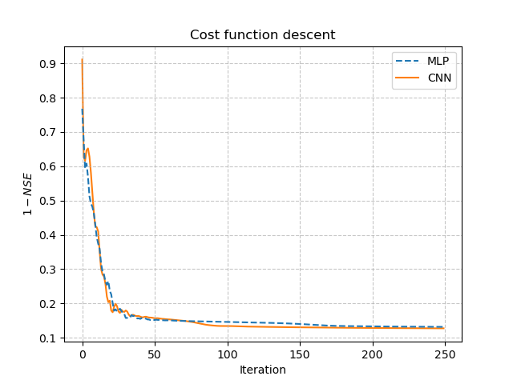
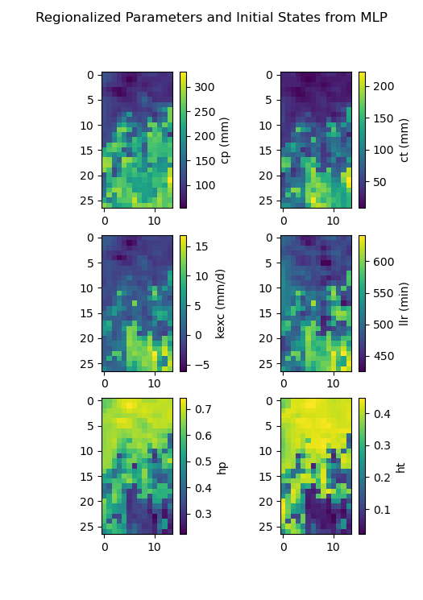
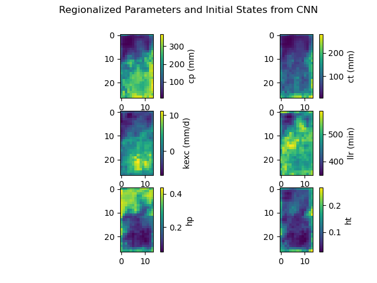

.. _user_guide.in_depth.advanced_learnable_regionalization:

=======================================================
Advanced Learnable Regionalization with Neural Networks
=======================================================

This tutorial aims to provide insights into regionalization using neural networks, including customizing network architecture and the training process. 
Currently, `smash` supports two types of regionalization neural networks: multilayer perceptrons (MLPs) and convolutional neural networks (CNNs).
While the MLP operates at the pixel level of descriptor maps and can generalize to any location where descriptors are available, the CNN operates on entire descriptor maps. 
This enables the CNN to learn spatial patterns and correlations across the whole hydrological mesh, but it becomes dependent on the specific shape of input and output maps, which limits its ability to regionalize hydrological parameters beyond the current spatial domain.

Before proceeding with this tutorial, a prerequisite is completing the tutorial on :ref:`user_guide.classical_uses.regionalization_spatial_validation`.  

We begin by opening a Python interface:

.. code-block:: none

    python3

Imports
-------

We will first import the necessary libraries for this tutorial.

.. code-block:: python

    >>> import smash
    >>> import matplotlib.pyplot as plt

Model creation
--------------

Now, we need to create a :class:`smash.Model` object.
For this case, we will use the :ref:`user_guide.data_and_format_description.lez` dataset as an example.

Load the ``setup`` and ``mesh`` dictionaries using the `smash.factory.load_dataset` function and create the :class:`smash.Model` object.

.. code-block:: python

    >>> setup, mesh = smash.factory.load_dataset("Lez")
    >>> model = smash.Model(setup, mesh)

Defining the neural network
---------------------------

If you do not specify the neural network (``net`` argument) in the ``optimize_options`` of the :meth:`smash.Model.optimize` method, 
a default network will be used to learn the descriptors-to-parameters mapping. 
The examples below demonstrate how to define customized neural networks using the :meth:`smash.factory.Net` method.

To define a regionalization neural network, you need information about the physical descriptors and hydrological parameters/states. 
This information is used to determine the input/output layers of the network, and the boundary condition (if you want to scale the network output to the boundary condition). 

In this example, we will also calibrate the initial states through the regionalization mapping in addition to the conceptual parameters. 
The calibrated parameters and boundary conditions are defined as follows:
The default values for these parameters can be obtained as shown below:

.. code-block:: python

    >>> problem = {
    ...             'cp': (1e-06, 1000.0), 'ct': (1e-06, 1000.0), 
    ...             'kexc': (-50, 50), 'llr': (1e-06, 1000.0), 
    ...             'hp': (0, 1), 'ht': (0, 1)
    ... }

.. hint::
    You can use :meth:`smash.Model.get_rr_parameters_bounds` and :meth:`smash.Model.get_rr_initial_states_bounds` 
    to get the default bound values of the model parameters and states.

Next, we need to initialize the `Net <smash.factory.Net>` object.

MLP-based regionalization
*************************

The MLP is a fully connected feedforward neural network.
In this regionalization setting, the MLP takes as input a vector of physical descriptors for each pixel independently and outputs the hydrological parameters and states corresponding to that pixel.
This means the MLP learns a mapping from physical descriptors to model parameters on a per-location basis, enabling regionalization even for ungauged sites outside the current mesh domain.

We define the graph of the network as follows:

.. code-block:: python

    >>> net_mlp = smash.factory.Net()  # initialize Net
    >>> # First hidden dense layer with ReLU activation (input shape must be defined)
    >>> net_mlp.add_dense(24, input_shape=model.setup.nd, activation="relu")
    >>> # Second hidden dense layer with ReLU activation
    >>> net_mlp.add_dense(60, activation="relu")
    >>> # Output dense layer with TanH activation
    >>> net_mlp.add_dense(len(problem), activation="tanh")
    >>> # Scale outputs to match boundary conditions
    >>> net_mlp.add_scale(list(problem.values()))

In the above example, we defined a neural network with 2 hidden dense layers consisting of 24 and 60 neurons respectively, each followed by a ``ReLU`` activation function, and an output layer followed by a ``TanH`` activation function. 
To scale the network output to match the boundary conditions, we apply a min-max scaling function. To display the network information:

.. code-block:: python

    >>> net_mlp

.. code-block:: output

    +---------------------------------------------------------+
    | Layer Type           Input/Output Shape  Num Parameters |
    +---------------------------------------------------------+
    | Dense                (6,)/(24,)          168            |
    | Activation (ReLU)    (24,)/(24,)         0              |
    | Dense                (24,)/(60,)         1500           |
    | Activation (ReLU)    (60,)/(60,)         0              |
    | Dense                (60,)/(6,)          366            |
    | Activation (TanH)    (6,)/(6,)           0              |
    | Scale (MinMaxScale)  (6,)/(6,)           0              |
    +---------------------------------------------------------+
    Total parameters: 2034
    Trainable parameters: 2034

CNN-based regionalization
*************************

In contrast to MLPs, CNNs operate on image-like data.
In this case, the CNN input is a 3D array with shape ``(height, width, n_descriptors)``, representing spatial maps of physical descriptors over the hydrological mesh.
The output is a set of spatial parameter maps with shape ``(height, width, n_parameters)``.

.. note::
    A CNN uses a kernel—a small matrix of learnable weights—that slides across the input descriptor maps to extract spatial patterns. 
    In the context of regionalization, the CNN can generalize to ungauged locations within the computational mesh domain, including areas outside the calibration catchments. 
    However, because CNNs are designed to work with fixed-size input and output maps, they are limited to operating within the current mesh domain and cannot directly generalize to locations outside it.

We define the neural network architecture as follows:

.. code-block:: python

    >>> net_cnn = smash.factory.Net()  # initialize Net
    >>> # Hidden conv layer with ReLU activation (input shape must be defined)
    >>> net_cnn.add_conv2d(
    ...     24,
    ...     filter_shape=(4, 4),
    ...     input_shape=model.physio_data.descriptor.shape,
    ...     activation="relu"
    ... )
    >>> net_cnn.add_flatten()  # flatten layer
    >>> # Hidden dense layer with ReLU activation
    >>> net_cnn.add_dense(60, activation="relu")
    >>> # Output dense layer with TanH activation
    >>> net_cnn.add_dense(len(problem), activation="tanh")
    >>> # Scale outputs to match boundary conditions
    >>> net_cnn.add_scale(list(problem.values()))

In the above example, we defined a CNN with the following architecture:

- A 2D convolutional layer with 24 filters of size :math:`4 \times 4` to extract spatial features, followed by ``ReLU`` activation;
- A flatten layer that transforms the 3D feature maps into a 1D vector;
- A dense layer with 60 neurons and ``ReLU`` activation;
- An output dense layer with ``TanH`` activation function to produce the final output;
- A scaling layer using a min-max scaling function to match the output boundary conditions.

To display the network information:

.. code-block:: python

    >>> net_cnn

.. code-block:: output

    +----------------------------------------------------------------+
    | Layer Type           Input/Output Shape         Num Parameters |
    +----------------------------------------------------------------+
    | Conv2D               (27, 14, 6)/(27, 14, 24)   2328           |
    | Activation (ReLU)    (27, 14, 24)/(27, 14, 24)  0              |
    | Flatten              (27, 14, 24)/(378, 24)     0              |
    | Dense                (378, 24)/(378, 60)        1500           |
    | Activation (ReLU)    (378, 60)/(378, 60)        0              |
    | Dense                (378, 60)/(378, 6)         366            |
    | Activation (TanH)    (378, 6)/(378, 6)          0              |
    | Scale (MinMaxScale)  (378, 6)/(378, 6)          0              |
    +----------------------------------------------------------------+
    Total parameters: 4194
    Trainable parameters: 4194

Training the neural network
---------------------------

Before training the neural network, it is important to note that its weights and biases are not initialized immediately upon creation.
If they are not set before calling the optimization function, they will be initialized randomly using initializer methods defined by the arguments ``kernel_initializer`` (default is ``"glorot_uniform"``) and ``bias_initializer`` (default is ``"zeros"``) in the trainable layers, such as those added by :meth:`smash.factory.Net.add_dense` and :meth:`smash.factory.Net.add_conv2d`.
Otherwise, the network will be trained with the initialized weights and biases when calling the optimization function.

.. hint::
    If you want to manually initialize the weights and biases of the neural network, you can use the :meth:`smash.factory.Net.set_weight` and :meth:`smash.factory.Net.set_bias` methods 
    (see also :meth:`smash.factory.Net.get_weight` and :meth:`smash.factory.Net.get_bias`). 
    Additionally, you can use the :meth:`smash.factory.Net.set_trainable` method to set the trainable status of specific layers. 
    This allows you to freeze certain layers during training, which can be useful for transfer learning or fine-tuning pretrained networks while keeping some layers fixed.

Next, we define the optimization options to estimate the hydrological parameters and states with neural networks:

- ``net``: the neural network configuration used to learn the regionalization mapping;
- ``random_state``: a random seed used to initialize neural network parameters (weights and biases);
- ``learning_rate``: the learning rate used for weight and bias updates during training;
- ``termination_crit``: the maximum number of training ``maxiter`` for the neural network and a positive number to stop training when the loss function does not decrease below the current optimal value for ``early_stopping`` consecutive iterations;
- ``parameters``: the list of hydrological parameters and states to be estimated;
- ``bounds``: the bounds of the hydrological parameters and states to be estimated.

.. code-block:: python

    >>> optimize_options_mlp = {
    ...     "net": net_mlp,
    ...     "learning_rate": 0.003,
    ...     "termination_crit": dict(maxiter=250, early_stopping=50),
    ...     "random_state": 1,
    ...     "parameters": list(problem.keys()),
    ...     "bounds": problem
    ... }  # optimization options for MLP-based regionalization
    ... 
    >>> optimize_options_cnn = {
    ...     "net": net_cnn,
    ...     "learning_rate": 0.003,  # lower lr since more sensitive weights update
    ...     "termination_crit": dict(maxiter=250, early_stopping=50),
    ...     "random_state": 1,
    ...     "parameters": list(problem.keys()),
    ...     "bounds": problem
    ... }  # optimization options for CNN-based regionalization

.. note::
    To ensure consistency between the outputs of the regionalization neural network and the hydrological parameters being optimized, 
    it is strongly recommended to explicitly define the ``parameters`` and ``bounds`` keys in the dictionary of optimization options as shown in the code above. 
    These should exactly match the order and names of the parameters used in the network's final layer and scaling layer. 
    Mismatches in naming or order can lead to incorrect parameter assignment during optimization.

Now, we can train the neural networks using the :meth:`smash.Model.optimize` method:

.. code-block:: python
    
    >>> model_mlp, opt_mlp = smash.optimize(
    ...     model,
    ...     mapping="ann",
    ...     optimize_options=optimize_options_mlp,
    ...     return_options={"net": True},
    ... )  # MLP-based regionalization

.. code-block:: output

    </> Optimize
        At iterate     0    nfg =     1    J = 8.34604e-01    |proj g| = 3.56477e-03
        At iterate     1    nfg =     2    J = 7.67661e-01    |proj g| = 3.77684e-03
        At iterate     2    nfg =     3    J = 6.77105e-01    |proj g| = 4.63283e-03
        ...
        At iterate   249    nfg =   250    J = 1.31735e-01    |proj g| = 4.17643e-04
        At iterate   250    nfg =   251    J = 1.31708e-01    |proj g| = 4.26444e-04
        STOP: TOTAL NO. of ITERATIONS REACHED LIMIT

.. code-block:: python
    
    >>> model_cnn, opt_cnn = smash.optimize(
    ...     model,
    ...     mapping="ann",
    ...     optimize_options=optimize_options_cnn,
    ...     return_options={"net": True},
    ... )  # CNN-based regionalization

.. code-block:: output

    </> Optimize
        At iterate     0    nfg =     1    J = 1.80586e+00    |proj g| = 3.28820e-02
        At iterate     1    nfg =     2    J = 9.11082e-01    |proj g| = 1.12828e-02
        At iterate     2    nfg =     3    J = 6.29026e-01    |proj g| = 1.75244e-03
        ...
        At iterate   249    nfg =   250    J = 1.27517e-01    |proj g| = 3.06498e-04
        At iterate   250    nfg =   251    J = 1.27503e-01    |proj g| = 3.07417e-04
        STOP: TOTAL NO. of ITERATIONS REACHED LIMIT

Results visualization
---------------------

Each returned `Optimize <smash.Optimize>` object (``opt_mlp`` or ``opt_cnn``) contains a `Net <smash.factory.Net>` object with the trained parameters and training information.
For example, we can access the bias of the last dense layer of the MLP:

.. code-block:: python

    >>> opt_mlp.net.get_bias()[-1]

.. code-block:: output

    array([[-0.13550091, -0.14853519,  0.00376027, -0.02834407,  0.02244247,
            -0.0597309 ]])

Or plot the cost function descent during the training:

.. code-block:: python

    >>> plt.plot(opt_mlp.net.history["loss_train"], label="MLP", linestyle="--")
    >>> plt.plot(opt_cnn.net.history["loss_train"], label="CNN", zorder=0)
    >>> plt.xlabel("Iteration")
    >>> plt.ylabel("$1-NSE$")
    >>> plt.legend()
    >>> plt.grid(alpha=.7, ls="--")
    >>> plt.title("Cost function descent")
    >>> plt.show()

We observe that, despite different network architectures and starting from different random weights, the cost function in these two cases behaves similarly and converges to a similar value.
It is now interesting to compare the estimated conceptual parameters and initial states estimated by each trained network.

.. code-block:: python

    >>> f, ax = plt.subplots(3, 2)
    >>> 
    >>> map_cp = ax[0, 0].imshow(model_mlp.get_rr_parameters("cp"))
    >>> f.colorbar(map_cp, ax=ax[0, 0], label="cp (mm)")
    >>> map_ct = ax[0, 1].imshow(model_mlp.get_rr_parameters("ct"))
    >>> f.colorbar(map_ct, ax=ax[0, 1], label="ct (mm)")
    >>> map_kexc = ax[1, 0].imshow(model_mlp.get_rr_parameters("kexc"))
    >>> f.colorbar(map_kexc, ax=ax[1, 0], label="kexc (mm/d)")
    >>> map_llr = ax[1, 1].imshow(model_mlp.get_rr_parameters("llr"))
    >>> f.colorbar(map_llr, ax=ax[1, 1], label="llr (min)")
    >>> map_hp = ax[2, 0].imshow(model_mlp.get_rr_initial_states("hp"))
    >>> f.colorbar(map_hp, ax=ax[2, 0], label="hp")
    >>> map_ht = ax[2, 1].imshow(model_mlp.get_rr_initial_states("ht"))
    >>> f.colorbar(map_ht, ax=ax[2, 1], label="ht")
    >>> f.suptitle("Regionalized Parameters and Initial States from MLP")
    >>> plt.show()

.. code-block:: python

    >>> f, ax = plt.subplots(3, 2)
    >>> 
    >>> map_cp = ax[0, 0].imshow(model_cnn.get_rr_parameters("cp"))
    >>> f.colorbar(map_cp, ax=ax[0, 0], label="cp (mm)")
    >>> map_ct = ax[0, 1].imshow(model_cnn.get_rr_parameters("ct"))
    >>> f.colorbar(map_ct, ax=ax[0, 1], label="ct (mm)")
    >>> map_kexc = ax[1, 0].imshow(model_cnn.get_rr_parameters("kexc"))
    >>> f.colorbar(map_kexc, ax=ax[1, 0], label="kexc (mm/d)")
    >>> map_llr = ax[1, 1].imshow(model_cnn.get_rr_parameters("llr"))
    >>> f.colorbar(map_llr, ax=ax[1, 1], label="llr (min)")
    >>> map_hp = ax[2, 0].imshow(model_cnn.get_rr_initial_states("hp"))
    >>> f.colorbar(map_hp, ax=ax[2, 0], label="hp")
    >>> map_ht = ax[2, 1].imshow(model_cnn.get_rr_initial_states("ht"))
    >>> f.colorbar(map_ht, ax=ax[2, 1], label="ht")
    >>> f.suptitle("Regionalized Parameters and Initial States from CNN")
    >>> plt.show()

Overall, the CNN produces smoother parameter maps compared to the MLP. 
This smoothing effect results from the convolution operations applied to physical descriptor maps, 
which enable the CNN to learn and exploit spatial patterns and correlations across the entire hydrological mesh, including areas outside the calibration catchments.  
