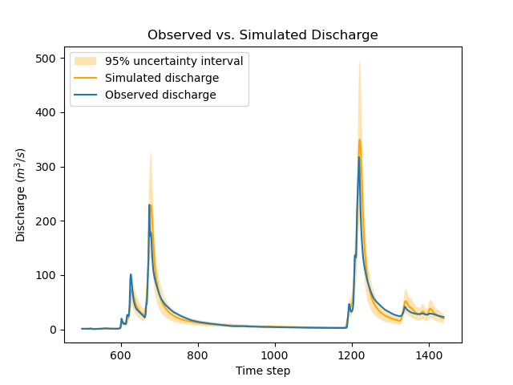
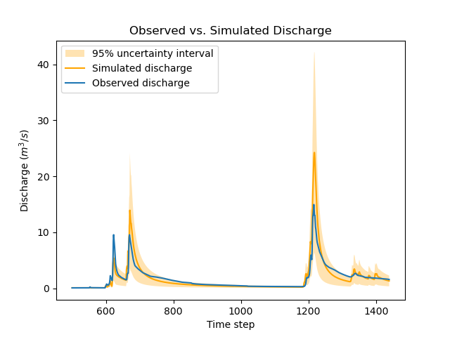
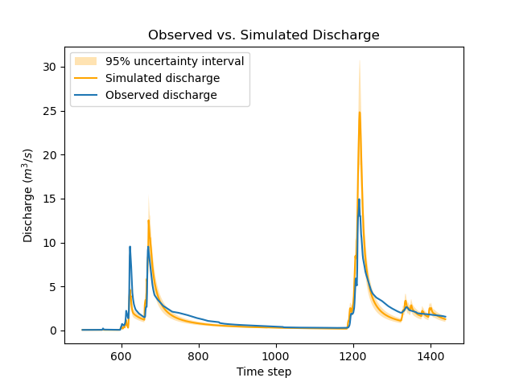

.. _user_guide.in_depth.bayesian_estimation:

===================
Bayesian Estimation
===================

The aim of this tutorial is to demonstrate the use of a Bayesian approach for parameter estimation and uncertainty quantification in `smash`.
The principle is to estimate parameters by maximizing the density of the :ref:`posterior distribution<math_num_documentation.bayesian_estimation>`, rather than by maximizing a predefined :ref:`efficiency metric<math_num_documentation.efficiency_error_metric>` such as the Nash-Sutcliffe Efficiency (NSE).
The advantages of this approach are the following:

1. it allows using prior information on parameters when available;
2. it explicitly recognizes the uncertainties affecting both the model-simulated discharge (structural uncertainty) and the discharge data used to calibrate the model (observation uncertainty);
3. it naturally handles multi-gauge calibration, with a built-in weighting of the information brought by each gauge. 

First, open a Python interface:

.. code-block:: none

    python3

Preliminaries
-------------

We start by importing the modules needed in this tutorial.

.. code-block:: python
	
	>>> import smash
	>>> import matplotlib.pyplot as plt
	>>> import numpy as np

Now, we need to create a :class:`smash.Model` object.
For this case, we use the :ref:`user_guide.data_and_format_description.cance` dataset as an example.

Load the ``setup`` and ``mesh`` dictionaries using the :meth:`smash.factory.load_dataset` method and create the :class:`smash.Model` object.

.. code-block:: python
	
	>>> setup, mesh = smash.factory.load_dataset("Cance")
	>>> model = smash.Model(setup, mesh)

By default, the optimization problem setup is:

.. code-block:: python
	
	>>> optimize_options_0 = smash.default_optimize_options(model)
	>>> optimize_options_0

.. code-block:: output
	
    {
        'parameters': ['cp', 'ct', 'kexc', 'llr'],
        'bounds': {'cp': (1e-06, 1000.0), 'ct': (1e-06, 1000.0), 'kexc': (-50, 50), 'llr': (1e-06, 1000.0)},
        'control_tfm': 'sbs',
        'termination_crit': {'maxiter': 50}
    }

In addition to the four model parameters ``cp``, ``ct``, ``kexc`` and ``llr``, we can also calibrate the initial state values (``hp`` and ``ht``) so that we work with "good" initial state values in the remainder of this tutorial.

.. code-block:: python
	
	>>> optimize_options_0["parameters"].extend(["hp", "ht"])
	>>> optimize_options_0["parameters"]

.. code-block:: output
	
    ['cp', 'ct', 'kexc', 'llr', 'hp', 'ht']

We finally optimize this model using the standard, non-Bayesian approach using the `Model.optimize <smash.Model.optimize>` method.
Note that, by default, only a single gauge, which is the most downstream one, is used for calibration.

.. code-block:: python

	>>> model_0 = smash.optimize(model, optimize_options=optimize_options_0)
	>>> # Equivalent to smash.optimize(model, optimize_options=optimize_options_0, cost_options={"gauge": "V3524010"})
	>>> # where "V3524010" is the most downstream gauge

.. code-block:: output
	
    </> Optimize
        At iterate     0    nfg =     1    J = 6.95010e-01    ddx = 0.64
        At iterate     1    nfg =    68    J = 1.12342e-01    ddx = 0.64
        At iterate     2    nfg =   134    J = 4.03726e-02    ddx = 0.32
        At iterate     3    nfg =   203    J = 3.43682e-02    ddx = 0.08
        ...
        At iterate    17    nfg =  1224    J = 2.87430e-02    ddx = 0.01
        At iterate    18    nfg =  1260    J = 2.87399e-02    ddx = 0.01
        CONVERGENCE: DDX < 0.01

After optimization completes, it is possible to look at estimated parameters using the code below.
The function `smash.optimize_control_info` allows retrieving information on the control vector, in particular the names and values of estimated parameters.

.. code-block:: python

	>>> control_info = smash.optimize_control_info(
	... 	model_0, optimize_options=optimize_options_0
	... )
	>>> control_names = control_info["name"].tolist()  # names of control values
	>>> control_values = control_info["x_raw"].tolist()  # raw values before transformation
	>>> dict(zip(control_names, control_values))

.. code-block:: output
	
    {
        'cp-0': 134.668212890625, 'ct-0': 226.844482421875, 'kexc-0': -0.818026602268219,
        'llr-0': 30.322528839111328, 'hp-0': 2.824860712280497e-05, 'ht-0': 0.2247009128332138
    }

.. note::
	The composition of the control vector is fairly obvious here because model parameters are spatially uniform (which is the default option).
	When a more complex :ref:`mapping operator <math_num_documentation.mapping>` is used, the composition of the control vector is more tricky because it is composed of parameters of the mapping operator.

Basic Bayesian estimation
-------------------------

Bayesian estimation works in a very similar way, with two notable differences:

1. the function `smash.bayesian_optimize` has to be called instead of the function `smash.optimize`; in the same vein, the function `smash.bayesian_optimize_control_info` replaces the function `smash.optimize_control_info`, and the function `smash.default_bayesian_optimize_options` replaces the function `smash.default_optimize_options`;
2. in addition to the four model parameters (``cp``, ``ct``, ``kexc`` and ``llr``), the list of calibrated parameters includes the parameters ``sg0`` and ``sg1`` which control structural uncertainty (see the documentation on :ref:`Bayesian inference<math_num_documentation.bayesian_estimation>` for details): the standard deviation of structural errors is an affine function of the simulated discharge, ``sg0 + sg1*Qsim``.

.. code-block:: python

	>>> optimize_options_bayes = smash.default_bayesian_optimize_options(model)
	>>> optimize_options_bayes["parameters"]

.. code-block:: output

    ['cp', 'ct', 'kexc', 'llr', 'sg0', 'sg1']

For simplicity, we will use the default optimization options as above for the rest of the tutorial, so there is no need to define ``optimize_options`` in `smash.bayesian_optimize`.
Additionally, we will use the simplest mapping, which is uniform mapping.
However, this Bayesian approach can also be applied to more complex mappings such as distributed mapping or multiple linear/power mappings.

.. warning::
	The Bayesian estimation approach is currently not supported for neural network-based mappings (``mapping='ann'``).

Before running the Bayesian optimization, we start from a model with "pre-calibrated" parameters/states.
For instance, we can take this one obtained by the classical optimization above with ``model_0``.  

.. code-block:: python

	>>> model_bayes = smash.bayesian_optimize(model_0)  # starting from pre-calibrated model_0

.. code-block:: output

    </> Bayesian Optimize
        At iterate     0    nfg =     1    J = 2.15670e+00    ddx = 0.64
        At iterate     1    nfg =    70    J = 1.86267e+00    ddx = 0.16
        At iterate     2    nfg =   137    J = 1.81886e+00    ddx = 0.08
        At iterate     3    nfg =   204    J = 1.79312e+00    ddx = 0.04
        ...
        At iterate     8    nfg =   563    J = 1.78530e+00    ddx = 0.01
        At iterate     9    nfg =   575    J = 1.78530e+00    ddx = 0.01
        CONVERGENCE: DDX < 0.01

Then, access to the control values:

.. code-block:: python

	>>> control_info_bayes = smash.bayesian_optimize_control_info(model_bayes)
	>>> print(dict(
	... 	zip(
	... 		control_info_bayes["name"].tolist(), 
	... 		control_info_bayes["x_raw"].tolist()
	... 	)
	... ))

.. code-block:: output

    {
        'cp-0': 129.3557891845703, 'ct-0': 198.18748474121094, 'kexc-0': -1.0734275579452515, 'llr-0': 39.20307540893555,
        'sg0-V3524010': 0.13169874250888824, 'sg1-V3524010': 0.2109578251838684
    }

Note that the parameter values changed quite a bit compared with the previous non-Bayesian calibration approach: for instance, parameter ``ct`` moved from 227 to 198 mm.
This is not surprising since the cost function on which calibration is based changed as well.

The function below generates a plot that compares the observed and simulated discharge time series.
Note how the values of ``sg0`` and ``sg1`` are used to compute the standard deviation of structural errors, which in turn allows deriving a 95% uncertainty interval for the simulated discharge using the `two-sigma rule <https://en.wikipedia.org/wiki/68-95-99.7_rule>`__. 

.. code-block:: python
	
	>>> def plot_hydrograph(obs, sim, sg0, sg1, 
	... 	title="Observed vs. Simulated Discharge", xlim=None):
	... 
	... 	if xlim is None:
	... 	    xl = [0, len(sim)-1]
	... 	else:
	... 	    xl = xlim
	... 	
	... 	serr_stdev = sg0 + sg1*sim  # std of structural errors
	... 	lower = sim - 2*serr_stdev  # 2-sigma rule
	... 	upper = sim + 2*serr_stdev  # 2-sigma rule
	... 
	... 	x=np.arange(xl[0],xl[1])
	... 	plt.fill_between(
	... 	    x=x, y1=lower[x], y2=upper[x], alpha=0.3, 
	...         facecolor='orange', label="95% uncertainty interval"
	...     )
	... 	plt.plot(x, sim[x], color='orange', label="Simulated discharge")
	... 	plt.plot(x, obs[x], label="Observed discharge")
	... 	plt.xlabel("Time step")
	... 	plt.ylabel("Discharge ($m^3/s$)")
	... 	plt.legend()
	... 	plt.title(title)
	... 	plt.show()
	...
	>>> igauge = 0  # index of the calibration gauge
	>>> obs = model_bayes.response_data.q[igauge]
	>>> sim = model_bayes.response.q[igauge]
	>>> sg0 = control_info_bayes['x_raw'][4]
	>>> sg1 = control_info_bayes['x_raw'][5]
	>>>
	>>> plot_hydrograph(obs=obs, sim=sim, sg0=sg0, sg1=sg1, xlim=[500, 1440])

.. image:: ../../_static/user_guide.in_depth.bayesian_estimation.hydrograph_basic.png
    :align: center

Using informative priors
------------------------

In the preceding calibration, no prior distributions were specified.
In such a case, using `improper flat priors <https://en.wikipedia.org/wiki/Prior_probability#Examples>`__ is defined as the default behavior.
Informative priors can be used by specifying, for each element of the control vector, a prior distribution and its parameters. Available prior distributions include: `Gaussian <https://en.wikipedia.org/wiki/Normal_distribution>`__, `LogNormal <https://en.wikipedia.org/wiki/Log-normal_distribution>`__, `Uniform <https://en.wikipedia.org/wiki/Continuous_uniform_distribution>`__, `Triangular <https://en.wikipedia.org/wiki/Triangular_distribution>`__, `Exponential <https://en.wikipedia.org/wiki/Exponential_distribution>`__ and the improper `FlatPrior <https://en.wikipedia.org/wiki/Prior_probability#Examples>`__ distribution.
The code below shows an example where the specified prior distributions are rather vague, except the one for parameter ``kexc-0`` which controls a non-conservative water loss or gain.

.. code-block:: python
	
	>>> priors = {
	...     "cp-0": ["LogNormal", [4.6, 0.5]],
	... 	"ct-0": ["LogNormal", [5.3, 0.5]],
	... 	"kexc-0": ["Gaussian", [0, 0.001]],  # precise prior, constraining kexc-0 to remain close to zero
	... 	"llr-0": ["Triangle", [24, 1, 72]],
	... 	"sg0-V3524010": ["FlatPrior", []],  # prior sg0 at the most donwstream gauge
	... 	"sg1-V3524010": ["FlatPrior", []]  # prior sg1 at the most donwstream gauge
	... }

These priors can be passed to the `smash.bayesian_optimize` function as an additional cost option, as shown below:

.. code-block:: python

	>>> cost_options_priors = {"control_prior": priors}
	>>> model_bayes_priors = smash.bayesian_optimize(
	... 	model_0, cost_options=cost_options_priors
	... )

.. code-block:: output

    </> Bayesian Optimize
        At iterate     0    nfg =     1    J = 2.34513e+02    ddx = 0.64
        At iterate     1    nfg =    69    J = 5.86152e+00    ddx = 0.16
        At iterate     2    nfg =   137    J = 2.08457e+00    ddx = 0.04
        At iterate     3    nfg =   205    J = 1.84397e+00    ddx = 0.02
        At iterate     4    nfg =   272    J = 1.83166e+00    ddx = 0.01
        At iterate     5    nfg =   308    J = 1.83155e+00    ddx = 0.01
        CONVERGENCE: DDX < 0.01

Then, access to the control values:

.. code-block:: python

	>>> control_info_bayes_priors = smash.bayesian_optimize_control_info(
	... 	model_bayes_priors, cost_options=cost_options_priors
	... )
	>>> print(dict(
	... 	zip(
	... 		control_info_bayes_priors["name"].tolist(), 
	... 		control_info_bayes_priors["x_raw"].tolist()
	... 	)
	... ))

.. code-block:: output

    {
        'cp-0': 142.9960174560547, 'ct-0': 168.05076599121094, 'kexc-0': 0.003317115129902959, 'llr-0': 40.523681640625,
        'sg0-V3524010': 0.15000002086162567, 'sg1-V3524010': 0.21000000834465027
    }

Note that calibrated parameter vector changed quite a bit compared with the previous calibration.
Parameter ``kexc-0`` is close to zero, as expected given the prior constraint.
Other parameters compensated by changing values, with no obvious loss of performance visible in the figure below:

.. code-block:: python

	>>> igauge = 0  # index of the calibration gauge
	>>> obs = model_bayes_priors.response_data.q[igauge]
	>>> sim = model_bayes_priors.response.q[igauge]
	>>> sg0 = control_info_bayes_priors['x_raw'][4]
	>>> sg1 = control_info_bayes_priors['x_raw'][5]
	>>>
	>>> plot_hydrograph(obs=obs, sim=sim, sg0=sg0, sg1=sg1, xlim=[500, 1440])

Using multiple gauges for calibration
-------------------------------------

To use data from the 3 gauges as calibration data, we simply add the gauge IDs to the list of calibration gauges.

.. hint::
	Refer to the :ref:`user_guide.in_depth.multisite_calibration` tutorial for more details on calibration with multiple gauges data.

Note that we go back to using non-informative priors by not specifying any ``control_prior`` in ``cost_options``.
Also, note that since there are 3 gauges, there are now 3 couples of ``(sg0, sg1)`` values, since structural uncertainty is gauge-specific.
The values estimated for ``(sg0, sg1)`` implicitly define the weighting of each gauge: in a nutshell, gauges with large ``(sg0, sg1)`` values (i.e., with large structural uncertainty) will exert less leverage on the calibration. The most important term is ``sg1``, which represents the part of uncertainty proportional to discharge, and which can hence be interpreted as a standard uncertainty in percent (``sg0`` is comparably negligible, except for near-zero discharge values). In the example below, simulation at the downstream gauge ``V3524010`` is affected by a ~20% standard uncertainty, while simulation at gauge ``V3517010`` is affected by a ~37% standard uncertainty.

.. code-block:: python

	>>> cost_options_mg = {"gauge": "all"}  # use alias "all" to add all of the 3 gauges
	>>> model_bayes_mg = smash.bayesian_optimize(
	... 	model_0, cost_options=cost_options_mg
	... )

.. code-block:: output

    </> Bayesian Optimize
        At iterate     0    nfg =     1    J = 1.60856e+00    ddx = 0.64
        At iterate     1    nfg =   193    J = 8.86700e-01    ddx = 0.16
        At iterate     2    nfg =   378    J = 7.35443e-01    ddx = 0.08
        At iterate     3    nfg =   548    J = 6.99859e-01    ddx = 0.04
        At iterate     4    nfg =   720    J = 6.91704e-01    ddx = 0.02
        At iterate     5    nfg =   865    J = 6.90985e-01    ddx = 0.01
        CONVERGENCE: DDX < 0.01

.. code-block:: python

	>>> control_info_bayes_mg = smash.bayesian_optimize_control_info(
	... 	model_bayes_mg, cost_options=cost_options_mg
	... )
	>>> print(dict(
	... 	zip(
	... 		control_info_bayes_mg["name"].tolist(), 
	... 		control_info_bayes_mg["x_raw"].tolist()
	... 	)
	... ))

.. code-block:: output

    {
        'cp-0': 126.82528686523438, 'ct-0': 183.87586975097656, 'kexc-0': 0.003317079972475767, 'llr-0': 44.7859001159668,
        'sg0-V3524010': 0.1900000423192978, 'sg0-V3515010': 9.999999974752427e-07, 'sg0-V3517010': 9.999999974752427e-07,
        'sg1-V3524010': 0.20000000298023224, 'sg1-V3515010': 0.3100000321865082, 'sg1-V3517010': 0.37000003457069397
    }

The figure below compares the observed and the simulated discharge time series at gauge ``V3517010`` and indeed shows a quite poor fit, leading to a rather high uncertainty.

.. code-block:: python

	>>> igauge = 2  # index of gauge V3517010
	>>> obs = model_bayes_mg.response_data.q[igauge]
	>>> sim = model_bayes_mg.response.q[igauge]
	>>> sg0 = control_info_bayes_mg['x_raw'][6]
	>>> sg1 = control_info_bayes_mg['x_raw'][9]
	>>>
	>>> plot_hydrograph(obs=obs, sim=sim, sg0=sg0, sg1=sg1, xlim=[500, 1440])

Recognizing uncertainty in streamflow data
------------------------------------------

Data uncertainties are stored in the attribute ``q_stdev`` of `Model.u_response_data <smash.Model.u_response_data>`.
The values represent standard uncertainties, i.e., the standard deviation of measurement errors, and by default they are set to zero. In plain words, calibration data are assumed to be perfect, which is quite unrealistic.

.. code-block:: python
	
	>>> model_bayes_mg.u_response_data.q_stdev

.. code-block:: output

    array([[0., 0., 0., ..., 0., 0., 0.],
           [0., 0., 0., ..., 0., 0., 0.],
           [0., 0., 0., ..., 0., 0., 0.]], dtype=float32)

It is possible to recognize the existence of uncertainty in calibration data by specifying nonzero values in the attribute ``q_stdev`` of `Model.u_response_data <smash.Model.u_response_data>`.
Note that a standard uncertainty needs to be specified for each time step, because uncertainty may strongly vary through the data range. The example below adopts a simple approach where data uncertainty is assumed to be proportional to the measured value (but in principle, the values should derive from a proper uncertainty analysis of the discharge measurement process).
At the first gauge, a moderate ~20% data uncertainty is assumed. The second gauge is assumed to provide very precise data (1% uncertainty), while at the opposite the third gauge is assumed to be very imprecise (~50% data uncertainty).
Similar to structural uncertainty, data uncertainty acts on the weighting of the information brought by each gauge: a large data uncertainty will decrease the leverage of the gauge on the calibration problem.

.. code-block:: python
	
	>>> for i, c in enumerate([0.2, 0.01, 0.5]):
	...     model_bayes_mg.u_response_data.q_stdev[i] = c*model_bayes_mg.response_data.q[i]
	...

Re-calibrating the model ``model_bayes_mg`` with these data uncertainties leads to different optimized parameters: for instance, parameter ``cp`` moved from 127 to 142 mm.
The parameters of structural errors also changed quite markedly: for instance, at the third gauge (``V3517010``), ``sg1`` decreased from 0.37 to 0.12, resulting in a smaller structural uncertainty as shown in the figure. While possibly surprising at first sight, this result can be explained by the fact that the huge ~50% data uncertainty we specified at this gauge is sufficient to explain most of the mismatch between observed and simulated discharge. In plain words, the poor fit at this gauge is due to poor data, not to a poor model. 

.. code-block:: python
	
	>>> model_bayes_mg.bayesian_optimize(cost_options=cost_options_mg)

.. code-block:: output

    </> Bayesian Optimize
        At iterate     0    nfg =     1    J = 7.73094e-01    ddx = 0.64
        At iterate     1    nfg =   162    J = 7.27340e-01    ddx = 0.04
        At iterate     2    nfg =   330    J = 7.19470e-01    ddx = 0.02
        At iterate     3    nfg =   416    J = 7.19137e-01    ddx = 0.01
        CONVERGENCE: DDX < 0.01

.. code-block:: python

	>>> control_info_bayes_mg = smash.bayesian_optimize_control_info(
	... 	model_bayes_mg, cost_options=cost_options_mg
	... )
	>>> print(dict(
	... 	zip(
	... 		control_info_bayes_mg["name"].tolist(), 
	... 		control_info_bayes_mg["x_raw"].tolist()
	... 	)
	... ))

.. code-block:: output

    {
        'cp-0': 141.57150268554688, 'ct-0': 168.050537109375, 'kexc-0': 0.0033170804381370544, 'llr-0': 45.69054412841797,
        'sg0-V3524010': 0.10000099241733551, 'sg0-V3515010': 9.999999974752427e-07, 'sg0-V3517010': 9.999999974752427e-07,
        'sg1-V3524010': 0.1599999964237213, 'sg1-V3515010': 0.36000004410743713, 'sg1-V3517010': 0.12000099569559097
    }

.. code-block:: python

	>>> igauge = 2  # index of gauge V3517010
	>>> obs = model_bayes_mg.response_data.q[igauge]
	>>> sim = model_bayes_mg.response.q[igauge]
	>>> sg0 = control_info_bayes_mg['x_raw'][6]
	>>> sg1 = control_info_bayes_mg['x_raw'][9]
	>>>
	>>> plot_hydrograph(obs=obs, sim=sim, sg0=sg0, sg1=sg1, xlim=[500, 1440])

