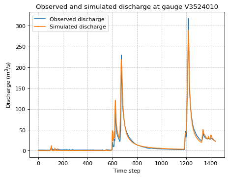
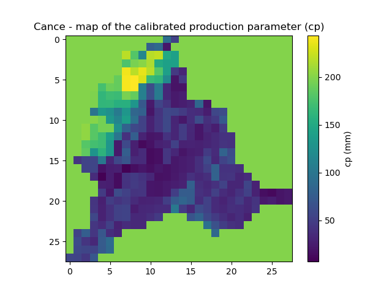
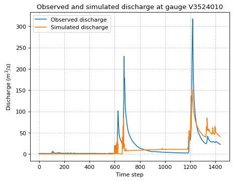
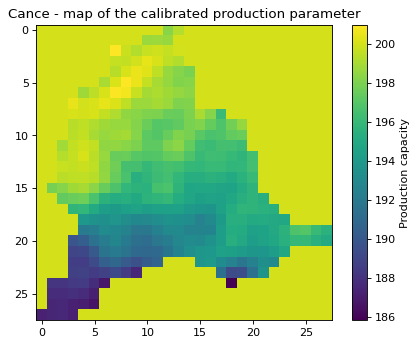
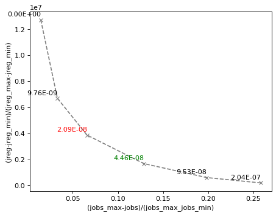
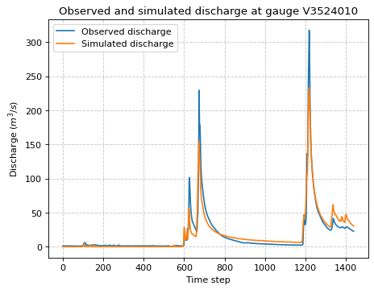
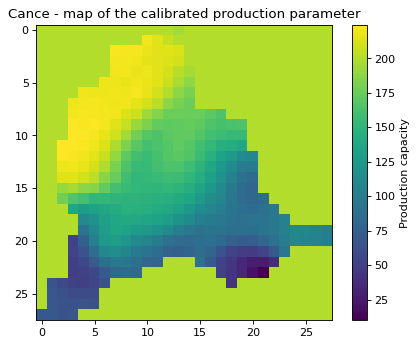
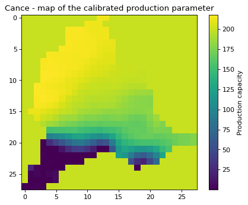

.. _user_guide.in_depth.calibration_with_regularization_term:

====================================
Calibration with Regularization Term
====================================

Preliminaries
-------------

We start by importing the modules needed in this tutorial.

.. code-block:: python
	
	>>> import smash
	>>> import matplotlib.pyplot as plt

Now, we need to create a :class:`smash.Model` object.
For this case, we use the :ref:`user_guide.data_and_format_description.cance` dataset as an example.

Load the ``setup`` and ``mesh`` dictionaries using the :meth:`smash.factory.load_dataset` method and create the :class:`smash.Model` object.

.. code-block:: python
	
	>>> setup, mesh = smash.factory.load_dataset("Cance")
	>>> model = smash.Model(setup, mesh)

Distributed calibration with regularization
-------------------------------------------

The regularization function can be applied with a distributed mapping using gradient-based optimizers (here we use the L-BFGS-B algorithm). 
That kind of calibration produces smoother parameters map with better correlation with the background.

To trigger the regularization function we must change the optimize and cost options:

.. code-block:: python

    >>> optimize_options = {"termination_crit": {"maxiter": 30}}
    >>> 
    >>> cost_options= {
    ...        "end_warmup": '2014-10-15 00:00',
    ...        "jobs_cmpt": "nse",
    ...        "wjobs_cmpt": "mean",
    ...        "jreg_cmpt": ["prior", "smoothing"],
    ...        "wjreg": 0.0,
    ...        }

The maximum of iteration has been increased so that enough iterations will be performed to reduce the cost (the criteria and the regularization term). 
The key option ``'end_warmup'`` has been set one month later than the model start time to avoid "jumps" of the cost computation during the first time-step (the model require a long warmup period, but for this tutorial only one month is given).

When triggering the regularization, the total cost :math:`J` is defined as follow:

.. math::
    \boxed{
    J = J_0 + w_{jreg} \times J_{reg}
    }

where :math:`J_0` is the missfit criteria and :math:`J_{reg}` the regularization term defined as follow:

.. math::
    \boxed{
    J_{reg} = w_{jreg, 1} \times J_{prior} + w_{jreg, 2} \times J_{smoothing}
    }

where :math:`w_{jreg, 1}` and :math:`w_{jreg, 2}` are the weight coefficients attributed to each penalization function.

The ``'jreg_cmpt'`` option selects the penalization function (choices are elements in [``'prior'``, ``'smoothing'``, ``'hard_smoothing'``]) used to compute the regularization term: ``'prior'``, denoted as :math:`J_{prior}`, computes :math:`|| X - X^b ||` (the norm of the distance of the control parameter :math:`X` to the background :math:`X^b`), while ``'smoothing'`` and ``'hard_smoothing'`` are spatial smoothing functions denoted as :math:`J_{smoothing}` (see :ref:`math_num_documentation.regularization_function` for more details).  
The ``'wjreg'`` option provides the total weight of the regularization function (here it is set to 0, meaning the regularization will be ineffective).

Now we can start the optimization of the model parameters.  

.. code-block:: python

    >>> model_noreg = smash.optimize(model, 
    ...                    optimizer="lbfgsb",
    ...                    mapping="distributed",
    ...                    optimize_options=optimize_options,
    ...                    cost_options=cost_options,
    ...                    )

.. code-block:: output
	
    </> Optimize
        At iterate     0    nfg =     1    J = 5.82505e-01    |proj g| = 2.26224e-02
        At iterate     1    nfg =     2    J = 4.98505e-01    |proj g| = 2.28896e-02
        At iterate     2    nfg =     4    J = 2.64331e-01    |proj g| = 3.06342e-02
        ...
        At iterate    29    nfg =    33    J = 1.47555e-02    |proj g| = 7.52695e-03
        At iterate    30    nfg =    35    J = 1.46135e-02    |proj g| = 1.18616e-02
        STOP: TOTAL NO. OF ITERATIONS REACHED LIMIT

Let's now plot the discharges and the map of the calibrated parameters.

.. code-block:: python

    >>> code = model.mesh.code[0]
    >>> plt.plot(model_noreg.response_data.q[0, :], label="Observed discharge")
    >>> plt.plot(model_noreg.response.q[0, :], label="Simulated discharge")
    >>> plt.xlabel("Time step")
    >>> plt.ylabel("Discharge ($m^3/s$)")
    >>> plt.grid(ls="--", alpha=.7)
    >>> plt.legend()
    >>> plt.title(f"Observed and simulated discharge at gauge {code}")
    >>> plt.show()

.. code-block:: python

    >>> plt.imshow(model_noreg.rr_parameters.values[:,:,1])
    >>> plt.colorbar(label="cp (mm)")
    >>> plt.title("Cance - map of the calibrated production parameter (cp)")
    >>> plt.show()

Now change the weight of the regularization term (set :math:`w_{jreg} > 0`) and observe the effects.

.. code-block:: python

    >>> cost_options= {
    ...        "end_warmup": '2014-10-15 00:00',
    ...        "jobs_cmpt": "nse",
    ...        "wjobs_cmpt": "mean",
    ...        "jreg_cmpt": ["prior", "smoothing"],
    ...        "wjreg": 1e-6,
    ...        }
    >>> 
    >>> model_reg = smash.optimize(model, 
    ...                    optimizer="lbfgsb",
    ...                    mapping="distributed",
    ...                    optimize_options=optimize_options,
    ...                    cost_options=cost_options,
    ...                    )

.. code-block:: output
	
    </> Optimize
        At iterate     0    nfg =     1    J = 5.82505e-01    |proj g| = 2.26224e-02
        At iterate     1    nfg =     2    J = 5.26515e-01    |proj g| = 3.61495e-02
        At iterate     2    nfg =     4    J = 5.19688e-01    |proj g| = 1.09659e-01
        ...
        At iterate    29    nfg =    33    J = 3.54491e-01    |proj g| = 9.42803e-03
        At iterate    30    nfg =    34    J = 3.54248e-01    |proj g| = 8.79138e-03
        STOP: TOTAL NO. OF ITERATIONS REACHED LIMIT

The simulated and observed discharges and the calibrated parameter map (e.g., for the parameter of production capacity) are shown below:

.. code-block:: python

    >>> plt.plot(model_reg.response_data.q[0, :], label="Observed discharge")
    >>> plt.plot(model_reg.response.q[0, :], label="Simulated discharge")
    >>> plt.xlabel("Time step")
    >>> plt.ylabel("Discharge ($m^3/s$)")
    >>> plt.grid(ls="--", alpha=.7)
    >>> plt.legend()
    >>> plt.title(f"Observed and simulated discharge at gauge {code}")
    >>> plt.show()

.. code-block:: python

    >>> plt.imshow(model_reg.rr_parameters.values[:,:,1]) 
    >>> plt.colorbar(label="cp (mm)")
    >>> plt.title("Cance - map of the calibrated production parameter (cp)")
    >>> plt.show()

The simulated discharge does not fit well with the observed discharge but the calibrated parameter map is smoother. 
Indeed the regularization adds some constraints for the optimization and forces the parameters to be correlated with its neighbours and close to the background. 
In this case, the weight for the regularization term (:math:`w_{jreg} \times J_{reg}`) is too large compared to the optimization criteria (:math:`J_0`), the convergence is then less efficient. 
We recommend to estimate the optimal regularization weight :math:`w_{jreg}` with the L-curve method :cite:p:`hansen1993`.

An automatic method to compute the L-curve is implemented in `smash`, where the optimal coefficient :math:`w_{jreg}` can be automatically estimated. 
To do so, simply set the ``'wjreg'`` cost option to ``'lcurve'``. 
To plot the result of the L-curve, you must configure optional return options. 
Note that the L-curve will perform six optimization cycles (the number of cycles is currently fixed), and thus the computation may take a significant amount of time.

.. code-block:: python

    >>> cost_options= {
    ...        "end_warmup": '2014-10-15 00:00',
    ...        "jobs_cmpt": "nse",
    ...        "wjobs_cmpt": "mean",
    ...        "jreg_cmpt": ["prior", "smoothing"],
    ...        "wjreg": "lcurve",
    ...        }
    >>> 
    >>> return_options= {
    ...            "time_step": "all",
    ...            "lcurve_wjreg": True,
    ...            "jreg": True,
    ...            "jobs": True,
    ...            "cost": True,
    ...            "control_vector": True,
    ...            "n_iter": True,
    ...        }
    >>> 
    >>> model_reg_lcurve, return_results = smash.optimize(model, 
    ...                    optimizer="lbfgsb",
    ...                    mapping="distributed",
    ...                    optimize_options=optimize_options,
    ...                    cost_options=cost_options,
    ...                    return_options=return_options,
    ...                    )

.. code-block:: output
	
    </> Optimize
        L-CURVE WJREG CYCLE 1
        At iterate     0    nfg =     1    J = 5.82505e-01    |proj g| = 2.26224e-02
        At iterate     1    nfg =     2    J = 4.98505e-01    |proj g| = 2.28896e-02
        At iterate     2    nfg =     4    J = 2.64331e-01    |proj g| = 3.06342e-02
        ...
        At iterate    29    nfg =    33    J = 1.47555e-02    |proj g| = 7.52695e-03
        At iterate    30    nfg =    35    J = 1.46135e-02    |proj g| = 1.18616e-02
        STOP: TOTAL NO. OF ITERATIONS REACHED LIMIT
        L-CURVE WJREG CYCLE 2
        At iterate     0    nfg =     1    J = 5.82505e-01    |proj g| = 2.26224e-02
        At iterate     1    nfg =     2    J = 4.98778e-01    |proj g| = 2.28872e-02
        At iterate     2    nfg =     5    J = 3.18264e-01    |proj g| = 1.74465e-02
        ...
        At iterate    29    nfg =    37    J = 9.89078e-02    |proj g| = 1.09698e-02
        At iterate    30    nfg =    38    J = 9.81276e-02    |proj g| = 9.43963e-03
        STOP: TOTAL NO. OF ITERATIONS REACHED LIMIT
        L-CURVE WJREG CYCLE 3
        At iterate     0    nfg =     1    J = 5.82505e-01    |proj g| = 2.26224e-02
        At iterate     1    nfg =     2    J = 4.99088e-01    |proj g| = 2.28846e-02
        At iterate     2    nfg =     5    J = 3.43218e-01    |proj g| = 1.91654e-02
        ...
        At iterate    29    nfg =    38    J = 1.47286e-01    |proj g| = 5.78975e-03
        At iterate    30    nfg =    39    J = 1.46883e-01    |proj g| = 5.82246e-03
        STOP: TOTAL NO. OF ITERATIONS REACHED LIMIT
        L-CURVE WJREG CYCLE 4
        At iterate     0    nfg =     1    J = 5.82505e-01    |proj g| = 2.26224e-02
        At iterate     1    nfg =     2    J = 4.99752e-01    |proj g| = 2.28789e-02
        At iterate     2    nfg =     5    J = 3.48342e-01    |proj g| = 1.93518e-02
        ...
        At iterate    29    nfg =    34    J = 2.03694e-01    |proj g| = 1.71777e-02
        At iterate    30    nfg =    35    J = 2.02995e-01    |proj g| = 8.75243e-03
        STOP: TOTAL NO. OF ITERATIONS REACHED LIMIT
        L-CURVE WJREG CYCLE 5
        At iterate     0    nfg =     1    J = 5.82505e-01    |proj g| = 2.26224e-02
        At iterate     1    nfg =     2    J = 5.01172e-01    |proj g| = 2.28668e-02
        At iterate     2    nfg =     5    J = 3.44131e-01    |proj g| = 3.55282e-02
        ...
        At iterate    29    nfg =    34    J = 2.55517e-01    |proj g| = 5.77013e-03
        At iterate    30    nfg =    35    J = 2.55214e-01    |proj g| = 8.10029e-03
        STOP: TOTAL NO. OF ITERATIONS REACHED LIMIT
        L-CURVE WJREG CYCLE 6
        At iterate     0    nfg =     1    J = 5.82505e-01    |proj g| = 2.26224e-02
        At iterate     1    nfg =     2    J = 5.04206e-01    |proj g| = 2.28408e-02
        At iterate     2    nfg =     4    J = 4.03004e-01    |proj g| = 1.24911e-01
        ...
        At iterate    29    nfg =    32    J = 2.96215e-01    |proj g| = 3.94920e-03
        At iterate    30    nfg =    33    J = 2.96043e-01    |proj g| = 3.54594e-03
        STOP: TOTAL NO. OF ITERATIONS REACHED LIMIT
        L-CURVE WJREG LAST CYCLE. wjreg: 2.08290e-08
        At iterate     0    nfg =     1    J = 5.82505e-01    |proj g| = 2.26224e-02
        At iterate     1    nfg =     2    J = 4.99088e-01    |proj g| = 2.28846e-02
        At iterate     2    nfg =     5    J = 3.43218e-01    |proj g| = 1.91654e-02
        ...
        At iterate    29    nfg =    38    J = 1.47286e-01    |proj g| = 5.78975e-03
        At iterate    30    nfg =    39    J = 1.46883e-01    |proj g| = 5.82246e-03
        STOP: TOTAL NO. OF ITERATIONS REACHED LIMIT

The L-curve can be plotted (:math:`J_{reg}` compared to the final cost :math:`J_0`). 
In the figure below, :math:`J_{reg}` and :math:`J_0` are normalized between 0 and 1 to better identify the optimal point.

The red cross indicates the optimal weight of the regularization term estimated by the L-curve (2.09e-8). 
This optimal point is located at the "corner" of the L-curve. 
The green cross represents an approximation of the optimal weight (4.46e-8) obtained by setting ``'wjreg'`` to ``'fast'``. 
In this case, only two optimization cycles are performed.

We notice that the optimization is much better (lower final cost), the parameters are spatially correlated and the spatial mean should remain close to the mean background value.

.. code-block:: python

    >>> plt.plot(model_reg_lcurve.response_data.q[0, :], label="Observed discharge")
    >>> plt.plot(model_reg_lcurve.response.q[0, :], label="Simulated discharge")
    >>> plt.xlabel("Time step")
    >>> plt.ylabel("Discharge ($m^3/s$)")
    >>> plt.grid(ls="--", alpha=.7)
    >>> plt.legend()
    >>> plt.title(f"Observed and simulated discharge at gauge {code}")
    >>> plt.show()

.. code-block:: python

    >>> plt.imshow(model_reg_lcurve.rr_parameters.values[:,:,1]) 
    >>> plt.colorbar(label="cp (mm)")
    >>> plt.title("Cance - map of the calibrated production parameter (cp)")
    >>> plt.show()

A penalization term with harder smoothing can be used. 
Simply set the ``'jreg_cmpt'`` option to [``'prior'``, ``'hard-smoothing'``]. 
Additionally, weighting between each penalization term can be adjusted: for instance, define a weighting twice as large for the smoothing term compared to the prior penalization term:

.. code-block:: python

    >>> cost_options= {
    ...        "end_warmup": '2014-10-15 00:00',
    ...        "jobs_cmpt": "nse",
    ...        "wjobs_cmpt": "mean",
    ...        "jreg_cmpt": ["prior", "hard-smoothing"],
    ...        "wjreg_cmpt": [1., 2.],
    ...        "wjreg": 2.09e-8,
    ...        }
    >>> 
    >>> model_reg_lcurve_hard_smoothing, return_results = smash.optimize(model, 
    ...                    optimizer="lbfgsb",
    ...                    mapping="distributed",
    ...                    optimize_options=optimize_options,
    ...                    cost_options=cost_options,
    ...                    return_options=return_options,
    ...                    )

.. code-block:: output
	
    </> Optimize
        At iterate     0    nfg =     1    J = 5.82505e-01    |proj g| = 2.26224e-02
        At iterate     1    nfg =     2    J = 4.99706e-01    |proj g| = 2.28790e-02
        At iterate     2    nfg =     5    J = 3.33072e-01    |proj g| = 2.34928e-02
        ...
        At iterate    29    nfg =    35    J = 2.01653e-01    |proj g| = 1.52276e-02
        At iterate    30    nfg =    36    J = 2.01213e-01    |proj g| = 7.89939e-03
        STOP: TOTAL NO. OF ITERATIONS REACHED LIMIT

The parameter map is now even smoother:

.. code-block:: python

    >>> plt.imshow(model_reg_lcurve_hard_smoothing.rr_parameters.values[:,:,1])
    >>> plt.colorbar(label="cp (mm)")
    >>> plt.title("Cance - map of the calibrated production parameter (cp)")
    >>> plt.show()

