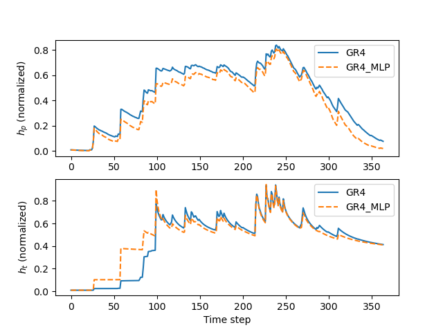

.. _user_guide.in_depth.hybrid_process_parameterization:

====================================================
Hybrid Process-Parameterization with Neural Networks
====================================================

The process-parameterization neural networks are integrated into `smash` for GR-like model structures, either within algebraic models solving analytical solutions of time-integrated ordinary differential equations (ODEs), or within state-space models that numerically solve the ODEs. 
These networks are used to refine internal water fluxes in hydrological models using a multilayer perceptron (MLP) based on the original hydrological model. 
For example, the model structure ``gr4_mlp`` is used to embed an MLP into the original ``gr4`` model, while the structure ``gr4_ode_mlp`` embeds neural ODEs into the original continuous state-space ``gr4_ode`` model. 
Please refer to the description of :ref:`Hydrological Operators <math_num_documentation.forward_structure.hydrological_module>` for mathematical details on different model structures. 
For simplicity, we will only refer to the ``gr4_mlp`` structure in this tutorial, but the same principles apply to the other hybrid structures.

We begin by opening a Python interface:

.. code-block:: none

    python3

Imports
-------

We will first import the necessary libraries for this tutorial.

.. code-block:: python

    >>> import smash
    >>> import numpy as np
    >>> import matplotlib.pyplot as plt

Model creation
--------------

Now, we need to create a :class:`smash.Model` object.
For this case, we will use the :ref:`user_guide.data_and_format_description.lez` dataset as an example.

Load the ``setup`` and ``mesh`` dictionaries using the `smash.factory.load_dataset` function.

.. code-block:: python

    >>> setup, mesh = smash.factory.load_dataset("Lez")

The hydrological model structure and the architecture of the process-parameterization neural network are defined in the ``setup`` dictionary. 

.. code-block:: python

    >>> setup["hydrological_module"] = "gr4_mlp"
    >>> setup["hidden_neuron"] = 12  # 1 hidden layer with 12 neurons. Use a tuple for 2 hidden layers.

The MLP architecture is configured via the ``hidden_neuron`` key. 
To define a single hidden layer, use an integer representing the number of neurons. 
To define two hidden layers, use a tuple of two integers, where each value specifies the number of neurons in the corresponding layer. 
A maximum of two hidden layers is supported.

.. note::
    The activation functions are not user-configurable. 
    They are fixed to ``SiLU`` for the hidden layer(s) and ``TanH`` for the output layer. 
    The ``SiLU`` function is twice differentiable everywhere and provides smooth gradients, ensuring numerical stability during optimization, 
    particularly when integrating neural ODEs (refer to the description of the ``gr4_ode_mlp`` structure in :ref:`Hydrological Operators <math_num_documentation.forward_structure.hydrological_module>`).

Now, we create the :class:`smash.Model` object using the ``setup`` and ``mesh`` dictionaries.

.. code-block:: python

    >>> model = smash.Model(setup, mesh)

By default, the weights and biases of the MLP are initialized to zeros, making the hybrid structure equivalent to the original GR-like model.

.. code-block:: python

    >>> model.get_nn_parameters_weight()

.. code-block:: output

    [array([[0., 0., 0., 0.],
           [0., 0., 0., 0.],
           [0., 0., 0., 0.],
           [0., 0., 0., 0.],
           [0., 0., 0., 0.],
           [0., 0., 0., 0.],
           [0., 0., 0., 0.],
           [0., 0., 0., 0.],
           [0., 0., 0., 0.],
           [0., 0., 0., 0.],
           [0., 0., 0., 0.],
           [0., 0., 0., 0.]], dtype=float32), array([[0., 0., 0., 0., 0., 0., 0., 0., 0., 0., 0., 0.],
           [0., 0., 0., 0., 0., 0., 0., 0., 0., 0., 0., 0.],
           [0., 0., 0., 0., 0., 0., 0., 0., 0., 0., 0., 0.],
           [0., 0., 0., 0., 0., 0., 0., 0., 0., 0., 0., 0.]], dtype=float32)]

Pre-calibration
---------------

Before training the process-parameterization network, it is highly recommended to perform a pre-calibration step to estimate only the conceptual parameters and/or initial states of the original GR-like model. 
This helps prevent increased identifiability issues that may arise at this stage when using the process-parameterization network. 
This step includes pre-calibrating the hydrological parameters (in the case of a uniform or distributed mapping) or pre-training the parameters of the descriptors-to-parameters mapping (in the case of regionalization). 
For simplicity, we will use the uniform mapping in this example.

By default of this model structure, the parameters that will be calibrated include the weights and biases of the MLP, as well as the parameters of the original GR-like model.

.. code-block:: python

    >>> optimize_options = smash.default_optimize_options(model)
    >>> optimize_options["parameters"]

.. code-block:: output

    ['cp', 'ct', 'kexc', 'llr', 'weight_1', 'bias_1', 'weight_2', 'bias_2']

Then, the weights and biases can be excluded from calibration at this stage:

.. code-block:: python

    >>> optimize_options["parameters"] = [p for p in optimize_options["parameters"] if "weight" not in p and "bias" not in p]
    >>> optimize_options["parameters"]

.. code-block:: output

    ['cp', 'ct', 'kexc', 'llr']

Pre-calibrate the model using the default SBS optimizer with a small number of iterations:
    
.. code-block:: python

    >>> optimize_options["termination_crit"]["maxiter"] = 2
    >>> model.optimize(optimize_options=optimize_options)

.. code-block:: output

    </> Optimize
        At iterate     0    nfg =     1    J = 6.85771e-01    ddx = 0.64
        At iterate     1    nfg =    30    J = 3.51670e-01    ddx = 0.64
        At iterate     2    nfg =    58    J = 1.80573e-01    ddx = 0.32
        STOP: TOTAL NO. of ITERATIONS REACHED LIMIT

.. note::
    You may see a warning such as "sbs optimizer may not be suitable for the gr4_mlp module..." because the SBS optimizer is generally not well-suited for high-dimensional optimization in hybrid process-parameterization models. 
    However, since the neural network parameters have been excluded from calibration in this step, this warning can be safely ignored.

Weights initialization
----------------------

After pre-calibrating the conceptual model parameters, the MLP weights should be initialized with small values to ensure a limited hybridization effect, preserving model behavior close to the original structure at the beginning of training. 
The weights and biases of the MLP can be initialized either by manually setting their values or by using an automatic initialization method.  
Here, we use the latter approach:

.. code-block:: python

    >>> # Initialize using He uniform method
    >>> model.set_nn_parameters_weight(initializer="he_uniform", random_state=23)
    >>> # Reduce the weights and biases to a small value
    >>> model.set_nn_parameters_weight([w*0.1 for w in model.get_nn_parameters_weight()])

Main training
-------------

Now we proceed to the main training of the process-parameterization neural network, jointly estimating the neural network weights and the hydrological parameters.  
Various gradient-based optimizers available in `smash` are suitable for this stage.  
In this example, we use the L-BFGS-B optimizer:

.. code-block:: python

    >>> model.optimize(optimizer="lbfgsb")

.. code-block:: output

    </> Optimize
        At iterate     0    nfg =     1    J = 2.45918e-01    |proj g| = 1.69959e+00
        At iterate     1    nfg =     4    J = 1.90550e-01    |proj g| = 4.10054e-01
        At iterate     2    nfg =     5    J = 1.80142e-01    |proj g| = 4.18718e-01
        ...
        At iterate    98    nfg =   118    J = 1.36854e-01    |proj g| = 1.10897e-01
        At iterate    99    nfg =   120    J = 1.36791e-01    |proj g| = 9.63801e-02
        At iterate   100    nfg =   122    J = 1.36720e-01    |proj g| = 1.22952e-01
        STOP: TOTAL NO. of ITERATIONS REACHED LIMIT

Comparison with the original model
----------------------------------

It is now interesting to observe how the hybrid model alters the state dynamics compared to the original model—illustrating the hybridization effect.

We start by creating the original model, and running a forward simulation with returned model states:

.. code-block:: python

    >>> model_org = model.copy()
    >>> model_org.set_nn_parameters_weight(initializer="zeros")
    >>> model_org.set_nn_parameters_bias(initializer="zeros")
    >>> 
    >>> ret_org = model_org.forward_run(return_options={"rr_states": True})

Next, get the states of the hybrid model:

.. code-block:: python

    >>> ret_hyb = model.forward_run(return_options={"rr_states": True})

Get the production and transfer states from both models at the outlet pixel:

.. code-block:: python

    >>> x, y = model.mesh.gauge_pos[2]  # position of the most downstream gauge
    >>> # Get the production state for the original model
    >>> hp_org = np.array([i.values[x, y, 1] for i in ret_org.rr_states])
    >>> # Get the production state for the hybrid model
    >>> hp_hyb = np.array([i.values[x, y, 1] for i in ret_hyb.rr_states])
    >>> # Get the transfer state for the original model
    >>> ht_org = np.array([i.values[x, y, 2] for i in ret_org.rr_states])
    >>> # Get the transfer state for the hybrid model
    >>> ht_hyb = np.array([i.values[x, y, 2] for i in ret_hyb.rr_states])

Finally, we can plot the normalized (by related reservoir capacities) states of the production (:math:`h_p`) and transfer (:math:`h_t`) reservoirs for both the original and hybrid models:

.. code-block:: python

    >>> fig, axs = plt.subplots(2, 1)
    >>> 
    >>> axs[0].plot(hp_org, label="GR4")
    >>> axs[0].plot(hp_hyb, label="GR4_MLP", linestyle="--")
    >>> axs[0].set_ylabel(r"$h_p$ (normalized)")
    >>> axs[0].legend()
    >>> 
    >>> axs[1].plot(ht_org, label="GR4")
    >>> axs[1].plot(ht_hyb, label="GR4_MLP", linestyle="--")
    >>> axs[1].set_ylabel(r"$h_t$ (normalized)")
    >>> axs[1].set_xlabel("Time step")
    >>> axs[1].legend()
    >>> 
    >>> plt.show()

