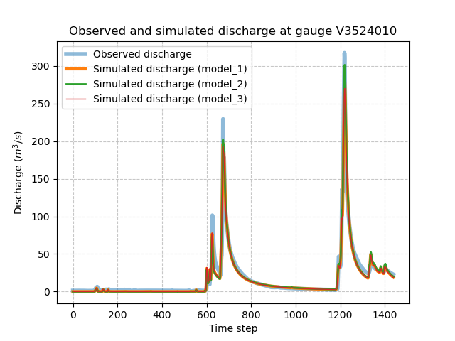

.. _user_guide.in_depth.multicriteria_calibration:

==========================
Multi-criteria Calibration
==========================

This section provides a detailed guide on optimizing a model using multiple calibration metrics.
The multiple calibration metrics are based on hydrological signatures :ref:`Math / Num Documentation <math_num_documentation.hydrological_signature>`.

First, open a Python interface:

.. code-block:: none

    python3

Imports
-------

We will first import the necessary libraries for this tutorial.

.. code-block:: python
    
    >>> import smash
    >>> import matplotlib.pyplot as plt
    >>> import pandas as pd
    >>> import numpy as np

Model object creation
---------------------

Now, we need to create a :class:`smash.Model` object.
For this case, we will use the :ref:`user_guide.data_and_format_description.cance` dataset as an example.

Load the ``setup`` and ``mesh`` dictionaries using the :meth:`smash.factory.load_dataset` method and create the :class:`smash.Model` object.

.. code-block:: python

    >>> setup, mesh = smash.factory.load_dataset("Cance")
    >>> model = smash.Model(setup, mesh)
    
Multiple metrics calibration using signatures
---------------------------------------------

The `smash` optimization algorithms enable the use of a cost function composed of multiple calibration metrics.
First, the observation at a gauge :math:`g` is defined as the sum of several metrics as:

.. math::

    J_{obs, g} = \sum w_c j_c

with :math:`j_c` and :math:`w_c` being a specific metric and the associated weight, respectively.
For more details, see the :ref:`Math / Num Documentation <math_num_documentation.cost_function>` section.

Note that this multi-criteria approach is possible for the optimization methods :meth:`smash.Model.optimize` and :meth:`smash.Model.bayesian_optimize`. 
For simplicity, in this example, we use :meth:`smash.Model.optimize` for single gauge optimization with a uniform mapping.

First, we establish a reference benchmark using the default cost options with a single-objective function.

.. code-block:: python

    >>> model_1 = smash.optimize(model)

.. code-block:: output

    </> Optimize
        At iterate     0    nfg =     1    J = 6.95010e-01    ddx = 0.64
        At iterate     1    nfg =    30    J = 9.84102e-02    ddx = 0.64
        At iterate     2    nfg =    59    J = 4.54091e-02    ddx = 0.32
        At iterate     3    nfg =    88    J = 3.81819e-02    ddx = 0.16
        At iterate     4    nfg =   117    J = 3.73623e-02    ddx = 0.08
        At iterate     5    nfg =   150    J = 3.70871e-02    ddx = 0.02
        At iterate     6    nfg =   183    J = 3.68001e-02    ddx = 0.02
        At iterate     7    nfg =   216    J = 3.67631e-02    ddx = 0.01
        At iterate     8    nfg =   240    J = 3.67280e-02    ddx = 0.01
        CONVERGENCE: DDX < 0.01

The default evaluation metric :math:`j_c` is the Nash-Sutcliffe efficiency (NSE).

In addition to NSE, we now perform a multi-criteria optimization using two other metrics: 
the relative error based on the continuous runoff coefficient (Crc) and the relative error of the peak flow (Epf) for multi-criteria calibration.

.. code-block:: python

    >>> cost_options = {
    ...     "jobs_cmpt": ["nse", "Crc", "Epf"],
    ...     "wjobs_cmpt": [0.4, 0.3, 0.3],
    ... }
    >>> model_2 = smash.optimize(model, cost_options=cost_options)

.. code-block:: output

    </> Optimize
        At iterate     0    nfg =     1    J = 5.24818e-01    ddx = 0.64
        At iterate     1    nfg =    30    J = 4.10862e-02    ddx = 0.64
        At iterate     2    nfg =    59    J = 3.00684e-02    ddx = 0.32
        At iterate     3    nfg =    87    J = 2.14456e-02    ddx = 0.32
        At iterate     4    nfg =   116    J = 1.76072e-02    ddx = 0.16
        At iterate     5    nfg =   150    J = 1.71483e-02    ddx = 0.04
        At iterate     6    nfg =   182    J = 1.66174e-02    ddx = 0.04
        At iterate     7    nfg =   216    J = 1.65803e-02    ddx = 0.01
        At iterate     8    nfg =   248    J = 1.65622e-02    ddx = 0.01
        At iterate     9    nfg =   256    J = 1.65622e-02    ddx = 0.01
        CONVERGENCE: DDX < 0.01

where the weights of the objective functions :math:`w_c` based on NSE, Crc, and Epf are set to 0.4, 0.3, and 0.3 respectively. 
If these weights are not provided by the user, they are equal by default and their sum equals 1, hence the cost value is computed as the mean of the objective functions.

.. code-block:: python

    >>> cost_options = {
    ...     "jobs_cmpt": ["nse", "Crc", "Epf"],
    ...     "wjobs_cmpt": "mean",  # default value using alias 'mean'
    ... }

For multiple metrics based on flood-event signatures, these metrics are computed using flood event signatures computed from an automatic segmentation algorithm (see the tutorial on :ref:`segmentation algorithm <user_guide.classical_uses.hydrograph_segmentation>`).
The parameters of this algorithm, which utilizes rainfall and discharge signals, can be adjusted.
For example, consider a calibration using a multi-criteria cost function based on NSE and the flood flow (Eff) metric, with respective weights of 0.4 and 0.6, where the segmentation criterion is set to exceed a peak threshold of 0.9.

.. code-block:: python

    >>> cost_options = {
    ...     "jobs_cmpt": ["nse", "Eff"],
    ...     "event_seg": {"peak_quant": 0.9},
    ...     "wjobs_cmpt": [0.4, 0.6],
    ... }
    >>> model_3 = smash.optimize(model, cost_options=cost_options)

.. code-block:: output

    </> Optimize
        At iterate     0    nfg =     1    J = 5.84773e-01    ddx = 0.64
        At iterate     1    nfg =    30    J = 5.60801e-02    ddx = 0.64
        At iterate     2    nfg =    59    J = 2.23582e-02    ddx = 0.32
        At iterate     3    nfg =    88    J = 1.66137e-02    ddx = 0.16
        At iterate     4    nfg =   117    J = 1.61157e-02    ddx = 0.04
        At iterate     5    nfg =   150    J = 1.55516e-02    ddx = 0.04
        At iterate     6    nfg =   183    J = 1.55025e-02    ddx = 0.02
        At iterate     7    nfg =   215    J = 1.54659e-02    ddx = 0.01
        At iterate     8    nfg =   232    J = 1.54594e-02    ddx = 0.01
        CONVERGENCE: DDX < 0.01

Now, we compute the Nash-Sutcliffe error for the calibrated gauge of each model.

.. code-block:: python
          
    >>> models = [model_1, model_2, model_3]
    >>> nse = []
    >>> for m in models:
    ...     nse.append(smash.evaluation(m, metric="nse")[0][0])

Then, we compute the observed and simulated signatures for each model.

.. code-block:: python

    >>> models = [model_1, model_2, model_3]
    >>> signatures_obs = []
    >>> signatures_sim = []
    >>> for m in models:
    ...     signatures_obs.append(smash.signatures(m, sign=["Crc", "Epf", "Eff"]))
    ...     signatures_sim.append(smash.signatures(m, sign=["Crc", "Epf", "Eff"], domain="sim"))

For simplicity, we arange the signatures by type.

.. code-block:: python

    >>> crc_obs = []
    >>> epf_obs = []
    >>> eff_obs = []
    >>> for sign in signatures_obs:
    ...     crc_obs.append(sign.cont.iloc[0]["Crc"])
    ...     epf_obs.append(sign.event.iloc[0]["Epf"])
    ...     eff_obs.append(sign.event.iloc[0]["Eff"])

    >>> crc_sim = []
    >>> epf_sim = []
    >>> eff_sim = []
    >>> for sign in signatures_sim:
    ...     crc_sim.append(sign.cont.iloc[0]["Crc"])
    ...     epf_sim.append(sign.event.iloc[0]["Epf"])
    ...     eff_sim.append(sign.event.iloc[0]["Eff"])

We compute the relative error for each signatures.

.. code-block:: python

    >>> ERR_Crc = [abs(sim - obs)/obs for (sim, obs) in zip(crc_sim, crc_obs)]
    >>> ERR_Epf = [abs(sim - obs)/obs for (sim, obs) in zip(epf_sim, epf_obs)]
    >>> ERR_Eff = [abs(sim - obs)/obs for (sim, obs) in zip(eff_sim, eff_obs)]

Finally, we group the metric information together as follows:

.. code-block:: python
        
    >>> metric_info = {
    ...     "NSE": nse,
    ...     "ERR_Crc": ERR_Crc,
    ...     "ERR_Epf": ERR_Epf,
    ...     "ERR_Eff": ERR_Eff,
    ... }
    >>> index = ["model_1 (NSE)", "model_2 (NSE, Crc, Epf)", "model_3 (NSE, Eff)"]
    >>> df = pd.DataFrame(metric_info, index=index)
    >>> df

.. code-block:: output

                                  NSE   ERR_Crc   ERR_Epf   ERR_Eff
    model_1 (NSE)            0.963272  0.048503  0.111760  0.067595
    model_2 (NSE, Crc, Epf)  0.960845  0.020717  0.050704  0.125812
    model_3 (NSE, Eff)       0.962252  0.061530  0.148913  0.033651

and visualize the simulated discharge for each model.

.. code-block:: python

    >>> code = model.mesh.code[0]
    >>> q_obs = model.response_data.q[0].copy()
    >>> q_obs[q_obs < 0] = np.nan
    >>> plt.plot(q_obs, linewidth=4, alpha=0.5, label="Observed discharge")
    >>> plt.plot(model_1.response.q[0, :], linewidth=3, label="Simulated discharge (model_1)")
    >>> plt.plot(model_2.response.q[0, :], linewidth=2, label="Simulated discharge (model_2)")
    >>> plt.plot(model_3.response.q[0, :], linewidth=1, label="Simulated discharge (model_3)")
    >>> plt.xlabel("Time step")
    >>> plt.ylabel("Discharge ($m^3/s$)")
    >>> plt.grid(ls="--", alpha=.7)
    >>> plt.legend()
    >>> plt.title(f"Observed and simulated discharge at gauge {code}")
    >>> plt.show()

