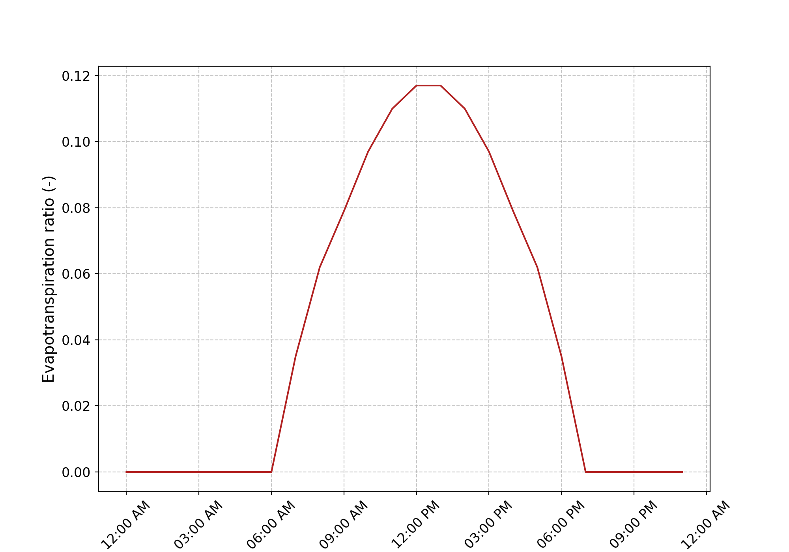

.. _user_guide.others.input_data_convention:

=====================
Input Data Convention
=====================

The aim of this section is to describe the conventions that apply to all input data used in `smash`
(i.e. observed discharge, precipitation, descriptor, etc)

Observed discharge
------------------

The observed discharge for one catchment is read from a ``.csv`` file with the following structure: 

.. csv-table:: V3524010.csv
    :align: center
    :header: "200601010000"
    :width: 50
    
    -99.000
    -99.000
    ...
    1.180
    1.185

It is a single-column ``.csv`` file containing the observed discharge values in m\ :sup:`3` \/s (negative values in the series will be interpreted 
as no-data) and whose header is the first time step of the chronicle. The name of the file, for any catchment, must contains the code of the 
gauge which is filled in the ``mesh`` (see the `smash.factory.generate_mesh` method).
    
.. note::
    The time step of the header does not have to match the first simulation time step. `smash` manages to read the corresponding lines 
    from the ``setup`` variables, ``start_time``, ``end_time`` and ``dt``.

Precipitation
-------------

The precipitation files must be stored for each time step of the simulation in ``tif`` format. For one time step, `smash` will recursively 
search in the ``prcp_directory``, a file with the following name structure: ``*%Y%m%d%H%M*.tif`` (``*`` means that we can match any character).
An example of file name in tif format for the date 2014-09-15 00:00: ``prcp_201409150000.tif``.

.. note::
    ``%Y%m%d%H%M`` is a unique key, the ``prcp_directory`` (and all subdirectories) can not contains files with similar dates.

Potential evapotranspiration
----------------------------

The potential evapotranspiration files must be stored for each each time step of the simulation in ``tif`` format. For one time step, `smash` 
will recursively search in the ``pet_directory``, a file with the following name structure: ``*%Y%m%d%H%M*.tif`` (``*`` means that we can match any character).
An example of file name in tif format for the date 2014-09-15 00:00: ``pet_201409150000.tif``.

.. note::
    ``%Y%m%d%H%M`` is a unique key, the ``pet_directory`` (and all subdirectories) can not contains files with similar dates.
    
In case of ``daily_interannual_pet``, `smash` will recursively search in the ``pet_directory``, a file with the following name 
structure: ``*%m%d*.tif`` (``*`` means that we can match any character).
An example of file name in tif format for the day 09-15: ``dia_pet_0915.tif``. This file will be disaggregated to the corresponding 
time step ``dt`` using the following distribution.

Snow
----

The snow files must be stored for each time step of the simulation in ``tif`` format. For one time step, `smash` will recursively 
search in the ``snow_directory``, a file with the following name structure: ``*%Y%m%d%H%M*.tif`` (``*`` means that we can match any character).
An example of file name in tif format for the date 2014-09-15 00:00: ``snow_201409150000.tif``.

.. note::
    ``%Y%m%d%H%M`` is a unique key, the ``snow_directory`` (and all subdirectories) can not contains files with similar dates.

Temperature
-----------

The temperature files must be stored for each time step of the simulation in ``tif`` format. For one time step, `smash` will recursively 
search in the ``temp_directory``, a file with the following name structure: ``*%Y%m%d%H%M*.tif`` (``*`` means that we can match any character).
An example of file name in tif format for the date 2014-09-15 00:00: ``temp_201409150000.tif``.

.. note::
    ``%Y%m%d%H%M`` is a unique key, the ``temp_directory`` (and all subdirectories) can not contains files with similar dates.

Descriptor
----------

The catchment descriptors files must be stored in ``tif`` format. For each descriptor name filled in the setup argument ``descriptor_name``,
`smash` will recursively search in the ``descriptor_directory``, a file with the following name structure: ``descriptor_name.tif``.
An example of file name in tif format for the slope descriptor: ``slope.tif``.

.. note::
    ``descriptor_name`` is a unique key, the ``descriptor_directory`` (and all subdirectories) can not contains files with similar decriptor name.

.. warning::
    There are 4 possible warnings when reading geo-referenced data (i.e. precipitation, descriptor, etc):

    - ``Missing Warning``
        A file (or more) is missing. It will be interpreted as no data.

    - ``Resolution Warning``
        A file (or more) has a spatial resolution different from the mesh resolution (i.e. the flow direction resolution).
        It will be resampled using a Nearest Neighbour algorithm.

    - ``Overlap Warning``
        A file (or more) has an origin that does not overlap with the mesh origin (i.e. the flow direction origin).
        The reading window is shifted towards the nearest overlapping cell.

    - ``Out Of Bound Warning``
        A file (or more) has an extent that does not include, partially or totally, the mesh extent.
        It will be interpreted as no data where the mesh extent is out of bound.

Directory structure
-------------------

The aim of this section is to present the directory structure for input data and how this translates into ``setup``.

Quick structure
***************

Below is the most basic directory structure you can have, with one subdirectory per type of input data, and all files at the root of each subdirectory.

.. code-block:: text

    input_data
    ├── prcp
    │   ├── prcp_201409150000.tif
    │   ├── prcp_201409150100.tif
    │   └── ...
    ├── pet
    │   ├── pet_201409150000.tif
    │   ├── pet_201409150100.tif
    │   └── ...
    ├── snow
    │   ├── snow_201409150000.tif
    │   ├── snow_201409150100.tif
    │   └── ...
    ├── temp
    │   ├── temp_201409150000.tif
    │   ├── temp_201409150100.tif
    │   └── ...
    ├── qobs
    │   ├── V3524010.csv
    │   ├── V3504010.csv
    │   └── ...
    └── descriptor
        ├── slope.tif
        └── dd.tif

This results in the following ``setup``:

.. code-block:: python

    setup = {
        "read_prcp": True,
        "prcp_directory": "./input_data/prcp",

        "read_pet": True,
        "pet_directory": "./input_data/pet",

        "read_snow": True,
        "pet_directory": "./input_data/snow",

        "read_temp": True,
        "pet_directory": "./input_data/temp",

        "read_qobs": True,
        "qobs_directory": "./input_data/qobs",

        "read_descriptor": True,
        "descriptor_directory": "./input_data/descriptor",
        "descriptor_name": ["slope", "dd"],
    }

This structure will be effective if few files are available for atmospheric data (i.e. precipitation, potential 
evapotranspiration, etc). However, if these directories contain a large number of files, a recursive search from the 
root folder can become very time-consuming. For this reason, it is necessary to adapt the directory structure to simplify and 
speed up file searches.

Smart structure
***************

We can use the same type of example as above, but this time incorporate sub-directories for years, months and days in the atmospheric data.

.. code-block:: text

    input_data
    ├── prcp
    │   └── 2014
    │       └── 09
    │           └── 15
    │               ├── prcp_201409150000.tif
    │               ├── prcp_201409150100.tif
    │               └── ...
    ├── pet
    │   └── 2014
    │       └── 09
    │           └── 15
    │               ├── pet_201409150000.tif
    │               ├── pet_201409150100.tif
    │               └── ...
    ├── snow
    │   └── 2014
    │       └── 09
    │           └── 15
    │               ├── snow_201409150000.tif
    │               ├── snow_201409150100.tif
    │               └── ...
    ├── temp
    │   └── 2014
    │       └── 09
    │           └── 15
    │               ├── temp_201409150000.tif
    │               ├── temp_201409150100.tif
    │               └── ...
    ├── qobs
    │   ├── V3524010.csv
    │   ├── V3504010.csv
    │   └── ...
    └── descriptor
        ├── slope.tif
        └── dd.tif

At this point, the ``setup`` used previously will also work, but there will be no difference in access to files if we don't specify
directory structure. We can therefore take the previous ``setup`` and add the access method.

.. code-block:: python
    
    setup = {
        "read_prcp": True,
        "prcp_directory": "./input_data/prcp",
        "prcp_access": "%Y/%m/%d",

        "read_pet": True,
        "pet_directory": "./input_data/pet",
        "pet_access": "%Y/%m/%d",

        "read_snow": True,
        "snow_directory": "./input_data/snow",
        "snow_access": "%Y/%m/%d",

        "read_temp": True,
        "temp_directory": "./input_data/temp",
        "temp_access": "%Y/%m/%d",

        "read_qobs": True,
        "qobs_directory": "./input_data/qobs",

        "read_descriptor": True,
        "descriptor_directory": "./input_data/descriptor",
        "descriptor_name": ["slope", "dd"],
    }

The ``prcp_access``, ``pet_access``, ``snow_acces`` and ``temp_access`` variables should therefore be adapted to your structure to 
speed up data access.
