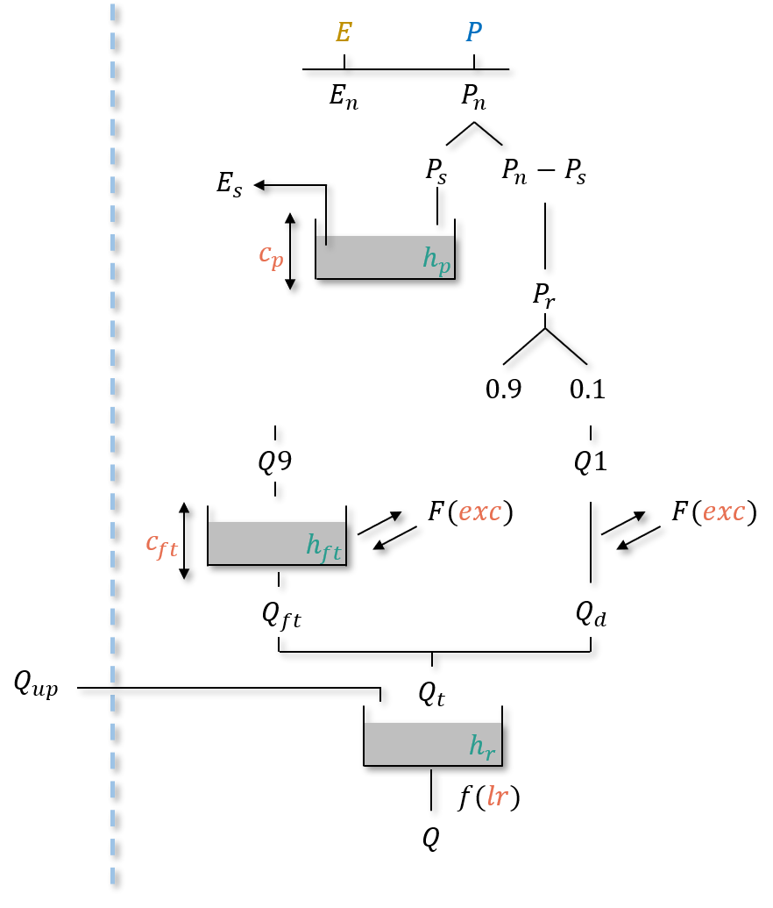
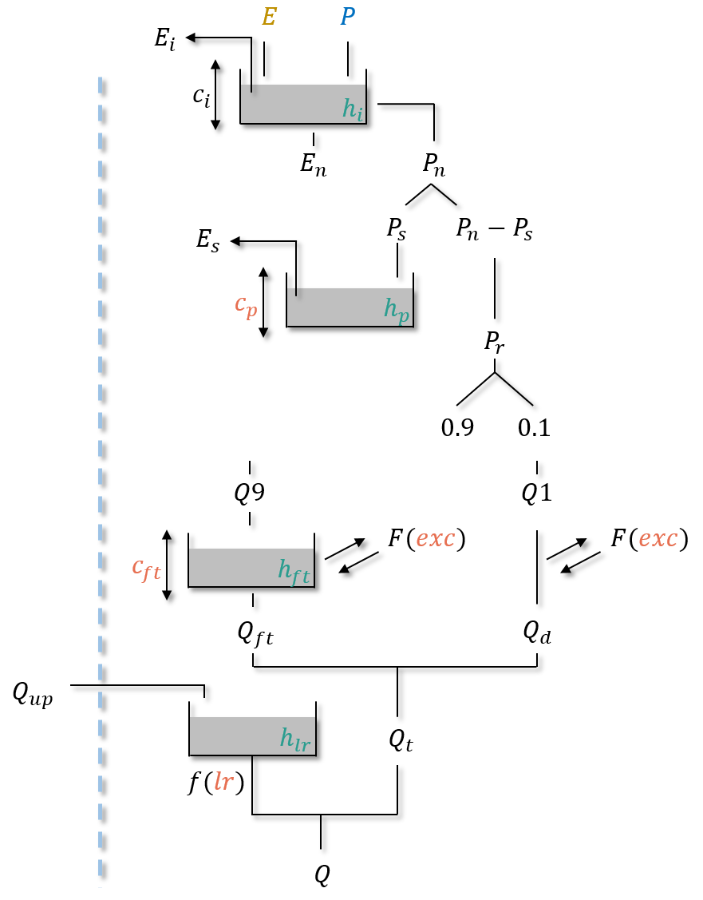
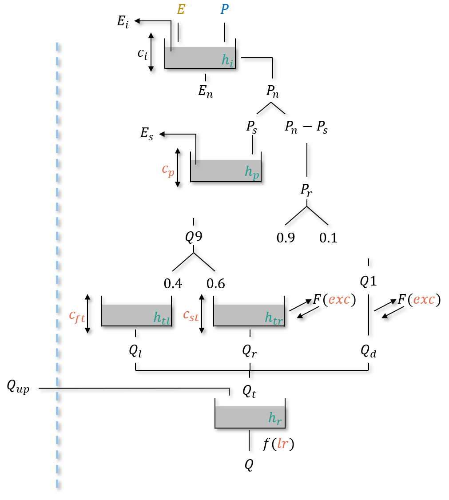
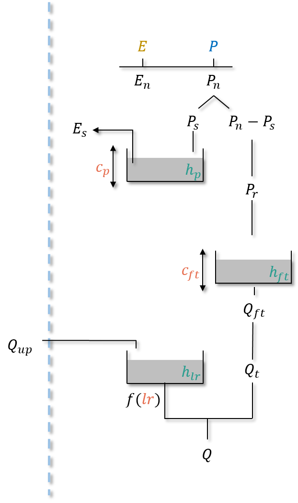

.. _user_guide.model_structure:

===============
Model structure
===============

In this section all the hydrological model structures that can be used will be presented.

There are 4 different structures available:

- "gr-a"
    4 parameters and 3 states structure derived from the GR model.
    
- "gr-b"
    4 parameters and 4 states structure derived from the GR model.
    
- "gr-c"
    5 parameters and 5 states structure derived from the GR model.
    
- "gr-d"
    3 parameters and 3 states structure derived from the GR model.
    
.. note::
    see the :ref:`Math / Num Documentation <math_num_documentation.hydrological_operators.gr>` for more information about GR model.
    

Model structure description
---------------------------

.. _user_guide.model_structure.gr_a:

gr-a
''''

    
Parameters
**********

- ``cp``: the maximum capacity of the production storage :math:`(mm)`,
- ``cft``: the maximum capacity of the transfer storage :math:`(mm)`,
- ``exc``: the non-conservative exchange parameter :math:`(mm/dt)`,
- ``lr``: the linear routing parameter :math:`(min)`.

States
******

- ``hp``: the relative state of the production storage :math:`(-)`,
- ``hft``: the relative state of the transfer storage :math:`(-)`,
- ``hlr``: the absolute state of the routing storage :math:`(mm)`.

Operating
*********

- neutralization of :math:`P` by :math:`E` to determine a net rainfall :math:`P_n` and a net evapotranspiration :math:`E_n`,
- filling (resp. emptying) the production storage by :math:`P_s` (resp. :math:`E_s`),
- splitting :math:`P_r` into two branches, 90% filling the transfer storage and 10% into the direct branch,
- application of the non-conservative flux :math:`F` (which can be either positive or negative) in both branches,
- summing :math:`Q_{ft}`, the outgoing flux of the transfer storage and :math:`Q_d`, the outgoing flux of the direct branch giving the cell flux :math:`Q_t`,
- filling the routing storage by the upstream flux :math:`Q_{up}`,
- computation of the final routed flow :math:`Q` at the output of the routing storage.

gr-b
''''

    
Parameters
**********

- ``cp``: the maximum capacity of the production storage :math:`(mm)`,
- ``cft``: the maximum capacity of the transfer storage :math:`(mm)`,
- ``exc``: the non-conservative exchange parameter :math:`(mm/dt)`,
- ``lr``: the linear routing parameter :math:`(min)`.

States
******

- ``hi``: the relative state of the interception storage :math:`(-)`,
- ``hp``: the relative state of the production storage :math:`(-)`,
- ``hft``: the relative state of the transfer storage :math:`(-)`,
- ``hlr``: the absolute state of the routing storage :math:`(mm)`.

Operating
*********

- neutralization of :math:`P` by :math:`E` to determine a net rainfall :math:`P_n` and a net evapotranspiration :math:`E_n` using an interception storage,

.. note::
    In case of a daily time step simulation, the interception storage is disabled and the neutralization of :math:`P` by :math:`E` is similar to :ref:`user_guide.model_structure.gr_a`.
    Otherwise (at sub-daily time step), the maximum capacity :math:`c_i` is adjusted to match fluxes between the simulation at daily time and sub-daily time step.

- filling (resp. emptying) the production storage by :math:`P_s` (resp. :math:`E_s`),
- splitting :math:`P_r` into two branches, 90% filling the transfer storage and 10% into the direct branch,
- application of the non-conservative flux :math:`F` (which can be either positive or negative) in both branches,
- summing :math:`Q_{ft}`, the outgoing flux of the transfer storage and :math:`Q_d`, the outgoing flux of the direct branch giving the cell flux :math:`Q_t`,
- filling the routing storage by the upstream flux :math:`Q_{up}`,
- computation of the final routed flow :math:`Q` at the output of the routing storage.

gr-c
''''

    
Parameters
**********

- ``cp``: the maximum capacity of the production storage :math:`(mm)`,
- ``cft``: the maximum capacity of the first transfer storage :math:`(mm)`,
- ``cst``: the maximum capacity of the second transfer storage :math:`(mm)`,
- ``exc``: the non-conservative exchange parameter :math:`(mm/dt)`,
- ``lr``: the linear routing parameter :math:`(min)`.

States
******

- ``hi``: the relative state of the interception storage :math:`(-)`,
- ``hp``: the relative state of the production storage :math:`(-)`,
- ``hft``: the relative state of the transfer storage :math:`(-)`,
- ``hst``: the relative state of the transfer storage :math:`(-)`,
- ``hlr``: the absolute state of the routing storage :math:`(mm)`.

Operating
*********

- neutralization of :math:`P` by :math:`E` to determine a net rainfall :math:`P_n` and a net evapotranspiration :math:`E_n` using an interception storage,

.. note::
    In case of a daily time step simulation, the interception storage is disabled and the neutralization of :math:`P` by :math:`E` is similar to :ref:`user_guide.model_structure.gr_a`.
    Otherwise (at sub-daily time step), the maximum capacity :math:`c_i` is adjusted to match fluxes between the simulation at daily time and sub-daily time step.

- filling (resp. emptying) the production storage by :math:`P_s` (resp. :math:`E_s`),
- splitting :math:`P_r` into three branches, 54% filling the first transfer storage, 36% filling the second transfer storage and 10% into the direct branch,
- application of the non-conservative flux :math:`F` (which can be either positive or negative) in the first transfer and direct branches,
- summing :math:`Q_{ft}`, the outgoing flux of the first transfer storage, :math:`Q_{st}`, the outgoing flux of the second transfer storage and :math:`Q_d`, the outgoing flux of the direct branch giving the cell flux :math:`Q_t`,
- filling the routing storage by the upstream flux :math:`Q_{up}`,
- computation of the final routed flow :math:`Q` at the output of the routing storage.

.. _user_guide.model_structure.gr_d:

gr-d
''''

    
Parameters
**********

- ``cp``: the maximum capacity of the production storage :math:`(mm)`,
- ``cft``: the maximum capacity of the transfer storage :math:`(mm)`,
- ``lr``: the linear routing parameter :math:`(min)`.

States
******

- ``hp``: the relative state of the production storage :math:`(-)`,
- ``hft``: the relative state of the transfer storage :math:`(-)`,
- ``hlr``: the absolute state of the routing storage :math:`(mm)`.

Operating
*********

- neutralization of :math:`P` by :math:`E` to determine a net rainfall :math:`P_n` and a net evapotranspiration :math:`E_n`,
- filling (resp. emptying) the production storage by :math:`P_s` (resp. :math:`E_s`),
- :math:`P_r` inflows the transfer storage,
- :math:`Q_{ft}`, the outgoing flux of the transfer storage, is the cell flux :math:`Q_t`,
- filling the routing storage by the upstream flux :math:`Q_{up}`,
- computation of the final routed flow :math:`Q` at the output of the routing storage.
