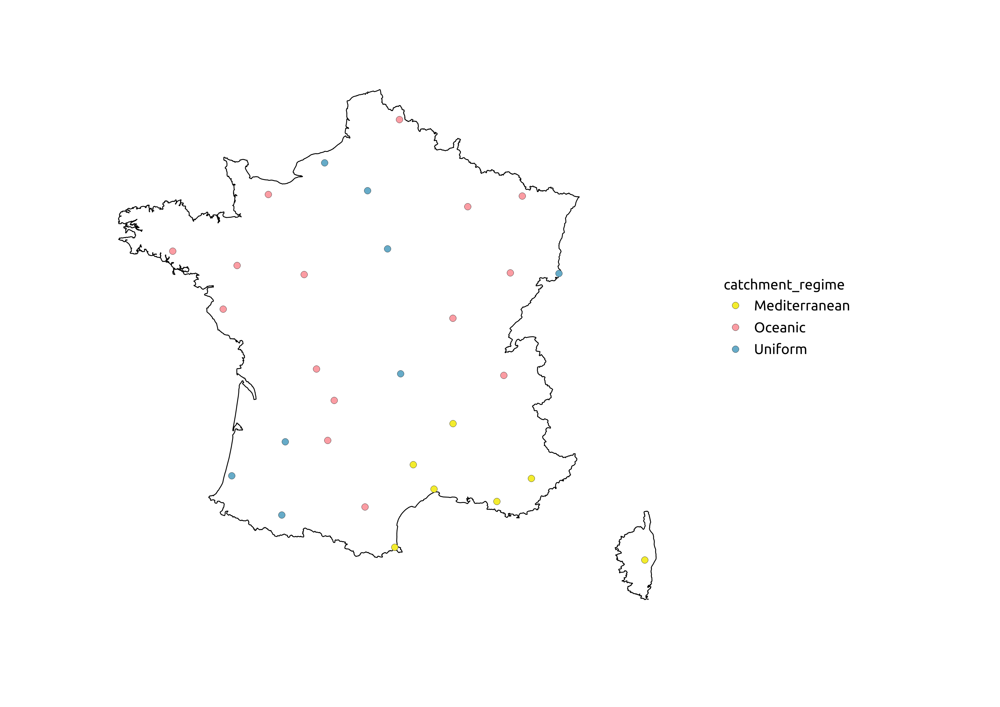
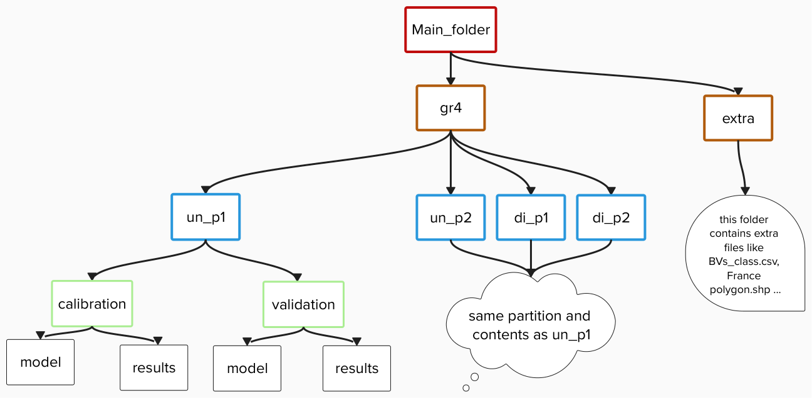
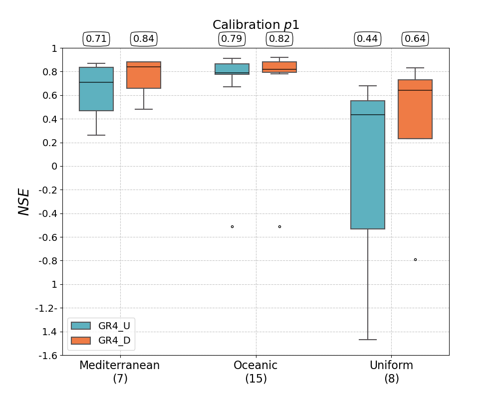
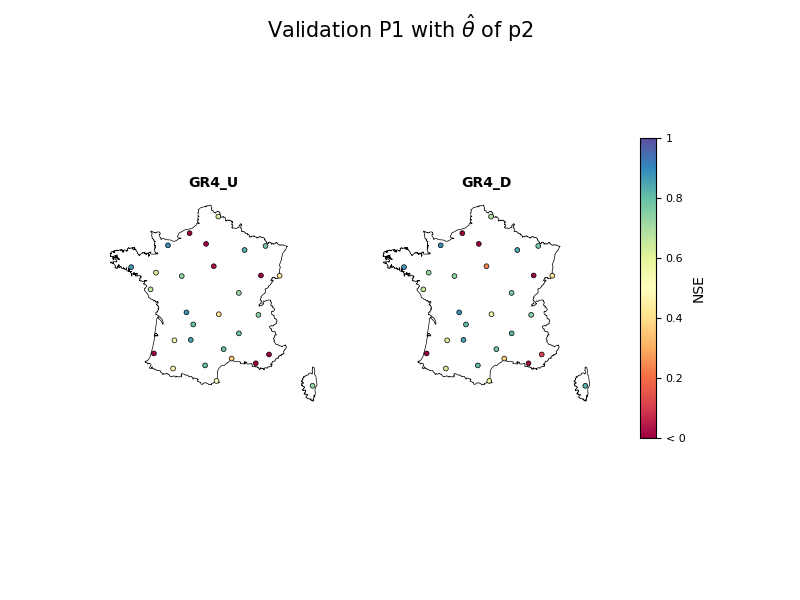
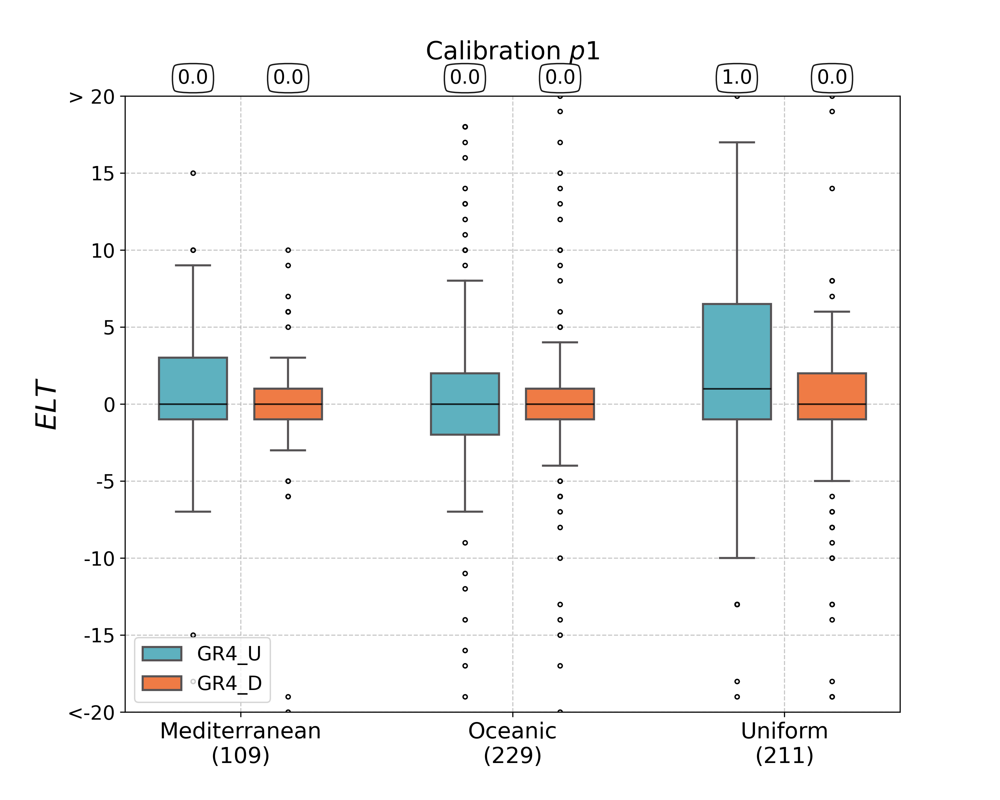
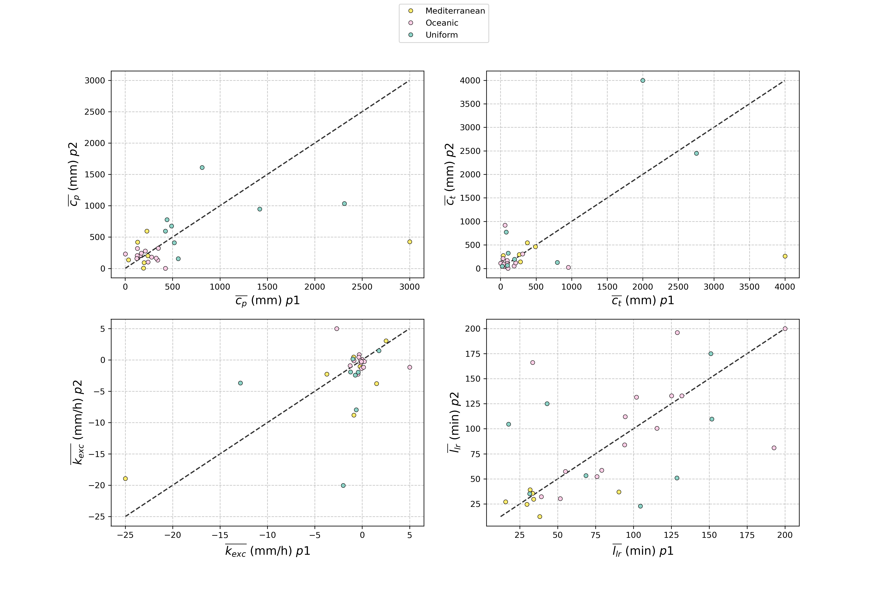

.. _user_guide.post_processing_external_tools.results_visualization_over_large_sample:

=======================================
Results Visualization Over Large Sample 
=======================================

The objective of this tutorial is to explain how to work with large data samples, focusing on data extraction and results visualization. 
We assume that model calibration and validation have already been performed with `smash`, and the `Model <smash.Model>` objects have been saved using the `smash.io.save_model` method. 
For example, we consider calibration methods with spatially uniform and distributed parameters on period ``p1`` (from 1 August 2006 to 31 July 2013), and validation on period ``p2`` (from 1 August 2013 to 31 July 2020), over 30 French catchments as shown in the figure below.

The following diagram represents the directory path of the `Model <smash.Model>` objects, results, and extra files that will be used in this tutorial.
The `Model <smash.Model>` objects used for calibration and validation are saved in the ``model`` folder for each set of calculations (``un_p1``, ``un_p2``, ``di_p1``, and ``di_p2``), where ``un`` stands for uniform and ``di`` for distributed mapping.
The extracted data will be stored in the ``results`` folder.

.. note::
    The directory structure shown in the diagram is optional and can be customized by the user as needed.

First, open a Python interface:

.. code-block:: none

    python3

Imports
-------

The libraries that need to be imported are as follows:

.. code-block:: python
    
    >>> import smash
    >>> import numpy as np
    >>> import pandas as pd
    >>> import os
    >>> import multiprocessing as mp
    >>> import glob
    >>> import matplotlib.pyplot as plt
    >>> import matplotlib as mpl
    >>> from functools import reduce
    >>> import geopandas as gpd

Model evaluation
----------------
This section demonstrates how to evaluate calibration results (model parameters, scoring metrics, signatures) from multiple model objects using the multiprocessing tool.
As an example, we perform this evaluation for distributed calibration over period ``p2``.

First, assign the path to the main folder where model objects are saved and sort the model object files:

.. code-block:: python

    >>> wdir = "./Main_folder/"
    >>> model_files = sorted(glob.glob(os.path.join(wdir, "gr4/di_p2/calibration/model/modelD_*.hdf5")))

Next, generate two `DataFrame <pandas.DataFrame>` objects:

- ``df_output``: Stores the performance scores (``NSE`` and ``KGE``), calibrated parameters (``cp``, ``ct``, ``kexc``, and ``llr``), and continuous hydrological signatures (runoff coefficients and wetness index).
- ``df1_output``: Stores the flood event signatures.

Save these DataFrames as ``result.csv`` and ``sig.csv``:

.. code-block:: python

    >>> df_output = pd.DataFrame(
    ...     columns=['code', 'nse', 'kge', 'cp', 'ct', 'kexc', 'llr', 'WI', 'RC_obs', 'RC_sim']
    ... )
    >>> df_output.to_csv(os.path.join(wdir, "gr4/di_p2/calibration/results/result.csv"), header=True, index=False)
    >>> df1_output = pd.DataFrame(columns=['code', 'Epf', 'Elt', 'Erc', 'Eff'])
    >>> df1_output.to_csv(os.path.join(wdir, "gr4/di_p2/calibration/results/sig.csv"), header=True, index=False)

The following function performs all the required operations to extract the desired results and save them into the previously generated ``csv`` files.

.. code-block:: python

    >>> def evaluate_models(model_file, not_used):
    ...     model = smash.io.read_model(model_file)
    ...     # Performance_scores 
    ...     perf_nse = np.round(smash.evaluation(model, metric="nse")[0], 2)
    ...     perf_kge = np.round(smash.evaluation(model, metric="kge")[0], 2)
    ...     # Parameters: To get parameters for distributed mapping, the parameters array 
    ...     # should be multiplied by the active_cells array in order to have parameters only 
    ...     # on active cells and then the mean is calculated for each parameter.
    ...     active_cells = model.mesh.active_cell
    ...     cp = model.get_rr_parameters("cp")*active_cells
    ...     ct = model.get_rr_parameters("ct")*active_cells
    ...     kexc = model.get_rr_parameters("kexc")*active_cells
    ...     llr = model.get_rr_parameters("llr")*active_cells
    ...     cp_mean = cp[np.nonzero(cp)].mean()
    ...     ct_mean = ct[np.nonzero(ct)].mean()
    ...     kexc_mean = kexc[np.nonzero(kexc)].mean()
    ...     llr_mean = llr[np.nonzero(llr)].mean()
    ...     # Continuous hydrological signatures (Run_off coefficient [RC] and Wetness Index [WI])
    ...     prcp = model.atmos_data.mean_prcp[0, :]
    ...     pet = model.atmos_data.mean_pet[0, :]
    ...     # Indices with no-data precipitation 
    ...     no_data_prcp_indices = np.where(prcp==-99.0)[0] 
    ...     # Indices with no-data evapotranspiration
    ...     no_data_pet_indices = np.where(pet==-99.0)[0] 
    ...     # Combines indices with no-data precipitation and evapotranspiration
    ...     combined_no_data_indices = np.concatenate((no_data_prcp_indices, no_data_pet_indices)) 
    ...     # Deletes the combined no_data indices for precipitation
    ...     prcp = np.delete(prcp, combined_no_data_indices)
    ...     # Deletes the combined no-data indices for evapotranspiration
    ...     pet = np.delete(pet, combined_no_data_indices) 
    ...     prcp_sum = np.sum(prcp)
    ...     pet_sum = np.sum(pet)
    ...     # Wetness Index
    ...     WI = prcp_sum/pet_sum
    ...     sign_obs = smash.signatures(model, domain="obs")
    ...     sign_sim = smash.signatures(model, domain="sim")
    ...     #Runoff Coefficient
    ...     RC_obs = sign_obs.cont["Crc"].values
    ...     RC_sim = sign_sim.cont["Crc"].values
    ...     # Reading the saved result.csv file and storing the extracted data of each model object in it
    ...     df_output = pd.read_csv(os.path.join(wdir, "gr4/di_p2/calibration/results/result.csv"), header=0)
    ...     df_out_this_run = pd.DataFrame(
    ...         data = {
    ...             'code': [model.mesh.code[0]],
    ...             'nse': [perf_nse[0]],
    ...             'kge': [perf_kge[0]],
    ...             'cp': [cp_mean],
    ...             'ct': [ct_mean],
    ...             'kexc': [kexc_mean],
    ...             'llr': [llr_mean],
    ...             'WI': [WI],
    ...             'RC_obs': [RC_obs[0]],
    ...             'RC_sim': [RC_sim[0]]
    ...         }
    ...     )
    ...     df_output = pd.concat([df_output, df_out_this_run])
    ...     df_output.to_csv(os.path.join(wdir, "gr4/di_p2/calibration/results/result.csv"), header=True, index=False)
    ...     # Error computation for flood event signatures
    ...     Epf = sign_sim.event['Epf']/(sign_obs.event['Epf']) -1
    ...     Elt = sign_sim.event['Elt']-(sign_obs.event['Elt'])
    ...     Erc = sign_sim.event['Erc']/(sign_obs.event['Erc']) -1
    ...     Eff = sign_sim.event['Eff']/(sign_obs.event['Eff']) -1
    ...     # Reading the saved sig.csv file and storing the extracted data of each model object in it
    ...     df1_output = pd.read_csv(os.path.join(wdir, "gr4/di_p2/calibration/results/sig.csv"), header=0)
    ...     df1_out_this_run = pd.DataFrame(
    ...         data = {
    ...             'code': sign_sim.event['code'],
    ...             'Epf': Epf,
    ...             'Elt': Elt,
    ...             'Erc': Erc,
    ...             'Eff': Eff
    ...         }
    ...     )
    ...     df1_output = pd.concat([df1_output, df1_out_this_run], ignore_index=True)
    ...     df1_output.to_csv(os.path.join(wdir, "gr4/di_p2/calibration/results/sig.csv"), header=True, index=False)
    ...

Evaluate `Model <smash.Model>` objects using 10 CPUs with the multiprocessing tool.

.. code-block:: python

    >>> pool = mp.Pool(10)
    >>> pool.starmap(evaluate_models,[(mf, 1) for mf in model_files])
    >>> pool.close()

Then, the computed values are saved to the ``result.csv`` and ``sig.csv`` files.

.. code-block:: python

    >>> result_csv_file = pd.read_csv(os.path.join(wdir, "gr4/di_p2/calibration/results/result.csv"), header=0)
    >>> result_csv_file.head()

.. code-block:: output

           code   nse   kge          cp          ct      kexc         llr        WI    RC_obs    RC_sim
    0  A0220200  0.40  0.48  575.042371   78.448448 -2.261202   38.085205  1.340259  0.199770  0.154343
    1  E3346020  0.78  0.83  285.865108   80.568040 -0.929104  101.446942  1.158639  0.302873  0.298541
    2  N0113010  0.88  0.82  198.773675   27.066852 -0.136231  128.228491  1.139423  0.366790  0.406840
    3  O3314010  0.84  0.86  374.452489  586.756746  2.929307   41.757472  2.979111  0.951228  0.966503
    4  J5704810  0.93  0.88  192.298131  892.015079  0.883080  127.961232  1.583767  0.581201  0.573484

.. code-block:: python

    >>> sig_csv_file = pd.read_csv(os.path.join(wdir, "gr4/di_p2/calibration/results/sig.csv"), header=0)
    >>> sig_csv_file.head()

.. code-block:: output

           code       Epf   Elt       Erc       Eff
    0  A0220200 -0.995463  82.0 -0.998180 -0.991648
    1  A0220200 -0.957354   0.0 -0.979879 -0.949528
    2  A0220200 -0.903731  -1.0 -0.859178 -0.889341
    3  A0220200 -0.766359  -2.0 -0.741470 -0.747489
    4  A0220200 -0.792389  -4.0 -0.769544 -0.799484

Now we can visualize the results and make plots using both ``csv`` files (``result.csv`` and ``sig.csv``) for any set of computations.

Boxplot of performance scores by class
--------------------------------------

The aim of this section is to generate boxplots of performance scores by catchment class.
As an example, we create boxplots of ``NSE`` for the calibration period ``p1`` (for both uniform and distributed mappings) based on the class of each catchment.
The first step is to create a `DataFrame <pandas.DataFrame>` for performance scores. 
In the following code lines, ``gauge`` refers to the ``BVs_class.csv`` file containing two columns: catchment ``code`` and corresponding ``class``.
``simu_list`` defines the directories of the ``csv`` files (``result.csv`` and ``sig.csv``) for each set of computations (calibration/validation; uniform/distributed).
``simu_type``, ``period``, and ``metric_name`` specify the type of simulation, period, and the metric score criterion.
The remaining lines process the creation of the final `DataFrame <pandas.DataFrame>`.

.. code-block:: python

    >>> gauge = pd.read_csv(os.path.join(wdir, "extra", "BVs_class.csv"), usecols=["code", "class"])
    >>> gauge.replace({'M': 'Mediterranean', 'O': 'Oceanic', 'U': 'Uniform'}, inplace=True)
    >>> simu_type = "cal"
    >>> period = "p1"
    >>> metric_name = "nse"
    >>> simu_list = [
    ...     {"simu_type": "cal", "mapping": "u", "period": "p1", "name": "GR4_U", "path": os.path.join(wdir, "gr4/un_p1/calibration/results")},
    ...     {"simu_type": "cal", "mapping": "d", "period": "p1", "name": "GR4_D", "path": os.path.join(wdir, "gr4/di_p1/calibration/results")},
    ... ]
    >>> dat_list = []
    >>> simu_name = []
    >>> for i, simu in enumerate(simu_list):    
    ...    if simu["simu_type"] == simu_type and simu["period"] == period:
    ...        simu_name.append(simu["name"])       
    ...        dat = pd.read_csv(f"{simu['path']}/result.csv")           
    ...        dat = dat.loc[dat["code"].isin(gauge["code"])]          
    ...        dat.reset_index(drop=True, inplace=True)           
    ...        dat = dat[["code", metric_name]]           
    ...        dat.rename(columns={metric_name: simu["name"]}, inplace=True)          
    ...        dat_list.append(dat)
    >>> df = reduce(lambda x, y: pd.merge(x, y, on='code'), dat_list)
    >>> df = pd.merge(df, gauge, on="code")     
    >>> df.drop(columns=["code"], inplace=True)
    >>> df.head()

.. code-block:: output

       GR4_U  GR4_D    class
    0   0.68   0.73  Uniform
    1   0.67   0.78  Oceanic
    2   0.88   0.88  Oceanic
    3  -4.31  -2.32  Uniform
    4   0.41   0.65  Uniform

Once the `DataFrame <pandas.DataFrame>` is created, the boxplot can be ploted as below:

.. code-block:: python

    >>> cls = ["Mediterranean", "Oceanic", "Uniform"]
    >>> ncls = [len(df.loc[df["class"] == c]) for c in cls]
    >>> arr_values = []
    >>> median_values = []
    >>> for i, cls_name in enumerate(cls):  
    ...     df_imd = df.loc[df["class"] == cls_name].copy()
    ...     df_imd.drop(columns=["class"], inplace=True)
    ...     df_imd_np = df_imd.to_numpy()
    ...     for j, cl in enumerate(list(df_imd)):
    ...         arr_values.append(df_imd_np[:,j])
    ...         median_values.append(round(np.median(df_imd_np[:,j]), 2))
    >>>
    >>> fig_width = 10
    >>> fig_height = 8
    >>> positions = [1, 1.7, 3, 3.7, 5, 5.7]
    >>> plt.figure(figsize=(fig_width, fig_height))
    >>> colors = ["#5EB1BF", "#EF7B45", "#5EB1BF", "#EF7B45", "#5EB1BF", "#EF7B45"]
    >>> bplt = plt.boxplot(arr_values, positions=positions, 
    ... medianprops=dict(color="black", linewidth=1.2, ls="solid", alpha=.8), showmeans=False,
    ... boxprops=dict(color="#565355", linewidth=1.5), whiskerprops=dict(color="#565355", linewidth=1.5),
    ... capprops=dict(color="#565355", linewidth=1.5), whis=1.5, flierprops=dict(marker="."),
    ... patch_artist=True, zorder=2)
    >>>
    >>> for patch, color in zip(bplt["boxes"], colors):
    ...     patch.set_facecolor(color)
    >>>
    >>> for i, med in enumerate(median_values):
    ...     x = (positions[i] - (min(positions) - 0.5)) / ((max(positions) + 0.5) - (min(positions) - 0.5))
    ...     annot = plt.annotate(med, xy=(x, 1.020), xycoords="axes fraction", ha="center",
    ...     bbox=dict(boxstyle="round4", alpha=0.9, facecolor="white", edgecolor='black'), fontsize=14)
    >>>
    >>> plt.grid(ls="--", alpha=.7, zorder=1)
    >>> plt.ylim(0, 1)
    >>>
    >>> if "_" in metric_name:
    ...     name, tfm = (*metric_name.split("_"), )  
    ...     plt.ylabel(f"${name.upper()}$ - {tfm} tfm", fontsize=20)   
    >>> else:
    ...     plt.ylabel(f"${metric_name.upper()}$", fontsize=20)
    >>>        
    >>> if simu_type == "cal":   
    ...     title = f"Calibration ${period}$"   
    >>> else:   
    ...     oth_period = "p1" if period == "p2" else "p2"   
    ...     title = f"Validation ${period}$ (with $\\hat{{\\theta}}$ of ${oth_period}$)"
    >>>       
    >>> plt.yticks(
    ...     ticks = [-1.6, -1.4, -1.2, -1, -0.8, -0.6, -0.4, -0.2, 0, 0.2, 0.4, 0.6, 0.8, 1], 
    ...     labels = ["-1.6", "1.4", "-1.2-", "1", "-0.8", "-0.6", "-0.4", "-0.2", "0", "0.2", "0.4", "0.6", "0.8", "1"], fontsize=14
    ...     )
    >>> xlabels = [f"{c}\n({ncls[i]})" for i, c in enumerate(cls)]
    >>> plt.xticks(ticks=[1.35, 3.35, 5.35], labels=xlabels, fontsize=16, rotation=0)
    >>> plt.title(f"{title}\n", fontsize=18)
    >>> lgd = [name for name in simu_name]
    >>> plt.legend(bplt['boxes'][0:2], lgd, loc='lower left', fontsize=14)

Plot of performance scores in map
---------------------------------

In this section we show how to plot performance scores over the map of France considering the location of each station.
The objective is to plot the metric score of validation for optimization methods.
In the code below, ``France_shp`` is created from the France border shapefile and ``gauge`` is the ``BVs_class.csv`` file which contains the ``code`` and ``class`` of all catchments.

First, we create a `DataFrame <pandas.DataFrame>` that includes the ``NSE`` score of each catchment, latitude, and longitude, for uniform mapping.

.. code-block:: python

    >>> gauge = pd.read_csv(os.path.join(wdir, "extra", "BVs_class.csv"), usecols=["code", "class"])
    >>> gauge.replace({'M': 'Mediterranean', 'O': 'Oceanic', 'U': 'Uniform'}, inplace=True)
    >>> France_shp = gpd.read_file(os.path.join(wdir, "extra", "France_polygone_L93.shp"))
    >>> simu_list = [
    ...     {"simu_type": "val", "mapping": "u", "period": "p1", "name": "GR4_U", "path": os.path.join(wdir, "gr4/un_p2/validation/results")},
    ...     {"simu_type": "val", "mapping": "d", "period": "p1", "name": "GR4_D", "path": os.path.join(wdir, "gr4/di_p2/validation/results")},
    ... ]
    >>> metric_name = "nse"
    >>> simu_type1 = "val"
    >>> mapping1 = "u"
    >>> period1 = "p1"
    >>>
    >>> # Extracts the NSE values (Uniform) for each gauge and makes a dataframe (df1)
    >>> dat_list1 = []
    >>> for i, simu in enumerate(simu_list):        
    ...     if simu["simu_type"] == simu_type1 and simu["mapping"] == mapping1 and simu["period"] == period1:           
    ...         simu_name1 = simu["name"]        
    ...         dat1 = pd.read_csv(f"{simu['path']}/result.csv")           
    ...         dat1 = dat1.loc[dat1["code"].isin(gauge["code"])]           
    ...         dat1.reset_index(drop=True, inplace=True)            
    ...         dat1 = dat1[["code", metric_name]]           
    ...         dat1.rename(columns={metric_name: simu["name"]}, inplace=True)           
    ...         dat_list1.append(dat1)               
    >>> df1 = pd.concat(dat_list1, axis=1)
    >>>
    >>> # Reading the full_batch_data.csv file which contains the latitue and longitude of each station,
    >>> # generating two new column having the lat and long coordinates and combining it with 
    >>> # the NSE values (Uniform) already in df1
    >>> dat = pd.read_csv(os.path.join(wdir, "extra", "full_batch_data.csv"))
    >>> dat = dat.loc[dat["code"].isin(gauge["code"])]
    >>> dat.reset_index(drop=True, inplace=True)
    >>> dat.replace({"PM": "Mediterranean", "PO": "Oceanic"}, inplace=True)
    >>> dat_shp = gpd.GeoDataFrame(dat, geometry=gpd.points_from_xy(dat.x_inrae_l93, dat.y_inrae_l93))
    >>> dat_shp1 = pd.merge(dat_shp, df1, on="code")
    >>> dat_shp1[['code', 'class', 'geometry', 'GR4_U']].head()

.. code-block:: output

           code    class                 geometry  GR4_U
    0  A0220200  Uniform  POINT (1040326 6727860)   0.44
    1  A9832010  Oceanic   POINT (964073 6888916)   0.78
    2  E3346020  Oceanic   POINT (708665 7047916)   0.64
    3  G4002020  Uniform   POINT (553088 6957964)  -1.58
    4  H3403102  Uniform   POINT (683912 6779077)   0.03
    
    [5 rows x 65 columns]

Then, for distributed mapping.

.. code-block:: python

    >>> simu_type2 = "val"
    >>> mapping2 = "d"
    >>> period2 = "p1"
    >>>
    >>> # Extracts the NSE values (Distributed) for each gauge and makes a dataframe (df2)
    >>> dat_list2 = []
    >>> for i, simu in enumerate(simu_list):        
    ...     if simu["simu_type"] == simu_type2 and simu["mapping"] == mapping2 and simu["period"] == period2:    
    ...         simu_name2 = simu["name"]
    ...         dat2 = pd.read_csv(f"{simu['path']}/result.csv")
    ...         dat2 = dat2.loc[dat2["code"].isin(gauge["code"])]
    ...         dat2.reset_index(drop=True, inplace=True)
    ...         dat2 = dat2[["code", metric_name]]
    ...         dat2.rename(columns={metric_name: simu["name"]}, inplace=True)
    ...         dat_list2.append(dat2)
    >>> df2 = pd.concat(dat_list2, axis=1)
    >>>
    >>> # Reading the full_batch_data.csv file which contains the latitue and longitude of each station,
    >>> # generating two new column having the lat and long coordinates and combining it with
    >>> # the NSE values (Distributed) already in df2.
    >>> dat = pd.read_csv(os.path.join(wdir, "extra", "full_batch_data.csv"))
    >>> dat = dat.loc[dat["code"].isin(gauge["code"])]
    >>> dat.reset_index(drop=True, inplace=True)
    >>> dat.replace({"PM": "Mediterranean", "PO": "Oceanic"}, inplace=True)
    >>> dat_shp = gpd.GeoDataFrame(dat, geometry=gpd.points_from_xy(dat.x_inrae_l93, dat.y_inrae_l93))
    >>> dat_shp2 = pd.merge(dat_shp, df2, on="code")
    >>> dat_shp2[['code', 'class', 'geometry', 'GR4_D']].head()

.. code-block:: output

           code    class                 geometry  GR4_D
    0  A0220200  Uniform  POINT (1040326 6727860)   0.44
    1  A9832010  Oceanic   POINT (964073 6888916)   0.78
    2  E3346020  Oceanic   POINT (708665 7047916)   0.69
    3  G4002020  Uniform   POINT (553088 6957964)  -1.19
    4  H3403102  Uniform   POINT (683912 6779077)   0.24
    
    [5 rows x 65 columns]

Using these DataFrames, we are able to plot the NSE scores over France map along with the colorbar as following.

.. code-block:: python
    
    >>> fig, axs = plt.subplots(nrows=1, ncols=2, figsize=(8,6))
    >>> France_shp.plot(ax=axs[0], color='white', edgecolor='black', linewidth=.5)
    >>> dat_shp1.plot(ax=axs[0], column=simu_name1, cmap="Spectral", edgecolor='black', linewidth=.5, legend=False, markersize=12, vmin=0, vmax=1)
    >>> axs[0].set_title('GR4_U', fontsize=10, weight='bold')
    >>> France_shp.plot(ax=axs[1], color='white', edgecolor='black', linewidth=.5)
    >>> dat_shp2.plot(ax=axs[1], column=simu_name2, cmap="Spectral", edgecolor='black', linewidth=.5, legend=False, markersize=12, vmin=0, vmax=1,)
    >>> axs[1].set_title('GR4_D', fontsize=10, weight='bold')
    >>> for ax in axs:
    ...     ax.spines['top'].set_visible(False)
    ...     ax.spines['bottom'].set_visible(False)
    ...     ax.spines['right'].set_visible(False)
    ...     ax.spines['left'].set_visible(False)
    ...     ax.set_yticks([])
    ...     ax.set_xticks([])
    >>> norm = mpl.colors.Normalize(vmin=0, vmax=1)
    >>> cmap='Spectral'
    >>> # Following two lines makes an space for the colorbar in the figure
    >>> fig.subplots_adjust(right=0.75)
    >>> sub_ax=plt.axes([0.8, 0.27, 0.02, 0.5])
    >>> cbar=plt.colorbar(mpl.cm.ScalarMappable(norm=norm, cmap=cmap), cax=sub_ax)
    >>> cbar.set_label("NSE", fontsize=10)
    >>> cbar.set_ticks([0, 0.2, 0.4, 0.6, 0.8, 1])
    >>> cbar.set_ticklabels(["< 0", "0.2", "0.4", "0.6", "0.8", "1"], fontsize=8)
    >>> fig.suptitle("Validation P1 with $\\hat{{\\theta}}$ of p2", fontsize=15)

Boxplot of signatures by class
------------------------------

To plot signatures, one more ``csv`` file is needed to be read in order to be used in defining the code of each catchment and this file can be the ``sig.csv`` file of any of the simulation sets that we want to plot its signatures.
The reason behind is that for signatures we have multiple events for each catchment while for scores there is just one for each, so in order to show to number of events in the boxplot we need this extra ``csv`` file.
In the following we want to plot ``Elt`` signature for the period ``p1`` of uniform and distributed calibration methods, so the extra ``csv`` file (called ``gauge_event.csv``) should be the ``sig.csv`` file of either ``un_p1`` or ``di_p1``.

.. code-block:: python

    >>> gauge = pd.read_csv(os.path.join(wdir, "extra", "BVs_class.csv"), usecols=["code", "class"])
    >>> gauge.replace({'M': 'Mediterranean', 'O': 'Oceanic', 'U': 'Uniform'}, inplace=True)
    >>> gauge_event = pd.read_csv(os.path.join(wdir, "gr4", "un_p1", "calibration", "results", "sig.csv"))
    >>> simu_type = "cal"
    >>> period = "p1"
    >>> metric_name = "Elt"
    >>> simu_list = [
    ...     {"simu_type": "cal", "mapping": "u", "period": "p1", "name": "GR4_U", "path": os.path.join(wdir, "gr4", "un_p1", "calibration", "results")},
    ...     {"simu_type": "cal", "mapping": "d", "period": "p1", "name": "GR4_D", "path": os.path.join(wdir, "gr4", "di_p1", "calibration", "results")},
    ... ]
    >>> dat_list = []
    >>> simu_name = []
    >>> for i, simu in enumerate(simu_list):       
    ...     if simu["simu_type"] == simu_type and simu["period"] == period:
    ...         simu_name.append(simu["name"])       
    ...         dat = pd.read_csv(f"{simu['path']}/sig.csv")           
    ...         dat = dat.loc[dat["code"].isin(gauge_event["code"])]           
    ...         dat.reset_index(drop=True, inplace=True)           
    ...         dat = dat[["code", metric_name]]           
    ...         dat.rename(columns={metric_name: simu["name"]}, inplace=True)           
    ...         dat_list.append(dat)
    >>> df = pd.concat(dat_list, axis=1)
    >>> df1 = df.iloc[:,:2]
    >>> df2 = df.iloc[:,2:]
    >>> df1.sort_values(by=['code'], ascending = True, inplace=True)
    >>> df2.sort_values(by=['code'], ascending = True, inplace=True)
    >>> df1 = pd.merge(df1, gauge, on="code")     
    >>> df2 = pd.merge(df2, gauge, on="code") 
    >>> df = pd.concat([df1['GR4_U'], df2['GR4_D'], df2['class']], axis=1)
    >>> df.head()

.. code-block:: output

       GR4_U  GR4_D    class
    0   -1.0   19.0  Uniform
    1   21.0   21.0  Uniform
    2    0.0    0.0  Uniform
    3    0.0   26.0  Uniform
    4    0.0    0.0  Uniform

The rest of code lines for plotting the boxplots remains the same as in the boxplot of performance scores by class, which provides the following figure.

Scatterplot of parameters
-------------------------

In this section we want to show how to scatter-plot calibrated parameters.
As an example, spatially uniform calibrated parameters for both periods of ``p1`` and ``p2`` are ploted.
Three ``csv`` files are needed which are the ``result.csv`` files for ``p1`` and ``p2`` which contains calibrated parameters for each catchment, and the ``BVs_class.csv`` file for catchment classification.

.. code-block:: python

    >>> gauge = pd.read_csv(os.path.join(wdir, "extra", "BVs_class.csv"), usecols=["code", "class"])
    >>> gauge.replace({'M': 'Mediterranean', 'O': 'Oceanic', 'U': 'Uniform'}, inplace=True)
    >>> structure_name = "GR4_U"
    >>> STRUCTURE_PARAMETERS = {
    ...     "GR4_U": ["cp", "ct", "kexc", "llr"],
    ... }
    >>> dat_p1 = pd.read_csv(os.path.join(wdir, "gr4", "un_p1", "calibration", "results", "result.csv"))
    >>> dat_p2 = pd.read_csv(os.path.join(wdir, "gr4", "un_p2", "calibration", "results", "result.csv"))
    >>> dat_p1 = pd.merge(dat_p1, gauge, on="code")
    >>> dat_p2 = pd.merge(dat_p2, gauge, on="code")
    >>> 
    >>> cls = ["Mediterranean", "Oceanic", "Uniform"]
    >>> cls_colors = {"Mediterranean": "#ffec6e", "Oceanic": "#fccee6", "Uniform": "#8dd3c7"}
    >>> f, ax = plt.subplots(2, 2, figsize=(15,10))
    >>> math_parameters = {
    ...     "cp": "$\\overline{c_{p}}$ (mm)", 
    ...     "ct": "$\\overline{c_{t}}$ (mm)", 
    ...     "kexc": "$\\overline{k_{exc}}$ (mm/h)", 
    ...     "llr": "$\\overline{l_{lr}}$ (min)", 
    ... }
    >>> for i, parameter in enumerate(STRUCTURE_PARAMETERS[structure_name]):       
    ...     row = i // 2
    ...     col = i % 2        
    ...     for c in cls:
    ...         cls_dat_p1 = dat_p1.loc[dat_p1["class"] == c].copy()
    ...         cls_dat_p2 = dat_p2.loc[dat_p2["class"] == c].copy()           
    ...         x = cls_dat_p1[parameter ]
    ...         y = cls_dat_p2[parameter ]       
    ...         ax[row, col].plot(x, y, ls="", marker=".", color=cls_colors[c], ms=10, mec="black", mew=0.5, zorder=2)
    ...         ax[row, col].grid(alpha=.7, ls="--")
    ...         ax[row, col].set_xlabel(math_parameters[parameter] + " $p1$", fontsize=14)
    ...         ax[row, col].set_ylabel(math_parameters[parameter] + " $p2$", fontsize=14)
    ...     t_x = dat_p1[parameter]
    ...     t_y = dat_p2[parameter]      
    ...     t_min = np.minimum(np.min(t_x), np.min(t_y))
    ...     t_max = np.maximum(np.max(t_x), np.max(t_y))       
    ...     ax[row, col].plot([t_min, t_max], [t_min, t_max], color="black", ls="--", alpha=.8, zorder=1)
    >>> f.legend(cls, loc='upper center')

