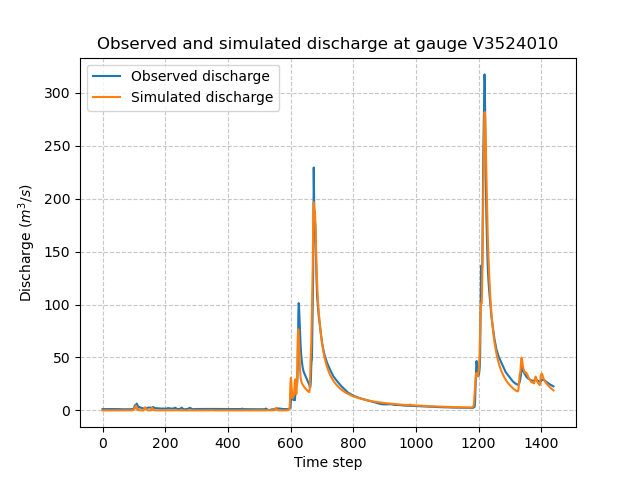

.. _user_guide.in_depth.forward_run_classical_calibration:

=====================================
Forward Run and Classical Calibration
=====================================

This tutorial explains how to perform simple simulations such as a forward run and a simple model optimization. 
We begin by opening a Python interface:

.. code-block:: none

    python3

Imports
-------

We will first import the necessary libraries for this tutorial.

.. code-block:: python

    >>> import smash
    >>> import matplotlib.pyplot as plt

.. hint::

    The visualization library `matplotlib <https://matplotlib.org/>`__ is not installed by default but can be installed with pip as follows:
    
    .. code-block:: none

        pip install matplotlib

Model creation
--------------

To create a :class:`Model <smash.Model>` object, we need to define both the ``setup`` and ``mesh`` dictionaries (see the tutorial on :ref:`user_guide.quickstart.model_object_initialization`).
For simplificity, starting from this tutorial, we will use the `smash.factory.load_dataset` function to load the ``setup`` and ``mesh`` dictionaries.

In this tutorial, we will use the :ref:`user_guide.data_and_format_description.cance` dataset as an example.

.. code-block:: python

    >>> setup, mesh = smash.factory.load_dataset("Cance")
    >>> model = smash.Model(setup, mesh)

Model simulation
----------------

Different methods associated with the `Model <smash.Model>` object are available to perform a simulation such as a forward run or an optimization.

Forward run
***********

The most basic simulation possible is the forward run, which consists of running a forward hydrological model given input data.
A forward run can be performed with the `Model.forward_run <smash.Model.forward_run>` method, which performs an in-place operation on the Model object, or with `smash.forward_run`, which creates a copy of the Model object.

.. code-block:: python

    >>> model.forward_run()  # in-place operation 

.. code-block:: output

    </> Forward Run

Once the forward run has been completed, we can visualize the simulated discharge, for example, at the most downstream gauge.

.. code-block:: python

    >>> code = model.mesh.code[0]
    >>> plt.plot(model.response_data.q[0, :], label="Observed discharge")
    >>> plt.plot(model.response.q[0, :], label="Simulated discharge")
    >>> plt.xlabel("Time step")
    >>> plt.ylabel("Discharge ($m^3/s$)")
    >>> plt.grid(ls="--", alpha=.7)
    >>> plt.legend()
    >>> plt.title(f"Observed and simulated discharge at gauge {code}")
    >>> plt.show()

.. image:: ../../_static/user_guide.quickstart.forward_run_classical_calibration.forward_run_q.png
    :align: center

As the hydrograph shows, the simulated discharge is quite different from the observed discharge at this gauge. Obviously, we ran a forward run with the default `smash` rainfall-runoff 
parameter set. We can now try to run an optimization to minimize the misfit between the simulated and observed discharge. 

Optimization
************

Similar to the forward run, there are two ways to perform an optimization using either `Model.optimize <smash.Model.optimize>` or `smash.optimize`.
The hydrological model optimization problem is complex, and there are many strategies that can be employed depending on the modeling goals and data available.
Here, for this first tutorial on model optimization, we consider a simple method with the default optimization parameters.
The default cost function ``J`` to be minimized here is one minus the Nash-Sutcliffe efficiency (:math:`1 - \text{NSE}`), 
using a global Step-By-Step algorithm (see SBS in :ref:`math_num_documentation.optimization_algorithms`).
By default, the optimized parameters are supposed to be spatially uniform, which are conceptual rainfall-runoff parameters (here we consider a classical structure with the parameters: ``cp``, ``ct``, ``kexc``, and ``llr``).

.. code-block:: python

    >>> model.optimize()
    >>> # Equivalent to model.optimize(mapping="uniform", optimizer="sbs")

.. code-block:: output

    </> Optimize
        At iterate     0    nfg =     1    J = 6.95010e-01    ddx = 0.64
        At iterate     1    nfg =    30    J = 9.84102e-02    ddx = 0.64
        At iterate     2    nfg =    59    J = 4.54091e-02    ddx = 0.32
        At iterate     3    nfg =    88    J = 3.81819e-02    ddx = 0.16
        At iterate     4    nfg =   117    J = 3.73623e-02    ddx = 0.08
        At iterate     5    nfg =   150    J = 3.70871e-02    ddx = 0.02
        At iterate     6    nfg =   183    J = 3.68001e-02    ddx = 0.02
        At iterate     7    nfg =   216    J = 3.67631e-02    ddx = 0.01
        At iterate     8    nfg =   240    J = 3.67280e-02    ddx = 0.01
        CONVERGENCE: DDX < 0.01

The outputs above show the different iterations of the optimization process, including information on the number of iterations, the cumulative number of evaluations ``nfg`` 
(the number of forward runs performed within each iteration of the optimization algorithm), the value of the cost function ``J`` to be minimized, and the value of the adaptive descent step ``ddx`` of the heuristic search algorithm. 
The final message indicates the termination type of the optimization (e.g., converged, stopped by maximum iterations, etc.).

.. hint::
    The default optimization options depend on the chosen ``mapping`` and ``optimizer``. 
    To get these default options, use `smash.default_optimize_options` for `smash.optimize`, and `smash.default_bayesian_optimize_options` for `smash.bayesian_optimize`.
    For example, the default options for the `smash.optimize` method using uniform mapping and the SBS optimizer are:

    .. code-block:: python

        >>> optimize_options = smash.default_optimize_options(model)
        >>> # Equivalent to smash.default_optimize_options(model, mapping="uniform", optimizer="sbs")
        >>> optimize_options

    .. code-block:: output

        {'parameters': ['cp', 'ct', 'kexc', 'llr'], 'bounds': {'cp': (1e-06, 1000.0), 'ct': (1e-06, 1000.0), 'kexc': (-50, 50), 'llr': (1e-06, 1000.0)}, 'control_tfm': 'sbs', 'termination_crit': {'maxiter': 50}}

Now, we visualize again the simulated discharge compared to the observed discharge, but this time with optimized model parameters.

.. code-block:: python

    >>> code = model.mesh.code[0]
    >>> plt.plot(model.response_data.q[0, :], label="Observed discharge")
    >>> plt.plot(model.response.q[0, :], label="Simulated discharge")
    >>> plt.xlabel("Time step")
    >>> plt.ylabel("Discharge ($m^3/s$)")
    >>> plt.grid(ls="--", alpha=.7)
    >>> plt.legend()
    >>> plt.title(f"Observed and simulated discharge at gauge {code}")
    >>> plt.show()

We get the optimized values of the rainfall-runoff parameters.

.. code-block:: python

    >>> ind = tuple(model.mesh.gauge_pos[0, :])
    >>> opt_parameters = {
    ...     k: model.get_rr_parameters(k)[ind] for k in ["cp", "ct", "kexc", "llr"]
    ... } # A dictionary comprehension
    >>> opt_parameters

.. code-block:: output

    {'cp': np.float32(75.816666), 'ct': np.float32(255.8543), 'kexc': np.float32(-1.3692871), 'llr': np.float32(30.552221)}

.. note::
    Hydrological models are often calibrated using a warm-up period to reduce the influence of initial conditions on the optimization process.
    This period is excluded from the cost function calculation.
    By default, the start and end times for optimization are set as defined in `Model.setup <smash.Model.setup>`.
    
    .. code-block:: python

        >>> model.setup.start_time, model.setup.end_time

    .. code-block:: output

        ('2014-09-15 00:00', '2014-11-14 00:00')

    To specify the end of the warm-up period (i.e., the start time for optimization), define the key ``'end_warmup'`` in the ``cost_options`` dictionary.
    
    .. use pycon to preserve Python format and avoid being captured by script pyexec_rst.py
 
    .. code-block:: pycon

        >>> # Optimize Model with a warm-up period
        >>> model.optimize(cost_options={"end_warmup": "2014-10-01"})

Save the Model
--------------

Finally, the `Model <smash.Model>` object, including all input data and optimized parameters, can be saved to a `HDF5 <https://www.hdfgroup.org/solutions/hdf5>`__ file,
and read back using the `smash.io.save_model` and `smash.io.read_model` functions.

.. code-block:: python

    >>> smash.io.save_model(model, "model.hdf5")
    >>> model = smash.io.read_model("model.hdf5")
    >>> model

.. code-block:: output

    Model
        atmos_data: ['mean_pet', 'mean_prcp', '...', 'sparse_prcp', 'sparse_snow']
        mesh: ['active_cell', 'area', '...', 'xres', 'ymax']
        nn_parameters: ['bias_1', 'bias_2', '...', 'weight_1', 'weight_2']
        physio_data: ['descriptor', 'imperviousness', 'l_descriptor', 'u_descriptor']
        response: ['q']
        response_data: ['q']
        rr_final_states: ['keys', 'values']
        rr_initial_states: ['keys', 'values']
        rr_parameters: ['keys', 'values']
        serr_mu_parameters: ['keys', 'values']
        serr_sigma_parameters: ['keys', 'values']
        setup: ['adjust_interception', 'compute_mean_atmos', '...', 'temp_access', 'temp_directory']
        u_response_data: ['q_stdev']

.. hint::
    For large domain simulations, the model object can be quite large. An alternative, lighter solution is to use the `smash.io.save_model_ddt` and `smash.io.read_model_ddt` functions.
    This method saves important derived data types of the Model object to the `HDF5 <https://www.hdfgroup.org/solutions/hdf5>`__ file instead of the entire Model object.
    However, there is no `smash` method to reconstruct the Model object from this saved data file.
    
    .. code-block:: python

        >>> smash.io.save_model_ddt(model, "model_ddt.hdf5")
        >>> model_ddt = smash.io.read_model_ddt("model_ddt.hdf5")
        >>> model_ddt.keys()  # a dictionary containing several derived data types of the Model object

    .. code-block:: output

        dict_keys(['mesh', 'nn_parameters', 'physio_data', 'response', 'response_data', 'rr_final_states', 'rr_initial_states', 'rr_parameters', 'serr_mu_parameters', 'serr_sigma_parameters', 'setup'])

.. use this directive to hide the code cell in the documentation while being captured by the script pyexec_rst.py
.. only:: never

    .. code-block:: python
        
        >>> import os
        >>> os.remove("model.hdf5")
        >>> os.remove("model_ddt.hdf5")