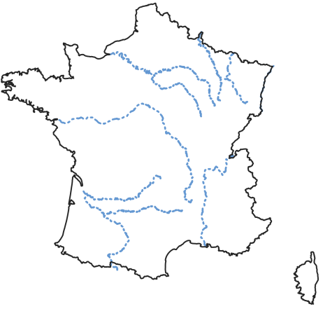

.. _user_guide.quickstart.france_large_domain_simulation:

================================
France - Large Domain Simulation
================================

This second tutorial on `smash` aims to perform a simulation over the whole of metropolitan France with a simple model structure. The objective, compared to the first tutorial, is to create a mesh over a large spatial domain, to perform a forward run and to visualize the simulated discharge over the entire domain.

Required data
-------------

You need first to download all the required data.

.. button-link:: https://smash.recover.inrae.fr/dataset/France-dataset.tar
    :color: primary
    :shadow:
    :align: center

    **Download**

If the download was successful, a file named ``France-dataset.tar`` should be available. We can switch to the directory where this file has been 
downloaded and extract it using the following command:

.. code-block:: shell

    tar xf France-dataset.tar

Now a folder called ``France-dataset`` should be accessible and contain the following files and folders:

- ``France_flwdir.tif``
    A GeoTiff file containing the flow direction data,
- ``prcp``
    A directory containing precipitation data in GeoTiff format with the following directory structure: ``%Y/%m/%d`` 
    (``2012/01/01``),
- ``pet``
    A directory containing daily interannual potential evapotranspiration data in GeoTiff format,

In this dataset, there are no gauge attributes or observed discharge, we are only interested in performing a forward run on a domain without 
optimization beforehand.

We can open a Python interface. The current working directory will be assumed to be the directory where
the ``France-dataset`` is located.

Open a Python interface:

.. code-block:: shell

    python3

.. ipython:: python
    :suppress:

    import os
    os.system("python3 generate_dataset.py -d France")

Imports
-------

We will first import everything we need in this tutorial. Both ``LogNorm`` and ``SymLogNorm`` will be used for plotting

.. ipython:: python

    import smash
    import numpy as np
    import matplotlib.pyplot as plt
    from matplotlib.colors import LogNorm, SymLogNorm

Model creation
--------------

Model setup creation
********************

The ``setup`` dictionary is pretty similar to the one used for the **Cance** tutorial except that we do not read observed discharge and the 
simulation period is different.

.. ipython:: python

    setup = {
        "start_time": "2012-01-01 00:00", 
        "end_time": "2012-01-02 08:00",
        "dt": 3_600,
        "hydrological_module": "gr4", 
        "routing_module": "lr",
        "read_prcp": True, 
        "prcp_conversion_factor": 0.1, 
        "prcp_directory": "./France-dataset/prcp", 
        "read_pet": True, 
        "daily_interannual_pet": True, 
        "pet_directory": "./France-dataset/pet", 
    }

Model mesh creation
*******************

For the ``mesh``, we only need the flow direction file and the mainland France bounding box ``bbox`` to pass to the `smash.factory.generate_mesh`
function. A bouding box in `smash` is a list of 4 values (``xmin``, ``xmax``, ``ymin``, ``ymax``), each of which corresponds respectively to 
the x minimum value, the x maximum value, the y mimimum value and the y maximum value. The values must be in the same unit and projection as the 
flow direction.

.. ipython:: python

    bbox = [100_000, 1_250_000, 6_050_000, 7_125_000] # Mainland Fance bbox in Lambert-93
    mesh = smash.factory.generate_mesh(
        flwdir_path="./France-dataset/France_flwdir.tif",
        bbox=bbox,
    )

.. note::

    Compare to a ``mesh`` generated with gauge attributes, the following variables are missing: ``flwdst``, ``gauge_pos``, ``code``, ``area``
    and ``area_dln``.

We can visualize the shape of the ``mesh``, the flow direction and the flow accumulation

.. ipython:: python

    mesh["nrow"], mesh["ncol"]

.. ipython:: python

    plt.imshow(mesh["flwdir"]);
    plt.colorbar(label="Flow direction (D8)");
    @savefig user_guide.quickstart.france_large_domain_simulation.flwdir.png
    plt.title("France - Flow direction");

.. ipython:: python

    plt.imshow(mesh["flwacc"], norm=LogNorm());
    plt.colorbar(label="Flow accumulation (m²)");
    @savefig user_guide.quickstart.france_large_domain_simulation.flwacc.png
    plt.title("France - Flow accumulation");

Then, we can initialize the `smash.Model` object

.. ipython:: python

    model = smash.Model(setup, mesh)

Model simulation
----------------

Forward run
***********

We can now call the `Model.forward_run <smash.Model.forward_run>` method, but by default and for memory reasons, the simulated discharge on the 
entire spatio-temporal domain is not saved. This means storing an `numpy.ndarray` of shape *(nrow, ncol, ntime_step)*, which may be quite large depending on the 
simulation period and the spatial domain. To activate this option, the ``return_options`` argument must be filled in, specifying that you want to retrieve 
the simulated discharge on the whole domain. Whenever the ``return_options`` is filled in, the `Model.forward_run <smash.Model.forward_run>` method
returns a `smash.ForwardRun` object storing these variables.

.. To speed up documentation generation
.. ipython:: python
    :suppress:
    
    ncpu = min(5, max(1, os.cpu_count() - 1))
    fwd_run = model.forward_run(return_options={"q_domain": True}, common_options={"ncpu": ncpu})

.. ipython:: python
    :verbatim:

    fwd_run = model.forward_run(return_options={"q_domain": True})

.. ipython:: python

    fwd_run
    fwd_run.time_step
    fwd_run.q_domain.shape

The returned object `smash.ForwardRun` contains two variables ``q_domain`` and ``time_step``. With ``q_domain`` a `numpy.ndarray` of shape 
*(nrow, ncol, ntime_step)* storing the simulated discharge and ``time_step`` a `pandas.DatetimeIndex` storing the saved time steps.
We can view the simulated discharge for one time step, for example the last one.

.. ipython:: python

    q = fwd_run.q_domain[..., -1]
    q = np.where(model.mesh.active_cell == 0, np.nan, q) # Remove the non-active cells from the plot
    plt.imshow(q, norm=SymLogNorm(1e-4));
    plt.colorbar(label="Discharge $(m^3/s)$");
    @savefig user_guide.quickstart.france_large_domain_simulation.forward_run_q.png
    plt.title("France - Discharge");

.. note::

    Given that we performed a forward run on only 32 time steps with default rainfall-runoff parameters and initial states, the simulated 
    discharge is not realistic.

By default, if the returned time steps are not defined, all the time steps are returned. It is possible to return only certain time steps by
specifying them in the ``return_options`` argument, for example only the two last ones.

.. To speed up documentation generation
.. ipython:: python
    :suppress:
    
    ncpu = min(5, max(1, os.cpu_count() - 1))
    time_step = ["2012-01-02 07:00", "2012-01-02 08:00"]
    fwd_run = model.forward_run(return_options={"time_step": time_step, "q_domain": True}, common_options={"ncpu": ncpu})

.. ipython:: python
    :verbatim:

    time_step = ["2012-01-02 07:00", "2012-01-02 08:00"]
    fwd_run = model.forward_run(
        return_options={
            "time_step": time_step,
            "q_domain": True
        }
    )

.. ipython:: python

    fwd_run.time_step
    fwd_run.q_domain.shape

.. ipython:: python

    q = fwd_run.q_domain[..., -1]
    q = np.where(model.mesh.active_cell == 0, np.nan, q) # Remove the non-active cells from the plot
    plt.imshow(q, norm=SymLogNorm(1e-4));
    plt.colorbar(label="Discharge $(m^3/s)$");
    @savefig user_guide.quickstart.france_large_domain_simulation.forward_run_q2.png
    plt.title("France - Discharge");

This concludes this second tutorial on `smash`.

.. ipython:: python
    :suppress:

    plt.close('all')
