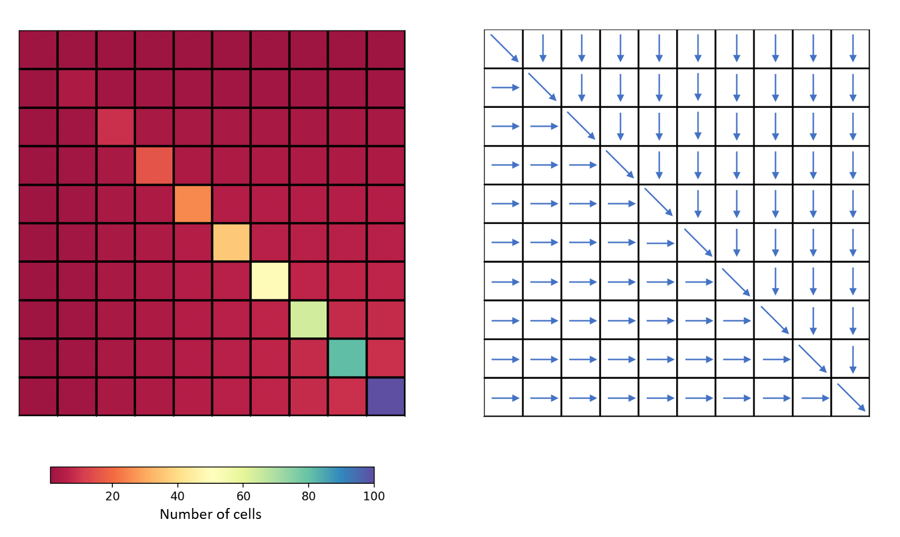

.. _user_guide.quickstart.practice_case:

=============
Practice case
=============

The Practice case is an introduction to `smash` for new users. The objective 
of this section is to create the dataset to run `smash` from scratch and 
get an overview of what is available. More details are provided on a real 
case available in the User Guide section: :ref:`user_guide.quickstart.real_case_cance`.

For this case, a fictitious square-shaped catchment of size 10 x 10 km² 
will be created with the following flow accumulation and flow directions :

First, open a Python interface:

.. code-block:: none

    python3
    
-------
Imports
-------

.. ipython:: python
    
    import smash
    import numpy as np
    import matplotlib.pyplot as plt
    
.. warning::

    - The wrapping of Fortran code in Python requires the use of the `f90wrap <https://github.com/jameskermode/f90wrap>`__ package, which itself uses `f2py <https://numpy.org/doc/stable/f2py/>`__. Thus, the `NumPy <https://numpy.org/>`__ package is essential in the management of arguments. A knowledge of this package is advised in the use of `smash`.
    
    - The `Matplotlib <https://matplotlib.org/>`__ package is the visualization package used in the `smash` documentation but any tool can be used.
    
---------------------   
Model object creation
---------------------

Creating a :class:`.Model` requires two input arguments: ``setup`` and ``mesh``.

.. _user_guide.quickstart.practice_case.setup_argument_creation:

Setup argument creation
***********************
    
``setup`` is a dictionary that allows to initialize :class:`.Model` 
(i.e. allocate the necessary Fortran arrays). 

A minimal ``setup`` configuration is:

- ``dt``: the calculation time step in s,

- ``start_time``: the beginning of the simulation,

- ``end_time``: the end of the simulation.

.. ipython:: python

    setup = {
        "dt": 3_600,
        "start_time": "2020-01-01 00:00",
        "end_time": "2020-01-04 00:00",
        "hydrological_module":"gr4",
        "read_qobs":True,
        "qobs_directory":"qobs", 
    }
    
    
- The default model is ``gr4``. The hydrological model can be selected from : ["gr4", "gr5", "grd", "loieau", "vic3l"], for more details on the models, refer to ...

- If the user wants to take account observed discharges, the option ``read_qobs`` must be activated, and the path of the discharge data ``qobs_directory`` filled. 

.. note::
    
    Each key and associated values that can be passed into the ``setup`` 
    dictionary are detailed in the User Guide section: :ref:`Model 
    initialization <user_guide.others.model_initialization.setup>`.

.. _user_guide.quickstart.practice_case.mesh_argument_creation:
    
Mesh argument creation
**********************

``mesh`` is a dictionary that allows to initialize :class:`.Model` 
(i.e. allocate the necessary Fortran arrays). 
    
.. ipython:: python

    
    mesh = smash.factory.generate_mesh(
        flwdir_path = "flwdir/flwdir_practice_case.tif",
        x = 10_000,
        y = 0,
        area = 100 * 1e6,
        code = ["practice_case_qobs"]
    )
    
    
- The ``flwdir_path`` allows to give flow directions,

- The coordinates (``x``, ``y``) give the outlet of the catchment area,

- The surface area is given by the parameter ``area``,

- The names of the gauges ``code`` must be filled by a list of gauges to read the discharges data.
    
    
Once ``setup`` and ``mesh`` are filled in, a :class:`.Model` object can be created :

.. ipython:: python
        
    model = smash.Model(setup, mesh)

.. note::
    
    - Each key and associated values that can be passed into the ``mesh`` dictionary are detailed in the User Guide section: :ref:`Model initialization <user_guide.others.model_initialization.mesh>`.
    
-------------
Viewing Model
-------------

Once the :class:`.Model` object is created, it is possible to visualize what it contains through 12 attributes. This 12 attributes are Python classes that are derived from the wrapping of Fortran derived types. See details in the :ref:`api_reference` for the attributes. In this section, we present some attributes :

- :attr:`.Model.setup`

- :attr:`.Model.mesh`

- :attr:`.Model.response_data`

- :attr:`.Model.atmos_data`

- :attr:`.Model.rr_parameters`

- :attr:`.Model.rr_initial_states`

- :attr:`.Model.response`

Setup
*****

The :attr:`.Model.setup` attribute contains a set of arguments necessary to initialize the :class:`.Model`. We have in the :ref:`user_guide.quickstart.practice_case.setup_argument_creation` part given values for the arguments ``dt``, ``start_time`` and ``end_time``. These values can be retrieved in the following way:

.. ipython:: python

    model.setup.dt, model.setup.start_time, model.setup.end_time
    
The other :attr:`.Model.setup` arguments can also be viewed even if they have not been directly defined in the :class:`.Model` initialization. These arguments have default values in the code. Some tables are empty but allocated according to the size of the grid and the simulation period.

.. ipython:: python
    
    model.setup.pet_format
    
    bool(model.setup.read_pet)
    
If you are using IPython, tab completion allows you to visualize all the attributes and methods.

Mesh
****

The :attr:`.Model.mesh` attribute contains a set of arguments necessary to initialize the :class:`.Model`. In the :ref:`user_guide.quickstart.practice_case.mesh_argument_creation` part, we use a method function to automatically initialize the attributs of the mesh. These values can be retrieved in the following way :

.. ipython:: python

    model.mesh.xres, model.mesh.yres
    
    model.mesh.nrow, model.mesh.ncol
 
``xres`` and ``yres`` are the the resolution of the grid. ``nrow`` and ``ncol`` the number of rows and columns. That corresponds to the area of the catchment.
        
The flow accumulation array can also be viewed :

.. ipython:: python

    model.mesh.flwacc
    
Or plotted using Matplotlib :

.. ipython:: python
    
    plt.imshow(model.mesh.flwacc, cmap="Spectral");
    plt.colorbar(label="Number of cells");
    @savefig user_guide.quickstart.practice_case.flwacc.png
    plt.title("Practice case - Flow accumulation");

Observed discharges
*******************

The :attr:`.Model.response_data` attribute contains the observed discharge `q`. The observed discharge is a numpy array of shape (1, 72). There is 1 gauge in the grid and the simulation period is up to 72 time steps. The value -99 indicates no data.

.. ipython:: python
        
    model.response_data.q
    
    model.response_data.q.shape

    plt.plot(model.response_data.q[0,:]);
    plt.grid(alpha=.7, ls="--");
    plt.xlabel("Time step");
    plt.ylabel("Simulated discharge $(m^3/s)$");
    @savefig user_guide.quickstart.practice_case.qobs.png
    plt.title(model.mesh.code[0]);

Atmosphere Data
***************

The atmosphere data attribut :attr:`.Model.atmos_data` contains the potential evapotranspiration (PET) chronicle `pet`, the precipitations `prcp`, and their space averages. Precipitation is also a numpy array but of shape (10, 10, 72). The number of rows and columns is 10 and same as the observed dicharge, the simulation period is up to 72 time steps.

.. ipython:: python

    model.atmos_data.prcp.shape

        
Parameters and States
*********************
The model GR is based on a series of consecutive reservoirs :math:`(c, h)`, with :math:`c` the capacity and `h` the water height contained. The rainfall-runoff parameters of a basis model as `gr4` are :

* the capacity production :math:`c_p`, characterizes the runoff ;

* the transfert capacity :math:`c_t`, for the low flows ;

* the capacity of interception :math:`c_i` of the plants at the surface ;

* the exchange coefficient with the ground :math:`k_{exc}` ; 

* the router :math:`llr` controls the transfers from one pixel to the next.

The initial states are the water levels of reservoirs :math:`h_i, h_p, h_t, h_{lr}`. These attributes of capacity and water level contain only numpy arrays of shape (10, 10) 
(i.e. number of rows and columns in the grid).

.. ipython:: python
    
    cp = model.get_rr_parameters("cp")
    hp = model.get_rr_initial_states("hp")
    cp.shape, hp.shape
    
This arrays are filled in with uniform default values.

.. ipython:: python

     cp, hp
    

Response
********

The last attribute, :attr:`.Model.response`, contains the simulated discharge `q`. The attribute values are empty as long as no simulation has been run.

.. ipython:: python

    model.response.q

------------------
Input Data filling
------------------

To run a simulation, the :class:`.Model` needs at least one precipitation and potential evapotranspiration (PET) chronicle. In this Practice case, we will impose a triangular precipitation over the simulation period, uniform on the domain and a zero PET. Generally, this option is filled when the setup is initialized with `read_prcp` and `prcp_directory`.

.. ipython:: python

    prcp = np.zeros(shape=model.atmos_data.prcp.shape[2], dtype=np.float32)
    
    tri = np.linspace(0, 6.25, 10)
    
    prcp[0:10] = tri
    
    prcp[9:19] = np.flip(tri)
    
    model.atmos_data.prcp = np.broadcast_to(
        prcp,
        model.atmos_data.prcp.shape,
    )

    model.atmos_data.pet = 0.
    
Checking on any cell the precipitation values:

.. ipython:: python

    plt.plot(model.atmos_data.prcp[0,0,:]);
    plt.grid(alpha=.7, ls="--");
    plt.xlabel("Time step");
    plt.ylabel("Precipitation $(mm/h)$");
    @savefig user_guide.quickstart.practice_case.prcp.png
    plt.title("Precipitation on cell (0,0)");
   
    
---
Run
---

Forward run
***********

The :class:`.Model` is finally ready to be run using the :meth:`.Model.forward_run()` method:
    
.. ipython:: python

    model.forward_run();
    
Once the run is done, it is possible to access the simulated discharge on the gauge via the :attr:`.Model.response` and to plot a hydrograph.
    
    
.. ipython:: python

    plt.plot(model.response.q[0,:]);
    plt.grid(alpha=.7, ls="--");
    plt.xlabel("Time step");
    plt.ylabel("Simulated discharge $(m^3/s)$");
    @savefig user_guide.quickstart.practice_case.qsim_forward.png
    plt.title("Simulated discharge");

This hydrograph is the result of a forward run of the code with the default structure, parameters and initial states.
    

Optimization
************

Finally, perform a spatially uniform calibration (which is default optimization) of the parameter :math:`c_p` with the :meth:`.Model.optimize` method.

.. ipython:: python

    qsim0 = np.copy(model.response.q[0,:])
    
    res = model.optimize(
                optimize_options={"parameters": ["cp",]},
                return_options={"control_vector": True},
                )
    
    res.control_vector

`return_option` allows to get the computation results as the `control_vector`, which is here the optimize value of :math:`c_p`.
For more details, refer to :meth:`.Model.optimize` method.

Let see the differences between the hydrographs.

.. ipython:: python
    
    plt.plot(model.response_data.q[0,:], marker="+", label="Observed discharge");
    plt.plot(qsim0, label="Simulated discharge");
    plt.plot(model.response.q[0,:], color="m", label="Optimized discharge");
    plt.grid(alpha=.7, ls="--");
    plt.xlabel("Time step");
    plt.ylabel("Discharge $(m^3/s)$");
    plt.legend();
    @savefig user_guide.quickstart.practice_case.qsim_su.png
    plt.title(model.mesh.code[0]);
    
------------
Getting data
------------

The last step is to save what we have entered in :class:`.Model` (i.e. ``setup`` and ``mesh`` dictionaries) and the :class:`.Model` itself.

Setup argument in/out
*********************

The setup dictionary ``setup``, which was created in the section :ref:`user_guide.quickstart.practice_case.setup_argument_creation`, can be saved in `YAML <https://yaml.org/spec/1.2.2/>`__ format via the method :meth:`smash.io.save_setup`.

.. ipython:: python

    smash.io.save_setup(setup, "setup.yaml")
    
A file named ``setup.yaml`` has been created in the current working directory containing the ``setup`` dictionary informations. This file can itself be opened in order to recover our initial ``setup`` dictionary via the method :meth:`smash.io.read_setup`.

.. ipython:: python

    setup2 = smash.io.read_setup("setup.yaml")
        
Mesh argument in/out
********************

In a similar way to ``setup`` dictionary, the ``mesh`` dictionary created in the section :ref:`user_guide.quickstart.practice_case.mesh_argument_creation` can be saved to file via the method :meth:`smash.io.save_mesh`. However, 3D numpy arrays cannot be saved in YAML format, so the ``mesh`` is saved in `HDF5 <https://www.hdfgroup.org/solutions/hdf5/>`__ format.

.. ipython:: python

    smash.io.save_mesh(mesh, "mesh.hdf5")
    
A file named ``mesh.hdf5`` has been created in the current working directory containing the ``mesh`` dictionary information. This file can itself be opened in order to recover our initial ``mesh`` dictionary via the method :meth:`smash.io.read_mesh`.

.. ipython:: python

    mesh2 = smash.io.read_mesh("mesh.hdf5")
    
A new :class:`.Model` object can be created from the read files (same as the first one).

.. ipython:: python

    model2 = smash.Model(setup2, mesh2)
    
Model in/out
************

The :class:`.Model` object can also be saved to file. Like the ``mesh``, it will be saved in HDF5 format using the :meth:`smash.io.save_model` method. Here, we will save the :class:`.Model` object ``model`` after optimization.

.. ipython:: python

    smash.io.save_model(model2, "model2.hdf5")

A file named ``model.hdf5`` has been created in the current working directory containing the ``model`` object information. This file can itself be opened in order to recover our initial ``model`` object via the method :meth:`smash.read_model`.

.. ipython:: python

    model3 = smash.io.read_model("model2.hdf5")

``model3`` is directly the :class:`.Model` object itself on which the methods associated with the object are applicable.

.. ipython:: python

    model3.forward_run();

.. ipython:: python
    :suppress:

    plt.close('all')
