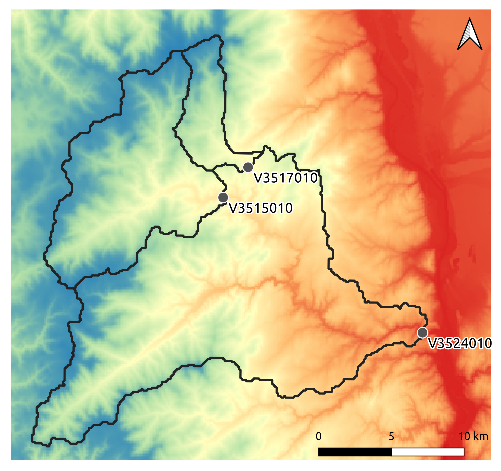

.. _user_guide.quickstart.real_case_cance:

=================
Real case - Cance
=================

A real case is considered: ``the Cance river catchment at Sarras``, a right bank tributary of the Rhône river. 

First, open a Python interface:

.. code-block:: none

    python3
    
-------
Imports
-------

.. ipython:: python
    
    import smash
    from smash.io import save_setup, read_setup, save_mesh, read_mesh 
    from smash.io import save_model, read_model
    import numpy as np
    import matplotlib.pyplot as plt

.. note::

    - The wrapping of Fortran code in Python requires the use of the `f90wrap <https://github.com/jameskermode/f90wrap>`__ package, which itself uses `f2py <https://numpy.org/doc/stable/f2py/>`__. Thus, the `NumPy <https://numpy.org/>`__ package is essential in the management of arguments. A knowledge of this package is advised in the use of `smash`.
    
    - The `Matplotlib <https://matplotlib.org/>`__ package is the visualization package used in the `smash` documentation but any tool can be used.
    
---------------------   
Model object creation
---------------------

Creating a :class:`.Model` requires two input arguments: ``setup`` and ``mesh``. 

.. _user_guide.quickstart.real_case_cance.setup_argument:

Setup argument creation
***********************
    
A minimal ``setup`` configuration is:

- ``dt``: the calculation time step in s,

- ``start_time``: the beginning of the simulation,

- ``end_time``: the end of the simulation.

In this example, we give the observed discharges `qobs`, the potential evapotranspiration (PET) chronicle `pet`, and the precipitations `prcp`. For example, to take account observed discharges, the option ``read_qobs`` must be activated, and the path of the discharge data ``qobs_directory`` filled with the path to the data. 

.. note::
    The pixel resolution of imported dataset is 1km². These imported dataset `qobs`, `pet`, `prpc` must be on the same grid of resolution.    

.. ipython:: python

    setup = {
        'hydrological_module': 'gr4', 
        'routing_module': 'lr', 
        'dt': 3600, 
        'start_time': '2014-09-15 00:00', 
        'end_time': '2014-11-14 00:00', 
        'read_qobs': True, 
        'qobs_directory': '../smash/factory/dataset/Cance/qobs', 
        'read_prcp': True, 
        'prcp_format': 'tif', 
        'prcp_conversion_factor': 0.1, 
        'prcp_directory': '../smash/factory/dataset/Cance/prcp', 
        'read_pet': True, 
        'pet_format': 'tif', 
        'pet_conversion_factor': 1, 
        'daily_interannual_pet': True, 
        'pet_directory': '../smash/factory/dataset/Cance/pet', 
        'read_descriptor': True, 
        'descriptor_name': ['slope', 'dd'], 
        'descriptor_directory': '../smash/factory/dataset/Cance/descriptor'
    }
    
    
Setup composition
'''''''''''''''''

To get into the details:

- ``hydrological_model``: the model structure, to be chosen from [``gr4``, ``gr5``, ``grd``, ``loieau``, ``vic3l``],

- ``routing_module``: the routing structure, to be chosen from [``lag0``, ``lr``, ``kw``], ``lr`` corresponds to the linear structure, 

- ``read_qobs``: whether or not to read observed discharges files,

- ``qobs_directory``: the path to the observed discharges files (this path is automatically generated when you load the data),

- ``read_prcp``: whether or not to read precipitation files,

- ``prcp_format``: the precipitation files format (``tif`` format is the only available at the moment),

- ``prcp_conversion_factor``: the precipitation conversion factor (the precipitation value will be **multiplied** by the conversion factor),

- ``prcp_directory``: the path to the precipitation files (this path is automatically generated when you load the data),

- ``read_pet``: whether or not to read potential evapotranspiration files,

- ``pet_format``: the potential evapotranspiration files format (``tif`` format is the only available at the moment),

- ``pet_conversion_factor``: the potential evapotranspiration conversion factor (the potential evapotranspiration value will be **multiplied** by the conversion factor),

- ``daily_interannual_pet``: whether or not to read potential evapotranspiration files as daily interannual value desaggregated to the corresponding time step ``dt``,

- ``pet_directory``: the path to the potential evapotranspiration files (this path is automatically generated when you load the data),

- ``read_descriptor``: whether or not to read catchment descriptors files,

- ``descriptor_name``: the names of the descriptors (the name must correspond to the name of the file without the extension such as ``slope.tif``),

- ``descriptor_directory``: the path to the catchment descriptors files (this path is automatically generated when you load the data),

.. _user_guide.quickstart.real_case_cance.mesh_argument:

Mesh argument creation
**********************

The method :meth:`smash.factory.generate_mesh` allows from a flow directions file, the gauge coordinates and the area to generate the mesh.
    
.. ipython:: python
    
    mesh = smash.factory.generate_mesh(
        flwdir_path = "../smash/factory/dataset/France_flwdir.tif",
        x = [840_261, 826_553, 828_269],
        y = [6_457_807, 6_467_115, 6_469_198],
        area = [381.7 * 1e6, 107 * 1e6, 25.3 * 1e6],
        code = ["V3524010", "V3515010", "V3517010"],
        epsg = 2154,
    )

- The ``flwdir_path`` allows to give flow directions,

- The coordinates (``x``, ``y``) give the outlet of the catchment area,

- The surface area is given by the parameter ``area``,

- The names of the gauges ``code`` must be filled by a list of gauges to read the discharges data.
    
- epsg is a spatial reference information.

Mesh composition
''''''''''''''''

.. ipython:: python

    mesh.keys()
    
To get into the details:

- ``xres``: the computation horizontal space step in m,

- ``yres``: the computation vertical space step in m,

.. ipython:: python
    
    mesh["xres"], mesh["yres"]

- ``xmin``: the minimum value of the domain extension in x (it depends on the flow directions projection)

.. ipython:: python
    
    mesh["xmin"]

- ``ymax``: the maximum value of the domain extension in y (it depends on the flow directions projection)

.. ipython:: python
    
    mesh["ymax"]

- ``nrow``: the number of rows,

.. ipython:: python
    
    mesh["nrow"]

- ``ncol``: the number of columns,

.. ipython:: python
    
    mesh["ncol"]

- ``ng``: the number of gauges,

.. ipython:: python
    
    mesh["ng"]
    
- ``nac``: the number of cells that contribute to any gauge discharge,

.. ipython:: python
    
    mesh["nac"]
    
- ``area``: the catchments area in m²,

.. ipython:: python 
    
    mesh["area"]
    
- ``code``: the gauges code, 

.. ipython:: python
    
    mesh["code"]
        
- ``gauge_pos``: the gauges position in the grid,

.. ipython:: python
    
    mesh["gauge_pos"]
    
- ``flwdir``: the flow directions,

.. ipython:: python
    
    plt.imshow(mesh["flwdir"]);
    plt.colorbar(label="Flow direction (D8)");
    @savefig user_guide.quickstart.real_case_cance.flwdir.png
    plt.title("Real case - Cance - Flow direction");
    
- ``flwacc``: the flow accumulation in number of cells,

.. ipython:: python
    
    plt.imshow(mesh["flwacc"]);
    plt.colorbar(label="Flow accumulation (nb cells)");
    @savefig user_guide.quickstart.real_case_cance.flwacc.png
    plt.title("Real case - Cance - Flow accumulation");
    
- ``flwdst``: the flow distances from the main outlet in m,

.. ipython:: python
    
    plt.imshow(mesh["flwdst"]);
    plt.colorbar(label="Flow distance (m)");
    @savefig user_guide.quickstart.real_case_cance.flwdst.png
    plt.title("Real case - Cance - Flow distance");
    
- ``active_cell``: the cells that contribute to any gauge discharge (mask),

.. ipython:: python
    
    plt.imshow(mesh["active_cell"]);
    plt.colorbar(label="Logical active cell (0: False, 1: True)");
    @savefig user_guide.quickstart.real_case_cance.active_cell.png
    plt.title("Real case - Cance - Active cell");
    
.. note::
    
    Each key and associated values that can be passed into the ``mesh`` dictionary are detailed in the User Guide section: :ref:`Model initialization <user_guide.others.model_initialization.mesh>`.

Finally, create the :class:`.Model` object using the ``setup`` and ``mesh`` loaded.

.. ipython:: python
    :suppress:
    
    model = smash.Model(setup, mesh)

.. ipython:: python
    :verbatim:
    
    model = smash.Model(setup, mesh)
   
-------------
Viewing Model
-------------

Once the :class:`.Model` object is created, it is possible to visualize what it contains through 12 attributes. These 12 attributes are Python classes that are derived from the wrapping of Fortran derived types. See details in the :ref:`api_reference` for the attributes. In this section, we present some of them :

- :attr:`.Model.setup`

- :attr:`.Model.mesh`

- :attr:`.Model.response_data`

- :attr:`.Model.atmos_data`

- :attr:`.Model.rr_parameters`

- :attr:`.Model.rr_initial_states`

- :attr:`.Model.response`

Users can refers to :ref:`user_guide.quickstart.real_case_cance.setup_argument` and :ref:`user_guide.quickstart.real_case_cance.mesh_argument` for the first two attributs. Then we can visualize the observed discharges and the spatialized atmospheric forcings.

Response Data - Observed discharge
**********************************

We access to the discharge by ``q`` of :attr:`.Model.response_data`
There are three gauges placed on the meshing. For the sake of clarity, only the most downstream gauge discharge ``V3524010`` is plotted, using ``code``.

.. ipython:: python
    
    plt.plot(model.response_data.q[0,:]);
    plt.grid(alpha=.7, ls="--");
    plt.xlabel("Time step");
    plt.ylabel("Discharge ($m^3/s$)");
    @savefig user_guide.quickstart.real_case_cance.qobs.png
    plt.title(model.mesh.code[0]);
    
Atmospheric data
****************

Precipitation and potential evapotranspiration files were read for each time step. As uniform rainfall was imposed on the domain, we only plot the precipitation and for the sake of clarity, only one precipiation grid at time step 1200 is plotted.

.. ipython:: python

    plt.imshow(model.atmos_data.prcp[..., 1200]);
    plt.title("Precipitation at time step 1200");
    @savefig user_guide.quickstart.real_case_cance.prcp.png
    plt.colorbar(label="Precipitation ($mm/h$)");
    
It is possible to mask the precipitation grid to only visualize the precipitation on active cells using numpy method ``np.where``.

.. ipython:: python

    ma_prcp = np.where(
        model.mesh.active_cell == 0,
        np.nan,
        model.atmos_data.prcp[..., 1200]
    )
    
    plt.imshow(ma_prcp);
    plt.title("Masked precipitation at time step 1200");
    @savefig user_guide.quickstart.real_case_cance.ma_prcp.png
    plt.colorbar(label="Precipitation ($mm/h$)");

       
Parameters and States
*********************

The model GR is based on a series of consecutive reservoirs :math:`(c, h)`, with :math:`c` the capacity and `h` the water height contained. The rainfall-runoff parameters of a basis model as `gr4` are :

* the capacity production :math:`c_p`, characterizes the runoff ;

* the transfert capacity :math:`c_t`, for the low flows ;

* the capacity of interception :math:`c_i` of the plants at the surface ;

* the exchange coefficient with the ground :math:`k_{exc}` ; 

* the router :math:`llr` controls the transfers from one pixel to the next.

The initial states are the water levels of reservoirs :math:`h_i, h_p, h_t, h_{lr}`. These attributes of capacity and water level contain only numpy arrays of shape (10, 10) 
(i.e. number of rows and columns in the grid).

.. ipython:: python
    
    cp = model.get_rr_parameters("cp")
    hp = model.get_rr_initial_states("hp")
    cp.shape, hp.shape
    
This arrays are filled in with uniform default values.

Response
********

The last attribute, :attr:`.Model.response`, contains the simulated discharge ``q``. The attribute values are empty as long as no simulation has been run.

.. ipython:: python

    model.response.q

---
Run
---

Forward run
***********

Make a forward run using the :meth:`.Model.forward_run()` method.

.. ipython:: python

    model.forward_run();
    
We can visualize the simulated discharges after a forward run for the most downstream gauge.

.. ipython:: python

    plt.plot(model.response_data.q[0,:], label="Observed discharge");
    plt.plot(model.response.q[0,:], label="Simulated discharge");
    plt.grid(alpha=.7, ls="--");
    plt.xlabel("Time step");
    plt.ylabel("Discharge $(m^3/s)$");
    plt.title(model.mesh.code[0]);
    @savefig user_guide.quickstart.real_case_cance.qsim_forward.png
    plt.legend();

.. _quickstart.cance.optimization:

Optimization
************

Let us briefly formulate here the general hydrological model calibration inverse problem. Let :math:`J \left( \theta \right)` be a cost function measuring the misfit between simulated and
observed quantities, such as discharge. Note that :math:`J` depends on the sought parameter set :math:`\theta` throught the hydrological model :math:`\mathcal{M}`. An optimal estimate of 
:math:`\hat{\theta}` of model parameter set is obtained from the condition:

.. math::
    
    \hat{\theta} = \underset{\theta}{\mathrm{argmin}} \; J\left( \theta \right)
    
Several calibration strategies are available in `smash`. They are based on different optimization algorithms and are for example adapted to inverse problems of various complexity, including high dimensional ones.
For the purposes of the User Guide, we will only perform a spatially uniform and distributed optimization on the most downstream gauge.

Spatially uniform optimization
''''''''''''''''''''''''''''''

We consider here for optimization (which is the default setup with ``gr4`` structure):

- a global minimization algorithm :math:`\mathrm{SBS}`,
- a single :math:`\mathrm{NSE}` objective function from discharge time series at the most downstream gauge ``V3524010``,
- a spatially uniform parameter set :math:`\theta = \left( \mathrm{c_p, c_t, llr, k_exc} \right)^T` with :math:`\mathrm{c_p}` being the maximum capacity of the production reservoir, :math:`\mathrm{c_t}` being the maximum capacity of the transfer reservoir, :math:`\mathrm{llr}` being the linear routing parameter and :math:`\mathrm{k_exc}` being the non-conservative exchange parameter.

Call the :meth:`.Model.optimize` method and for the sake of computation time, set the maximum number of iterations in the ``options`` argument to 2. 

.. ipython:: python
    :suppress:
    
    res = model.optimize(
        optimize_options={"termination_crit":{"maxiter": 2}}, 
        return_options={"cost": True, "iter_cost": True}
        );
    
    model_su = model
    
.. ipython:: python
    :verbatim:

    res = model.optimize(
        optimize_options={"termination_crit":{"maxiter": 2}}, 
        return_options={"cost": True, "iter_cost": True}
        );

.. ~ While the optimization routine is in progress, some information are provided.

.. code-block:: text

    </> Optimize
    At iterate      0    nfg =     1    J =      0.643190    ddx = 0.64
    At iterate      1    nfg =    30    J =      0.097397    ddx = 0.64
    At iterate      2    nfg =    59    J =      0.052158    ddx = 0.32
    STOP: TOTAL NO. OF ITERATION EXCEEDS LIMIT  
        
.. ~ This information remainds the optimization options:

.. ~ - ``Mapping``: the optimization mapping of parameters,
.. ~ - ``Algorithm``: the minimization algorithm,
.. ~ - ``Jobs_fun``: the objective function(s),
.. ~ - ``wJobs``: the weight assigned to each objective function,
.. ~ - ``Nx``: the dimension of the problem (1 means that we perform a spatially uniform optimization),
.. ~ - ``Np``: the number of parameters to optimize and their name,
.. ~ - ``Ns``: the number of initial states to optimize and their name,
.. ~ - ``Ng``: the number of gauges to optimize and their code/name,
.. ~ - ``wg``: the weight assigned to each optimized gauge.

.. ~ .. note::

.. ~     The size of the control vector is defined by :math:`Nx \left(Np + Ns \right)`
    
.. ~ Then, for each iteration, we can retrieve:

.. ~ - ``nfg``: the total number of function and gradient evaluations (there is no gradient evaluations in the minimization algorithm :math:`\mathrm{SBS}`),
.. ~ - ``J``: the value of the cost function,
.. ~ - ``ddx``: the convergence criterion specific to the minimization algorithm :math:`\mathrm{SBS}` (the algorithm converges when ``ddx`` is lower than 0.01).

The last line informs about the reason why the optimization ended. Here, since we have forced 2 iterations maximum, the algorithm stopped because the number of iterations was exceeded.

.. note::

    By default, the mapping of optimize method is ``uniform``, thus
    
    .. code-block:: text

        res = model.optimize(
            optimize_options={"termination_crit":{"maxiter": 2}}, 
            return_options={"cost": True, "iter_cost": True}
            );
    
    is equivalent to
    
    .. code-block:: text

        res = model.optimize(
            mapping="uniform",
            optimize_options={"termination_crit":{"maxiter": 2}}, 
            return_options={"cost": True, "iter_cost": True}
            );
    
Once the optimization is complete. We can visualize the simulated discharge,

.. ipython:: python

    plt.plot(model.response_data.q[0,:], label="Observed discharge");
    plt.plot(model.response.q[0,:], label="Simulated discharge");
    plt.grid(alpha=.7, ls="--");
    plt.xlabel("Time step");
    plt.ylabel("Discharge $(m^3/s)$");
    plt.title(model.mesh.code[0]);
    @savefig user_guide.quickstart.real_case_cance.qsim_su.png
    plt.legend();

The cost function value :math:`J` (should be equal to the last iteration ``J``),

.. ipython:: python

    res.cost
    res.iter_cost

    
The optimized parameters :math:`\hat{\theta}` (for the sake of clarity and because we performed a spatially uniform optimization, we will only display the parameter set values for one cell within the catchment active cells, which is the most downstream gauge position here),

.. ipython:: python

    cp = model.get_rr_parameters("cp")
    ct = model.get_rr_parameters("ct")
    llr = model.get_rr_parameters("llr")
    kexc = model.get_rr_parameters("kexc")

    ind = tuple(model.mesh.gauge_pos[0,:])
    
    ind
    
    (
    cp[ind],
    ct[ind],
    llr[ind],
    kexc[ind],
    )

It is possible to save any :class:`.Model` object to HDF5. Here, we will save the uniform optimized instances for a future displaying.

.. ipython:: python

    save_model(model, "model.hdf5")
    model_su = read_model("model.hdf5")

    
Spatially distributed optimization
''''''''''''''''''''''''''''''''''

We consider here for optimization:

- a gradient descent minimization algorithm :math:`\mathrm{L}\text{-}\mathrm{BFGS}\text{-}\mathrm{B}`,
- a single :math:`\mathrm{NSE}` objective function from discharge time series at the most downstream gauge ``V3524010``,
- a spatially distributed parameter set :math:`\theta = \left( \mathrm{cp, cft, lr, exc} \right)^T` with :math:`\mathrm{cp}` being the maximum capacity of the production reservoir, :math:`\mathrm{cft}` being the maximum capacity of the transfer reservoir, :math:`\mathrm{lr}` being the linear routing parameter and :math:`\mathrm{exc}` being the non-conservative exchange parameter.
- a prior set of parameters :math:`\bar{\theta}^*` generated from the previous spatially uniform global optimization.

Call the :meth:`.Model.optimize` method, fill in the arguments ``mapping`` with "distributed" and for the sake of computation time, set the maximum number of iterations in the ``options`` argument to 15.

As we run this optimization from the previously generated uniform parameter set, we apply the :meth:`.Model.optimize` method from the ``model`` instance which had stored the previous optimized parameters.

.. ipython:: python
    :suppress:
    
    res = model.optimize(
            mapping="distributed",
            optimize_options={"termination_crit":{"maxiter": 15}},
            return_options={"cost": True, "iter_cost": True},
        )
    

.. ipython:: python
    :verbatim:
    
    res = model.optimize(
            mapping="distributed",
            optimize_options={"termination_crit":{"maxiter": 15}},
            return_options={"cost": True, "iter_cost": True},
        )
    

While the optimization routine is in progress, some information are provided.

.. code-block:: text
    
    </> Optimize
        At iterate      0    nfg =     1    J =      0.052158    |proj g| =      0.003706
        At iterate      1    nfg =     3    J =      0.046520    |proj g| =      0.034254
        At iterate      2    nfg =     4    J =      0.045327    |proj g| =      0.018078
        At iterate      3    nfg =     6    J =      0.044052    |proj g| =      0.013705
        At iterate      4    nfg =     7    J =      0.039764    |proj g| =      0.031789
        At iterate      5    nfg =     8    J =      0.037352    |proj g| =      0.020424
        At iterate      6    nfg =    10    J =      0.032467    |proj g| =      0.028793
        At iterate      7    nfg =    11    J =      0.030155    |proj g| =      0.065370
        At iterate      8    nfg =    12    J =      0.024909    |proj g| =      0.007977
        At iterate      9    nfg =    13    J =      0.023737    |proj g| =      0.017989
        At iterate     10    nfg =    14    J =      0.022914    |proj g| =      0.007681
        At iterate     11    nfg =    15    J =      0.022013    |proj g| =      0.008621
        At iterate     12    nfg =    17    J =      0.020395    |proj g| =      0.011236
        At iterate     13    nfg =    18    J =      0.018925    |proj g| =      0.027226
        At iterate     14    nfg =    19    J =      0.018672    |proj g| =      0.033382
        At iterate     15    nfg =    20    J =      0.018326    |proj g| =      0.003987
        STOP: TOTAL NO. OF ITERATION EXCEEDS LIMIT
        
        
.. ~ The information are broadly similar to the spatially uniform optimization, except for

.. ~ - ``Jreg_function``: the regularization function,
.. ~ - ``wJreg``: the weight assigned to the regularization term,

.. ~ .. note::
    
.. ~     We did not specified any regularization options. Therefore, the ``wJreg`` term is set to 0 and no regularization is applied to the optimization.
    
.. ~ Then, for each iteration, we can retrieve same information with ``nfg`` (there are gradients evaluations for the :math:`\mathrm{L}\text{-}\mathrm{BFGS}\text{-}\mathrm{B}` algorithm) and ``J``.
.. ~ ``|proj g|`` is the infinity norm of the projected gradient.

.. note::
    
    The cost function :math:`J` at 0\ :sup:`th` iteration is equal to the cost function at the end of the spatially uniform optimization. This means that we used the previous optimized parameters as new prior.

The algorithm also stopped because the number of iterations was exceeded.

We can once again visualize, the simulated discharges (``su``: spatially uniform, ``sd``: spatially distributed)

.. ipython:: python
    
    plt.plot(model.response_data.q[0,:], label="Observed discharge");
    plt.plot(model_su.response.q[0,:], label="Simulated discharge - su");
    plt.plot(model.response.q[0,:], label="Simulated discharge - sd");
    plt.grid(alpha=.7, ls="--");
    plt.xlabel("Time step");
    plt.ylabel("Discharge $(m^3/s)$");
    plt.title(model.mesh.code[0]);
    @savefig user_guide.quickstart.real_case_cance.qsim_sd.png
    plt.legend();
    
.. note::
    
    The difference between the two simulated discharges is very slight. Indeed, the spatially uniform optimization already leads to rather good performances with a cost function :math:`J` equal to 0.05.
    Spatially distributed optimization only improved the performances by approximately 0.02.
    
The cost function value :math:`J`,

.. ipython:: python

    res.cost
    
We can plot the optimized parameters :math:`\hat{\theta}`,
    
.. ipython:: python

    ma = (model.mesh.active_cell == 0)

    ma_cp = np.where(ma, np.nan, cp)
    ma_ct = np.where(ma, np.nan, ct)
    ma_llr = np.where(ma, np.nan, llr)
    ma_kexc = np.where(ma, np.nan, kexc)
    
    f, ax = plt.subplots(2, 2)
    
    map_cp = ax[0,0].imshow(ma_cp);
    f.colorbar(map_cp, ax=ax[0,0], label="cp (mm)");
    
    map_ct = ax[0,1].imshow(ma_ct);
    f.colorbar(map_ct, ax=ax[0,1], label="ct (mm)");
    
    map_llr = ax[1,0].imshow(ma_llr);
    f.colorbar(map_llr, ax=ax[1,0], label="llr (min)");
    
    map_kexc = ax[1,1].imshow(ma_kexc);
    @savefig user_guide.quickstart.real_case_cance.theta.png
    f.colorbar(map_kexc, ax=ax[1,1], label="kexc (mm/h)");

  
------------
Getting data
------------

The last step is to save what we have entered in :class:`.Model` (i.e. ``setup`` and ``mesh`` dictionaries) and the :class:`.Model` itself.

Setup argument in/out
*********************

The setup dictionary ``setup``, which was created in the section :ref:`user_guide.quickstart.real_case_cance.setup_argument`, can be saved in `YAML <https://yaml.org/spec/1.2.2/>`__ format via the method :meth:`smash.io.save_setup`.

.. ipython:: python

    smash.io.save_setup(setup, "setup.yaml")
    
A file named ``setup.yaml`` has been created in the current working directory containing the ``setup`` dictionary informations. This file can itself be opened in order to recover our initial ``setup`` dictionary via the method :meth:`smash.io.read_setup`.

.. ipython:: python

    setup2 = smash.io.read_setup("setup.yaml")
        
Mesh argument in/out
********************

In a similar way to ``setup`` dictionary, the ``mesh`` dictionary created in the section :ref:`user_guide.quickstart.real_case_cance.mesh_argument` can be saved to file via the method :meth:`smash.io.save_mesh`. However, 3D numpy arrays cannot be saved in YAML format, so the ``mesh`` is saved in `HDF5 <https://www.hdfgroup.org/solutions/hdf5/>`__ format.

.. ipython:: python

    smash.io.save_mesh(mesh, "mesh.hdf5")
    
A file named ``mesh.hdf5`` has been created in the current working directory containing the ``mesh`` dictionary information. This file can itself be opened in order to recover our initial ``mesh`` dictionary via the method :meth:`smash.io.read_mesh`.

.. ipython:: python

    mesh2 = smash.io.read_mesh("mesh.hdf5")
    
A new :class:`.Model` object can be created from the read files (same as the first one).

.. ipython:: python

    model2 = smash.Model(setup2, mesh2)
    
Model in/out
************

The :class:`.Model` object can also be saved to file. Like the ``mesh``, it will be saved in HDF5 format using the :meth:`smash.io.save_model` method. Here, we will save the :class:`.Model` object ``model`` after optimization.

.. ipython:: python

    smash.io.save_model(model2, "model2.hdf5")

A file named ``model.hdf5`` has been created in the current working directory containing the ``model`` object information. This file can itself be opened in order to recover our initial ``model`` object via the method :meth:`smash.read_model`.

.. ipython:: python

    model3 = smash.io.read_model("model2.hdf5")

``model3`` is directly the :class:`.Model` object itself on which the methods associated with the object are applicable.

.. ipython:: python

    model3.forward_run();

Loading data from repository
****************************

The dataset about the Cance, the Lez and France are available in the `sma../smash/factory/dataset/` directory. For greater convenience, you can directly load the data. Run the ipython command:

.. ipython:: python

    setup, mesh = smash.factory.load_dataset("Cance")

.. ipython:: python
    :suppress:

    plt.close('all')
